# Agent Subagent Map Diagrams Reference

## Table of Contents

- [Purpose and Context](#purpose-and-context)
- [Fundamental Structure Rules](#fundamental-structure-rules)
- [Node Types and Agent Script Elements](#node-types-and-agent-script-elements)
- [Subagent Map Patterns](#subagent-map-patterns)
- [Complete Example: Local_Info_Agent](#complete-example-local_info_agent)
- [Validation Checklist](#validation-checklist)
- [Anti-patterns](#anti-patterns)

---

## Purpose and Context

A Subagent Map diagram is a Mermaid flowchart that visualizes an agent's
subagent graph structure. Use the smallest graph that represents the design.
For a multi-subagent agent, it displays:

- The `start_agent agent_router` entry point when multiple genuine domains need
  intent classification
- All subagents in the agent
- Subagent transitions and routing logic
- Action calls within subagents (with backing type: Apex, Prompt Template, Flow)
- Gating conditions (`available when` expressions), when required
- Variable state changes that have a trusted writer and named consumer
- Escalation and off-topic handling
- Conditional instructions based on variable values

Subagent Map diagrams are the primary visual deliverable in an Agent Spec (design document) and serve both specification and comprehension purposes.

---

## Fundamental Structure Rules

### Graph Orientation

- ALWAYS use `graph TD` (Top-Down orientation)
- Put the `start_agent` entry point at the top
- For a router-first design, subagents flow downward from the router
- Never use other orientations

### Node Identification

- Use sequential capital letters (A, B, C, ...) for node IDs
- Start with `A` for start_agent
- Increment sequentially through subagents and decisions
- Use descriptive labels within brackets

### Flow Direction

- Primary flow moves top-to-bottom
- Use `-->` for standard transitions
- Label decision branches with `|Label|` syntax
- Separate paths for different subagents

---

## Node Types and Agent Script Elements

### Start Agent Subagent Router Node

Format: `[start_agent agent_router]`

Represents the entry point where user input is evaluated and routed to appropriate subagents.

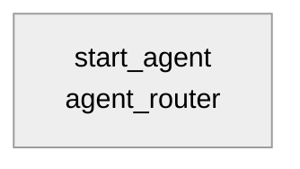

### Subagent Nodes

Format: `[subagent_name Subagent]`

Represents a subagent within the agent.

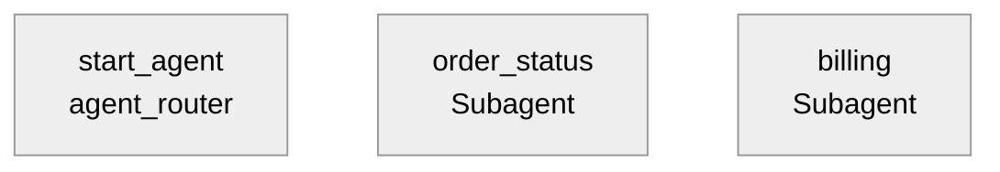

### Action Call Nodes

Format: `[Call action_name backing: Type]`

Backing types: Apex, Prompt Template, Flow

Example: `[Call check_weather backing: Apex]`

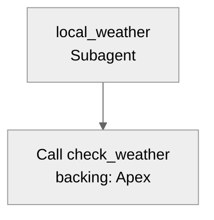

### Decision/Gating Nodes

Use curly braces `{}` for required deterministic conditions. Common formats:

- Authorization or confirmation gates: `{Check: customer_verified == true?}`
- External outcome gates: `{Check: verification_success == true?}`
- Subagent transition logic: `{user_intent matches?}`

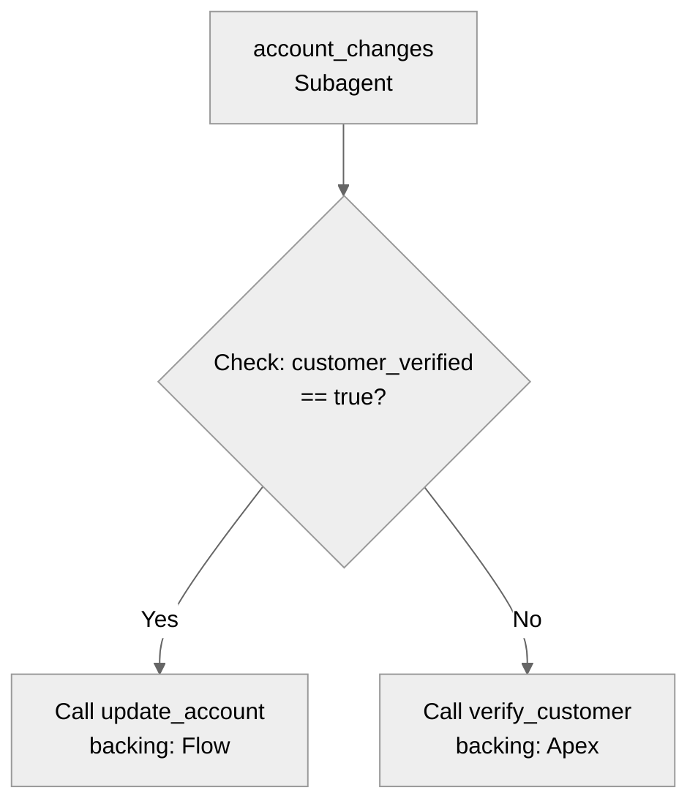

### Variable State Change Nodes

Format: `[Set verified_customer_id = action output]`

Show a state modification only when a later runtime gate, transition, or action
binding consumes it. Ordinary conversational facts belong in conversation
history and do not need state-change nodes.

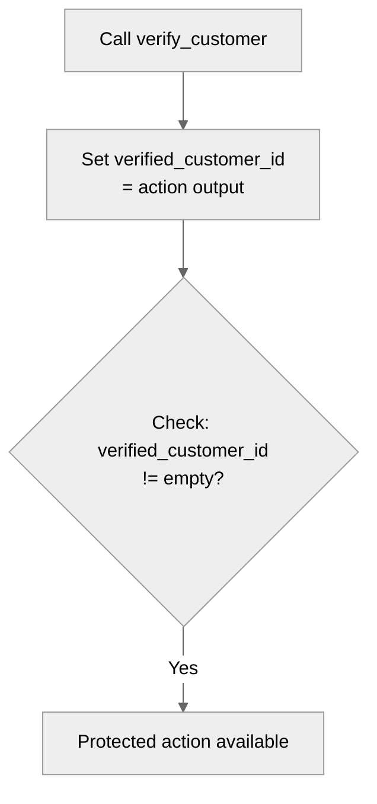

### Utility Call Nodes

Format: `[Call @utils.name]`

For escalation and system utilities.

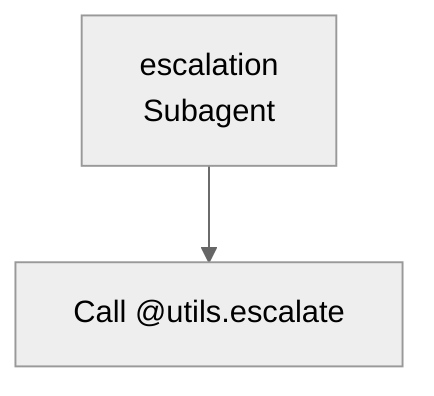

---

## Subagent Map Patterns

### Basic Subagent with Single Action

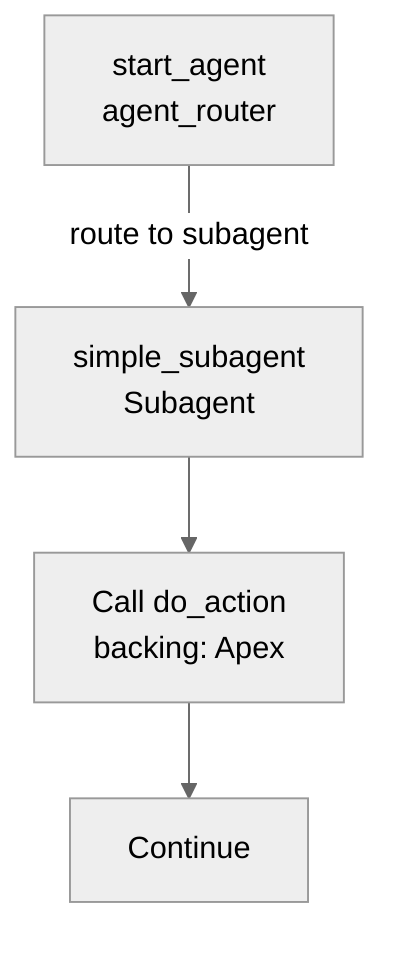

### Subagent with Gating Condition

`available when` expressions prevent protected action execution until trusted
preconditions are met.

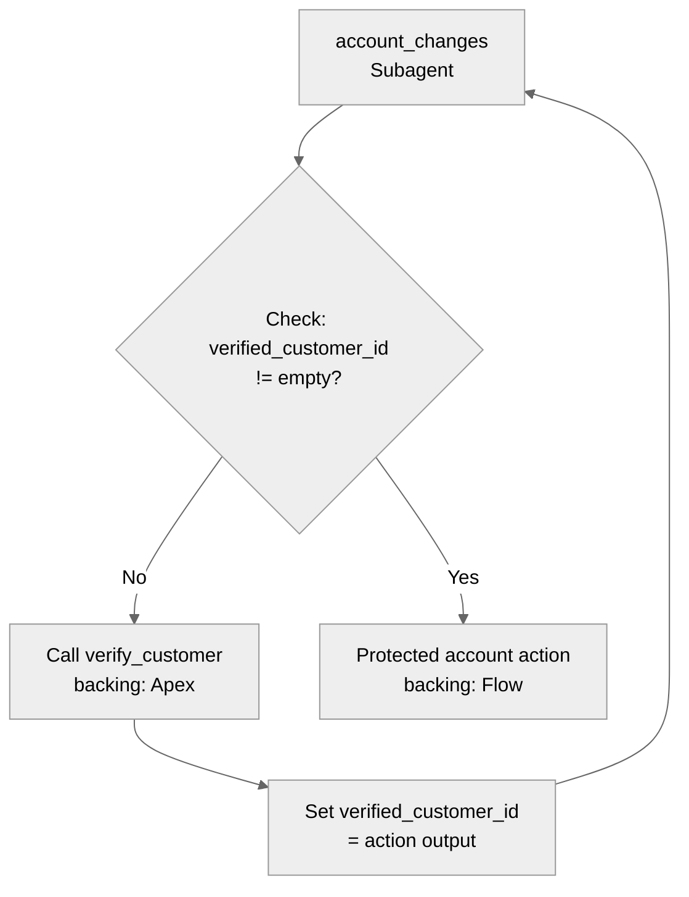

### Subagent with Conditional Instructions

Trusted action outputs or named invariants may control which instructions apply.
Do not add a variable solely to create a conditional prompt.

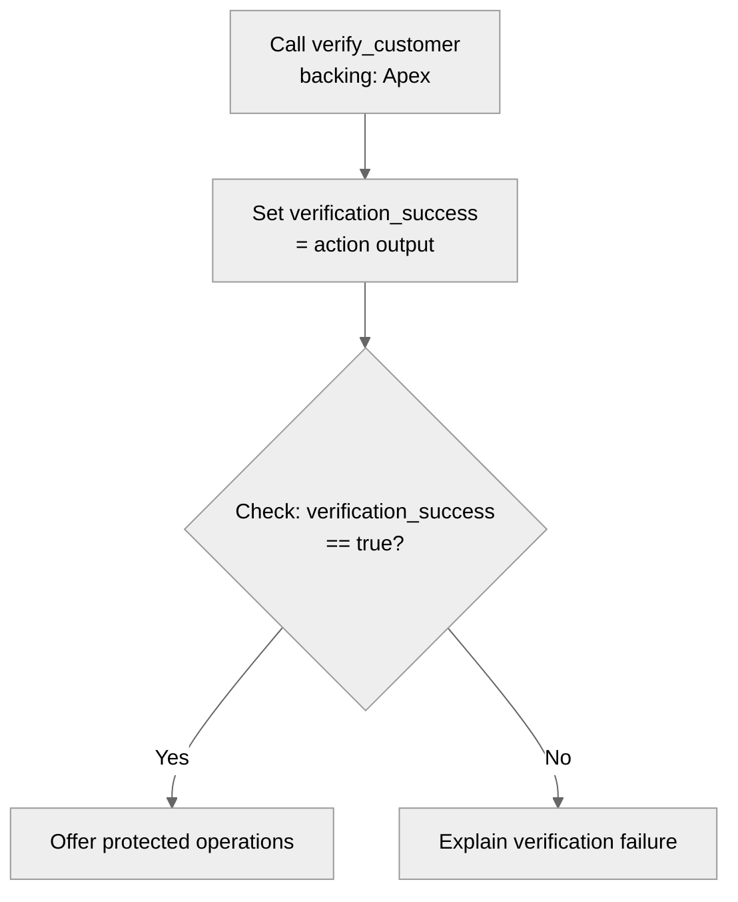

### Subagent Transitions

When logic determines a new subagent should be active.

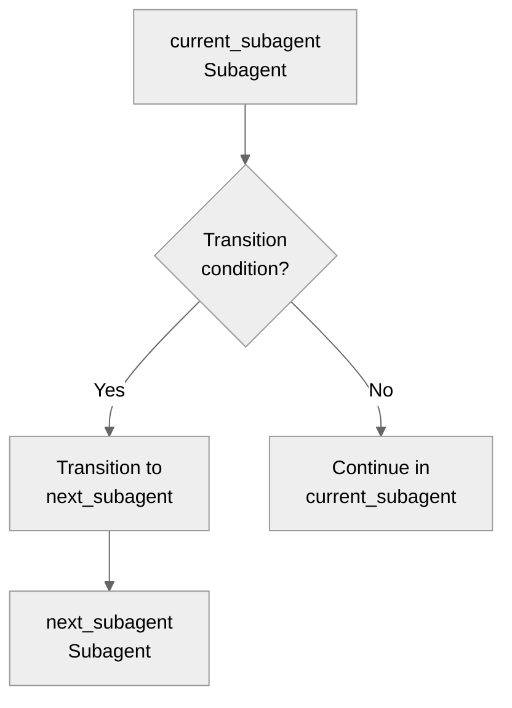

### Off-Topic and Escalation Routing

How the agent handles out-of-scope requests.

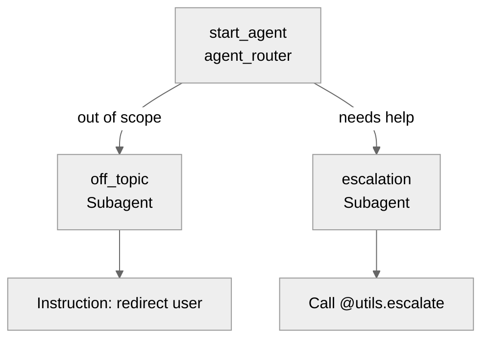

---

## Complete Example: Local_Info_Agent

This example demonstrates a complete Subagent Map for a guest information
agent. It needs no mutable state: surviving conversation history carries
follow-up context, and each action can slot-fill its input from the conversation.

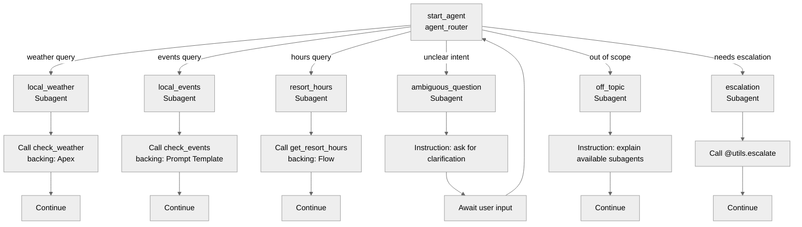

### Subagent Descriptions

**local_weather**: Provides weather information via Apex-backed action. No preconditions.

**local_events**: Uses the Prompt Template-backed action when the user asks for
events. Its conversational input is slot-filled from the current turn and
surviving history.

**resort_hours**: Calls a Flow-backed action and presents its returned hours.

**ambiguous_question**: No actions. Requests clarification and routes back to start_agent.

**off_topic**: No actions. Explains available subagents and continues conversation.

**escalation**: Calls @utils.escalate utility to route to human agent.

**start_agent agent_router**: Routes incoming user input to appropriate subagents based on intent.

---

## Validation Checklist

Before finalizing a Subagent Map diagram:

- [ ] Uses `graph TD` syntax
- [ ] Starts with `%%{init: {'theme':'neutral'}}%%`
- [ ] `start_agent` is node A at top; use `agent_router` only for a
      router-first multi-domain design
- [ ] Nodes use sequential capital letter IDs
- [ ] All subagents labeled with `[subagent_name Subagent]` format
- [ ] Action calls include backing type (Apex, Prompt Template, Flow)
- [ ] Required gating conditions are shown as decision nodes with `{Check: ...?}` format
- [ ] Every shown variable has a trusted writer and named runtime consumer
- [ ] Variable state changes that affect logic are labeled with `[Set variable = value]`
- [ ] Escalation uses `[Call @utils.escalate]` format
- [ ] All transition branches are labeled
- [ ] Diagram fits in 20-30 nodes
- [ ] Subagent routing from start_agent is clear
- [ ] Off-topic and escalation paths are visible
- [ ] Required conditional instruction logic is shown

---

## Anti-patterns

### Don't

- Use `graph LR` or other orientations instead of `graph TD`
- Place `start_agent` anywhere except top (node A)
- Label actions without backing type information
- Use ambiguous decision node labels (avoid `{Process?}`)
- Hide gating conditions in node descriptions instead of showing as decisions
- Omit variable state changes that affect downstream behavior
- Add variables for facts already available in surviving conversation history
- Show a state node without its trusted writer and named consumer
- Create subagent routing without labels on the decision logic
- Mix subagent nodes with action nodes at same level without clear containment
- Use custom color styling (breaks in dark mode)
- Leave off-topic and escalation paths out of diagram

### Do

- Keep the selected `start_agent` at the top
- Show all subagents reachable from start_agent
- Include backing type for every action call
- Make gating conditions explicit as decision nodes
- Show justified variable updates as separate nodes when they affect logic flow
- Label all transition branches
- Include off-topic and escalation subagents
- Show conditional instructions with decision nodes
- Use `%%{init: {'theme':'neutral'}}%%` for light/dark mode compatibility
- Focus diagram on subagent structure, not detailed action logic
