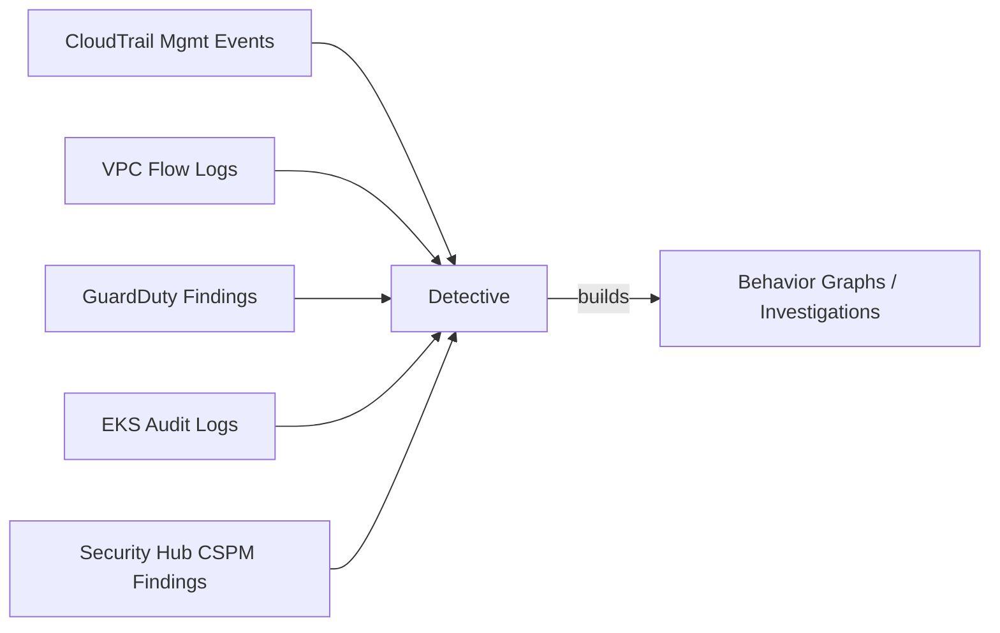

# Detective

- **Docs**: https://docs.aws.amazon.com/detective/latest/userguide/
- **Docs (llms.txt)**: https://docs.aws.amazon.com/detective/latest/userguide/llms.txt

Amazon Detective helps investigate security findings by building behavior graphs from CloudTrail management events, VPC Flow Logs, GuardDuty findings, EKS audit logs, and Security Hub CSPM findings. It does not generate findings — it provides investigation context through entity profiles, finding groups, and automated investigations. Detective does NOT support S3 data events. Detective uses AWS Security Finding Format (ASFF) for ingestion. It does not produce findings — it produces investigations.

## Data Sources

## Read-Only APIs

| API | Purpose |
|-----|---------|
| `detective:ListGraphs` | Discover behavior graphs |
| `detective:ListDatasourcePackages` | Check enabled data source packages |
| `detective:ListMembers` | List graph members |
| `detective:ListInvitations` | Check pending invitations |
| `detective:ListOrganizationAdminAccounts` | Identify delegated admin |
| `detective:DescribeOrganizationConfiguration` | Get org auto-enable settings |
| `detective:ListInvestigations` | List investigations with filters |
| `detective:GetInvestigation` | Get investigation details |
| `detective:ListIndicators` | List indicators for an investigation |

## Severity Scoring

Detective investigations use a severity score:

| Level | Description |
|-------|-------------|
| INFORMATIONAL | Investigation found no notable indicators |
| LOW | Minor anomalies detected |
| MEDIUM | Notable behavioral deviations |
| HIGH | Significant threat indicators |
| CRITICAL | Strong evidence of compromise |

**Key notes:**

- Investigation severity is based on the combination and weight of indicators found
- Indicator types: TTP_OBSERVED, IMPOSSIBLE_TRAVEL, FLAGGED_IP_ADDRESS, NEW_GEOLOCATION, NEW_ASO, NEW_USER_AGENT, RELATED_FINDING, RELATED_FINDING_GROUP
- Detective does not generate findings — it produces investigations and finding groups from ingested data

**Documentation:** https://docs.aws.amazon.com/detective/latest/userguide/investigations-report.html

## Service Notes

- **Detective**: Ingests Security Hub CSPM findings in ASFF format but produces investigations in its own proprietary format. Does NOT support S3 data events. Focuses on investigations and finding groups, not findings.

## Output Sensitivity

Detective investigation details (`GetInvestigation`, `ListIndicators`) contain:

- AWS account IDs and IAM principal ARNs under investigation
- IP addresses flagged as suspicious (FLAGGED_IP_ADDRESS indicators)
- Geolocation data (NEW_GEOLOCATION, IMPOSSIBLE_TRAVEL indicators)
- User agent strings and ASN details
- Related GuardDuty finding IDs and Security Hub finding references

Present investigation status/severity summary first. Offer full indicator details on request.
