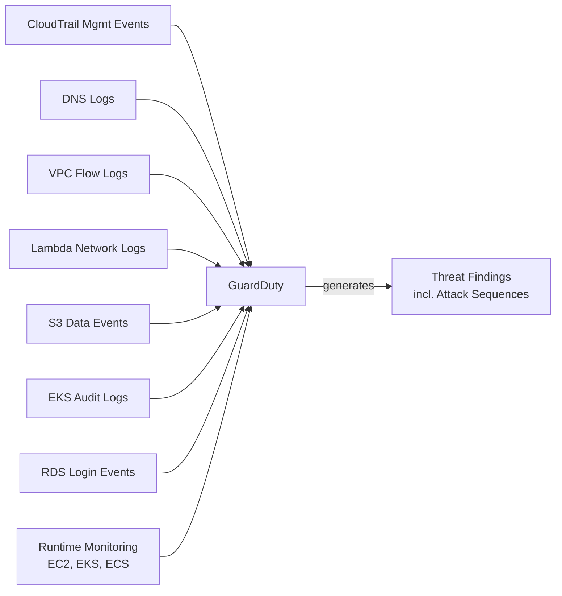

# GuardDuty

- **Docs**: https://docs.aws.amazon.com/guardduty/latest/ug/
- **Docs (llms.txt)**: https://docs.aws.amazon.com/guardduty/latest/ug/llms.txt

Amazon GuardDuty is a threat detection service that continuously monitors AWS accounts and workloads for malicious activity. It analyzes CloudTrail management events, VPC Flow Logs, DNS logs, S3 data events, EKS audit logs, RDS login events, and runtime activity (EC2, EKS, ECS containers) to identify threats ranging from reconnaissance to active compromise. Findings are in GuardDuty's proprietary JSON format and are also sent to Security Hub in OCSF format.

## Data Sources

## Read-Only APIs

| API | Purpose |
|-----|---------|
| `guardduty:ListDetectors` | Discover detector IDs in the account |
| `guardduty:GetDetector` | Get detector configuration and feature status |
| `guardduty:ListMalwareProtectionPlans` | Check Malware Protection for S3 plans |
| `guardduty:ListPublishingDestinations` | List configured publishing destinations |
| `guardduty:DescribePublishingDestination` | Get publishing destination details |
| `guardduty:ListIPSets` | List trusted IP sets |
| `guardduty:ListThreatIntelSets` | List threat intelligence sets |
| `guardduty:ListFilters` | List suppression filters |
| `guardduty:ListOrganizationAdminAccounts` | Identify delegated admin accounts |
| `guardduty:DescribeOrganizationConfiguration` | Get org auto-enable settings |
| `guardduty:GetCoverageStatistics` | Get coverage summary by status |
| `guardduty:ListMembers` | List member accounts |
| `guardduty:GetMemberDetectors` | Get member detector feature status |
| `guardduty:GetFindingsStatistics` | Get finding counts by severity |
| `guardduty:ListFindings` | List finding IDs with filters |
| `guardduty:GetFindings` | Get finding details (batch, max 50) |

## Severity Scoring

GuardDuty uses a numeric 0–10 scale mapped to severity levels:

| Level | Score Range | Description |
|-------|------------|-------------|
| Low | 1.0 – 3.9 | Suspicious activity that did not compromise resources |
| Medium | 4.0 – 6.9 | Suspicious activity deviating from normal behavior |
| High | 7.0 – 8.9 | Resource compromised and actively used for unauthorized purposes |
| Critical | 9.0 – 10.0 | Attack Sequences — correlated multi-step attacks across multiple signals |

**Key notes:**

- Attack Sequence findings (type prefix `AttackSequence:`) are always Critical severity
- Severity is assigned by GuardDuty based on threat intelligence and behavior analysis
- Severity may differ for the same finding type depending on context (e.g., known malicious IP vs unknown)

**Documentation:** https://docs.aws.amazon.com/guardduty/latest/ug/guardduty_findings-severity.html

## Service Notes

- **EKS_RUNTIME_MONITORING**: Legacy feature flag — only relevant for customers who enabled it before unified RUNTIME_MONITORING. Treat as edge case.
- **GuardDuty Malware Protection for S3**: On-demand scanning (not continuous like EC2 malware scanning). Checked via `list-malware-protection-plans`.

## Output Sensitivity

GuardDuty finding details (`GetFindings`) contain:

- IP addresses (actor and target)
- Network connection details (ports, protocols, direction)
- AWS account IDs and resource ARNs
- Threat intelligence source details
- DNS query names
- S3 object keys and bucket names
- Process and container details (runtime findings)

Present severity/type summary first. Offer full finding body on request.
