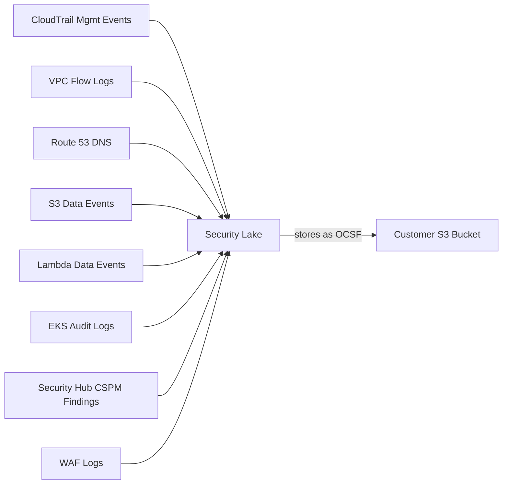

# Security Lake

- **Docs**: https://docs.aws.amazon.com/security-lake/latest/userguide/
- **Docs (llms.txt)**: https://docs.aws.amazon.com/security-lake/latest/userguide/llms.txt

Amazon Security Lake centralizes security data from AWS services and third-party sources into a purpose-built data lake in OCSF format. It ingests CloudTrail events, VPC Flow Logs, Route 53 DNS, S3/Lambda data events, EKS audit logs, Security Hub CSPM findings, and WAF logs into customer-owned S3 buckets for analysis and long-term retention.

## Data Sources

## Read-Only APIs

| API | Purpose |
|-----|---------|
| `securitylake:ListDataLakes` | Check data lake enablement per region |
| `securitylake:GetDataLakeSources` | Get configured AWS sources |
| `securitylake:ListLogSources` | List log sources with detail |
| `securitylake:ListSubscribers` | List subscribers |
| `securitylake:GetSubscriber` | Get subscriber details |
| `securitylake:GetDataLakeOrganizationConfiguration` | Get org auto-enable settings |
| `securitylake:ListDataLakeExceptions` | List account/region exceptions |
| `cloudwatch:GetMetricStatistics` | Get per-source ingestion volume metrics (optional, on request) |

## Severity Scoring

Security Lake does not generate findings or assign severity scores. It stores security data from other services in OCSF format. Severity scoring is determined by the originating service (GuardDuty, Inspector, etc.).

## Service Notes

- **Security Lake**: Includes optional volume/metrics check (`get-metric-statistics` via CloudWatch) only when user asks about ingestion volume. Do not query CloudWatch metrics by default.

## Output Sensitivity

Security Lake configuration APIs reveal:

- Data lake S3 bucket names and KMS key ARNs per region
- Subscriber identities, access types, and source subscriptions
- Organization account coverage and exception details
- Log source configuration across accounts and regions

Present source enablement and subscriber summary first. Offer full configuration details on request.
