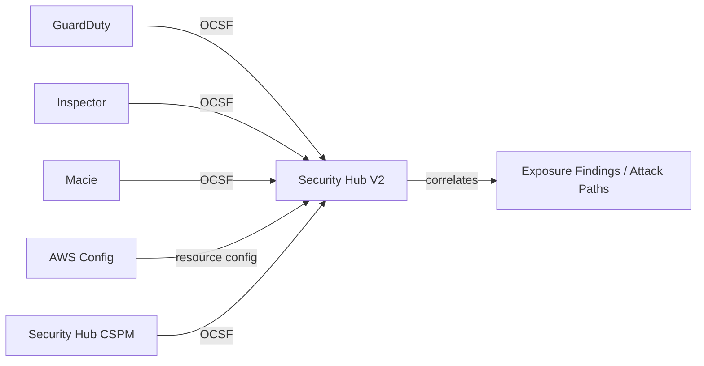

# AWS Security Services Overview

## Service Summary

| Service | Purpose | Native Format | CLI Namespace |
|---------|---------|---------------|---------------|
| GuardDuty | Threat detection | GuardDuty JSON | `aws guardduty` |
| Inspector | Vulnerability management | Inspector JSON | `aws inspector2` |
| Macie | Sensitive data discovery | Macie JSON | `aws macie2` |
| Detective | Investigation | Proprietary | `aws detective` |
| Security Hub | Unified security dashboard, exposure analysis | OCSF | `aws securityhub` (APIs suffixed with `-v2`) |
| Security Hub CSPM | Posture management | ASFF | `aws securityhub` (APIs without `-v2` suffix) |
| Security Lake | Centralized security log storage | OCSF | `aws securitylake` |

## Service-to-Service Integrations

Security Hub V2 (OCSF) is the preferred unified dashboard for AWS security services. It ingests and normalizes findings from Security Hub CSPM, Inspector, GuardDuty, and more into OCSF format, correlates them into exposure findings and attack paths, and provides a single pane of glass for security posture. Select third-party partners in the Security Hub Extended program can import OCSF findings via `BatchImportFindingsV2`.

### Finding Flow



Security Hub CSPM (V1) also receives findings from the same services in ASFF format and generates compliance findings against standards (FSBP, CIS, PCI-DSS, NIST). Third-party tools can import findings via `BatchImportFindings` (ASFF only).

Detective builds behavior graphs from GuardDuty findings, CloudTrail events, VPC Flow Logs, EKS audit logs, and Security Hub CSPM findings for investigation.

Security Lake stores security data from CloudTrail, VPC Flow Logs, Route 53 DNS, S3/Lambda data events, EKS audit logs, Security Hub CSPM findings, and WAF logs in OCSF format in customer-owned S3 buckets.

## Security Hub API Suffix Convention

Both Security Hub and Security Hub CSPM share the `aws securityhub` CLI namespace:

| Category | Convention | Examples |
|----------|-----------|----------|
| Security Hub APIs | Suffixed with `-v2` | `get-findings-v2`, `describe-security-hub-v2`, `list-aggregators-v2` |
| Security Hub CSPM APIs | No suffix | `get-findings`, `describe-hub`, `get-enabled-standards`, `list-members` |

Skills MUST NOT cross API namespaces.

## Membership Models

| Service | Organizations (delegated admin) | Invitation-based |
|---------|:----:|:----:|
| GuardDuty | ✅ (recommended) | ✅ |
| Inspector | ✅ (required) | ❌ |
| Macie | ✅ (recommended) | ✅ |
| Detective | ✅ (recommended) | ✅ |
| Security Hub | ✅ (required) | ❌ |
| Security Hub CSPM | ✅ (recommended) | ✅ |
| Security Lake | ✅ (required) | ❌ |

For invitation-model services, each service has its own `list-members` API in its CLI namespace (e.g., `aws guardduty list-members`, `aws macie2 list-members`, `aws detective list-members`). These return accounts enrolled in that specific service — both organization-linked and invitation-linked members. This is distinct from `aws organizations list-accounts` which returns all accounts in the organization regardless of service enrollment.

For Organizations-only services (Security Hub, Inspector, Security Lake), the account denominator comes from `aws organizations list-accounts`.

## Admin Discovery

### Universal Approach (Organizations API)

Works from any account with Organizations read access:

```bash
aws organizations list-delegated-administrators \
  --service-principal <service>.amazonaws.com
```

Service principals:

- `guardduty.amazonaws.com`
- `inspector2.amazonaws.com`
- `securityhub.amazonaws.com`
- `macie.amazonaws.com`
- `detective.amazonaws.com`
- `securitylake.amazonaws.com`

### Per-Service APIs

| Service | API |
|---------|-----|
| GuardDuty | `aws guardduty list-organization-admin-accounts` |
| Inspector | `aws inspector2 list-delegated-admin-accounts` |
| Security Hub | `aws securityhub list-organization-admin-accounts` |
| Macie | `aws macie2 list-organization-admin-accounts` |
| Detective | `aws detective list-organization-admin-accounts` |
| Security Lake | `aws organizations list-delegated-administrators --service-principal securitylake.amazonaws.com` |

## Cross-service APIs

APIs used across multiple security service workflows.

### AWS Organizations

| API | Purpose |
|-----|---------|
| `organizations:ListAccounts` | Get all org accounts (coverage denominator) |
| `organizations:ListDelegatedAdministrators` | Discover delegated admin for a service |

### Amazon S3 (bucket verification)

| API | Purpose |
|-----|---------|
| `s3:GetBucketEncryption` | Verify bucket encryption configuration (used by Macie export, Security Lake) |
