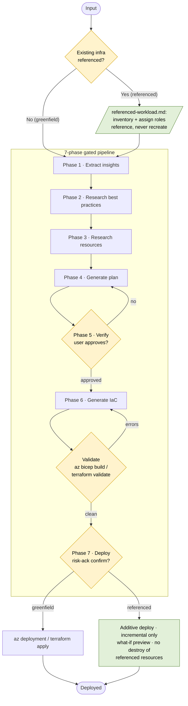

# Azure Enterprise Infra Planner

## When to Use This Skill

Activate this skill when user wants to:
- Plan enterprise Azure infrastructure from a workload or architecture description
- Architect a landing zone, hub-spoke network, or multi-region topology
- Design networking infrastructure: VNets, subnets, firewalls, private endpoints, VPN gateways
- Plan identity, RBAC, and compliance-driven infrastructure
- Generate Bicep or Terraform for subscription-scope or multi-resource-group deployments
- Plan disaster recovery, failover, or cross-region high-availability topologies

## Quick Reference

| Property | Details |
|---|---|
| MCP tools | `insights_get`, `get_azure_bestpractices_get`, `wellarchitectedframework_serviceguide_get`, `microsoft_docs_fetch`, `microsoft_docs_search`, `bicepschema_get` |
| CLI commands | `az deployment group create`, `az bicep build`, `az resource list`, `terraform init`, `terraform plan`, `terraform validate`, `terraform apply`, `checkov` |
| Output schema | [schema.md](references/schema.md) |
| Key references | [workflow.md](references/workflow.md), [waf-checklist.md](references/waf-checklist.md), [resources/](references/resources/README.md), [constraints/](references/constraints/README.md) |

## Workflow (Start Here)

Follow the step-by-step instructions in [workflow.md](references/workflow.md) to execute the 7 phases of infrastructure planning and provisioning.

## Architecture

The skill runs a **7-phase, gated pipeline**. Input is triaged into one of two flows:

- **Greenfield** — only new requirements; run the phases straight through.
- **Referenced (brownfield)** — the user supplies something that already exists (a live resource /
  resource group / subscription, IaC or an infra plan, or a requirements doc). The same phases run, plus
  [referenced-workload.md](references/referenced-workload.md): existing resources are inventoried and
  referenced (never recreated), the new workload is wired into them, and **Phase 7 deploys additively**
  (incremental only — never modifying or destroying the referenced resources).

Every phase advances only after its gate passes. Phase 5 requires explicit user approval; **Phase 6 is a
hardened, self-verifying gate** — the generated IaC must be secure-by-default, pass local validation
(`az bicep build` / `terraform validate`) with zero errors, pass a `checkov` security scan with no
unresolved high/critical findings, and the skill must **show the command output** and emit a completion
self-check before advancing; Phase 7 requires an explicit, risk-acknowledged deploy confirmation.

**Artifacts** (written under `<project-root>/`): `.azure/insights.json` (Phase 1),
`.azure/infrastructure-plan.json` (Phase 4, status `draft`→`approved`→`deployed`), and
`infra/main.bicep` + `infra/modules/*` or `infra/main.tf` + `infra/modules/**` (Phase 6).

## MCP Tools

| Tool | Purpose |
|------|---------|
| `insights_get` | Retrieve insights about the user's existing Azure environment to guide planning decisions |
| `get_azure_bestpractices_get` | Azure best practices for code generation, operations, and deployment |
| `wellarchitectedframework_serviceguide_get` | WAF service guide for a specific Azure service |
| `microsoft_docs_search` | Search Microsoft Learn for relevant documentation chunks |
| `microsoft_docs_fetch` | Fetch full content of a Microsoft Learn page by URL |
| `bicepschema_get` | Bicep schema definition for any Azure resource type (latest API version) |

## Error Handling

| Error | Cause | Fix |
|---|---|---|
| MCP tool error or not available | Tool call timeout, connection error, or tool doesn't exist | Retry once; fall back to reference files and notify user if unresolved |
| Plan approval missing | `meta.status` is not `approved` | Stop and prompt user for approval before IaC generation or deployment |
| IaC validation failure | `az bicep build` or `terraform validate` returns errors | Fix the generated code and re-validate; notify user if unresolved |
| Pairing constraint violation | Incompatible SKU or resource combination | Fix in plan before proceeding to IaC generation |
| Infra plan or IaC files not found | Files written to wrong location or not created | Verify files exist at `<project-root>/.azure/` and `<project-root>/infra/`; if missing, re-create the files by following [workflow.md](references/workflow.md) exactly |