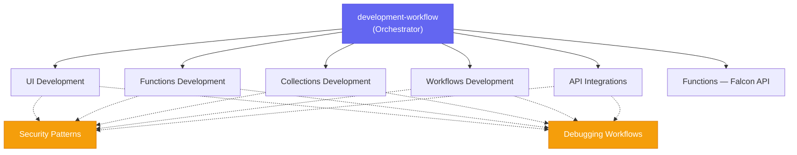

# Falcon Foundry Skills


[](https://github.com/CrowdStrike/foundry-skills/actions/workflows/main.yml)

AI coding assistant skills for building [CrowdStrike Falcon Foundry](https://www.crowdstrike.com/en-us/platform/next-gen-siem/falcon-foundry/) apps. Build Foundry apps from a natural language prompt — API integrations, workflows, UI pages, functions, and collections — all scaffolded with the Foundry CLI and deployed to the Falcon console.

## Getting Started

### Prerequisites

- **Foundry CLI**: Install with `brew tap crowdstrike/foundry-cli && brew install crowdstrike/foundry-cli/foundry` (macOS/Linux) or [download for Windows](https://assets.foundry.crowdstrike.com/cli/latest/foundry_Windows_x86_64.zip)
- **CrowdStrike Account**: With Falcon Foundry access
- **Authentication**: Run `foundry login` to authenticate
- **AI Coding Assistant**: Claude Code, Codex, Copilot CLI, Cursor, Gemini CLI, or any tool that supports loading reference documentation

### Claude Code (Tested)

Install from the [Anthropic Plugin Marketplace](https://github.com/anthropics/claude-plugins-official):

```
/plugin install crowdstrike-falcon-foundry
```

Or register this repo as a plugin marketplace, then install:

```
/plugin marketplace add CrowdStrike/foundry-skills
/plugin install crowdstrike-falcon-foundry@foundry-marketplace
```

Or install from a local clone for development:

```bash
git clone https://github.com/CrowdStrike/foundry-skills.git
claude --plugin-dir /path/to/foundry-skills
```

The `--plugin-dir` flag loads the plugin for that session. To make it permanent, add it to your `.claude/settings.json`:

```json
{
  "plugins": ["/path/to/foundry-skills"]
}
```

Changes to skill files take effect on the next Claude Code session — no reinstall needed.

### Codex (Experimental)

Codex discovers skills from `~/.agents/skills/`. Clone and symlink:

```bash
git clone https://github.com/CrowdStrike/foundry-skills.git
mkdir -p ~/.agents/skills
ln -s /path/to/foundry-skills/skills ~/.agents/skills/foundry-skills
```

Restart Codex to discover the skills. See the [Codex skills docs](https://developers.openai.com/codex/skills) for details.

### Copilot CLI (Experimental)

Copilot CLI shares the `~/.agents/skills/` discovery directory with Codex:

```bash
git clone https://github.com/CrowdStrike/foundry-skills.git
mkdir -p ~/.agents/skills
ln -s /path/to/foundry-skills/skills ~/.agents/skills/foundry-skills
```

Restart Copilot CLI to discover the skills.

### Cursor (Experimental)

Add a rule file to your project's `.cursor/rules/` directory:

```bash
git clone https://github.com/CrowdStrike/foundry-skills.git
mkdir -p .cursor/rules
cat > .cursor/rules/foundry-skills.mdc << 'EOF'
---
description: Use when building Falcon Foundry apps — API integrations, workflows, UI pages, functions, collections
alwaysApply: false
---

Reference the Falcon Foundry skills in /path/to/foundry-skills/skills/ for building Foundry apps.
The primary orchestrator is development-workflow/SKILL.md.
EOF
```

Cursor activates the rule automatically when your prompt matches the description.

### Gemini CLI (Experimental)

Link the skills so Gemini discovers them as native Agent Skills:

```bash
git clone https://github.com/CrowdStrike/foundry-skills.git
gemini skills link /path/to/foundry-skills/skills --scope user
```

This creates symlinks in `~/.gemini/skills/` so all skills are available in every workspace. Use `--scope workspace` to install into the current project's `.gemini/skills/` instead. Verify with `gemini skills list` or `/skills list` inside a session.

Gemini activates the right skill on demand based on your prompt.

### Other Tools

These skills are plain markdown files. Any AI coding assistant that can read local files can use them. See `AGENTS.md` for the full development guide, or point your tool at the `skills/` directory and start with `development-workflow/SKILL.md` as the entry point.

## Usage

### Example prompt

This prompt exercises the full skill set — API integration, workflow, and UI:

```
Can you create a Falcon Foundry app for me that has an Okta API integration
with openapi? Share its listusers endpoint with Falcon Fusion SOAR. Then,
create a workflow that can be run on-demand to email or print the list of
users. Finally, create a UI extension that calls the listusers endpoint and
displays the results.
```

### How skill routing works

The skills include hooks that ensure the right skills get used:

1. **`UserPromptSubmit` hook** — Matches an action verb paired with a Foundry noun — e.g., "create a foundry app". Explicit CLI commands and skill requests also trigger it.

2. **`PreToolUse` hook** — When Foundry intent is detected, injects a non-blocking advisory reminder to use the Foundry workflow skill. Claude can still use all tools normally. If [superpowers](https://github.com/obra/superpowers) is installed, also intercepts `superpowers:brainstorming` and redirects to the Foundry workflow skill.

3. **`PreToolUse` hook (CLI guard)** — Validates all Bash commands to ensure Foundry CLI commands include `--no-prompt` flag (prevents `Error: EOF` failures) and blocks manual directory creation for app structure (prevents invalid `manifest.yml`). This enforcement is automatic and transparent — you'll only see it when it catches an error.

Hooks observe prompts and tool I/O to keyword-match Foundry-specific actions; no data leaves the session.

## Skills

| Skill | Purpose |
|-------|---------|
| `development-workflow` | Primary orchestrator — coordinates the full app lifecycle |
| `api-integrations` | OpenAPI spec import, auth scheme configuration, SOAR sharing |
| `functions-falcon-api` | Calling Falcon APIs from within Functions (OAuth, SDKs) |
| `workflows-development` | YAML workflow creation, Falcon Fusion SOAR actions and triggers |
| `ui-development` | React/Vue UI pages with Shoelace components and Falcon theming |
| `functions-development` | Go/Python serverless functions with CrowdStrike SDK |
| `collections-development` | JSON Schema data modeling and CRUD operations |
| `security-patterns` | OAuth scoping, input validation, content security |
| `debugging-workflows` | Systematic troubleshooting for CLI, manifest, and deployment issues |
| `e2e-testing` | End-to-end testing with `@crowdstrike/foundry-playwright` |

## Architecture

The skills follow a hub-and-spoke pattern. `development-workflow` is the orchestrator that parses your requirements, runs CLI commands for scaffolding, and delegates capability-specific implementation to sub-skills:



## Use Cases

The `use-cases/` directory contains real-world implementation patterns extracted from [CrowdStrike Tech Hub](https://www.crowdstrike.com/tech-hub/ng-siem/) blog posts:

- API pagination strategies
- Detection enrichment with UI extensions
- LogScale data ingestion from functions
- Lookup table enrichment with 3rd-party data
- Custom SOAR actions
- NGSIEM query export to CSV/JSON
- Publishing certified apps
- And more (see [use-cases/README.md](use-cases/README.md))

## Recommended Companion: Superpowers

These skills pair well with [obra/superpowers](https://github.com/obra/superpowers), which adds structured planning, TDD discipline, and code review workflows. Foundry skills handle the Foundry-specific CLI and platform knowledge while superpowers provides general software engineering best practices.

See [skills/development-workflow/references/superpowers-integration.md](skills/development-workflow/references/superpowers-integration.md) for details on how they work together.

**Note:** The without-superpowers path produces more reliable results because the Foundry skill has full control from the start. Superpowers brainstorming loads first and creates a plan before the Foundry skills are read, which may not follow Foundry-specific patterns.

## Foundry CLI Quick Reference

```bash
foundry login                                                    # Authenticate
foundry apps create --name "My App" --no-prompt --no-git         # Create app
foundry api-integrations create --name "X" --spec /tmp/spec.json --no-prompt  # Add API integration
foundry ui pages create --name "X" --from-template React --no-prompt          # Add UI page
foundry ui extensions create --name "X" --from-template React --sockets "activity.detections.details" --no-prompt  # Add UI extension
foundry functions create --name "X" --language python --no-prompt              # Add function
foundry collections create --name "X" --schema /tmp/schema.json --no-prompt   # Add collection
foundry workflows create --name "X" --spec /tmp/workflow.yaml --no-prompt     # Add workflow
foundry apps deploy --change-type Patch --change-log "msg" --no-prompt  # Deploy to cloud
foundry apps release                                             # Release to catalog
```

## Troubleshooting

### Skills not invoked

If Claude doesn't use Foundry skills automatically, phrase your prompt with a clear action verb and Foundry noun (e.g., "create a foundry app", "fix the foundry function"). You can also say "Use Foundry skills" at any point to redirect.

### CLI authentication

```bash
foundry profile active    # Check current profile
foundry login             # Re-authenticate
foundry profile list      # List all profiles
```

### Deployment failures

1. Validate immediately after `foundry api-integrations create` (`foundry apps validate --no-prompt`) — Foundry's server-side OpenAPI parser is stricter than `redocly lint` and may reject large vendor specs
2. Run `foundry apps deploy` from the project root directory
3. Check the `debugging-workflows` skill for systematic troubleshooting

## Testing

Three scripts validate skill changes at different levels. All require macOS or Linux (bash).

**Tip:** Wrap long-running tests with `caffeinate -i` to prevent macOS from sleeping mid-run:

```bash
caffeinate -i ./run-ab-test.sh --fresh 5
```

### Hook tests

```bash
./test-hooks.sh
```

Unit tests for the three hook scripts (skill router, superpowers bridge, CLI guard). Fast, no API calls, no Foundry CLI needed. Run after any hook change.

### Skill test (single run)

```bash
./test-skill.sh                    # 5 runs against local plugin
./test-skill.sh --runs 1           # Quick single run
./test-skill.sh --plugin-dir .     # Explicit plugin path (default is ".")
```

Runs the example Okta prompt end-to-end: scaffolds an app, deploys it, and scores the result. Each run takes 5-10 minutes and costs ~5-10M tokens. Results go to `/tmp/foundry-skill-test/`.

### Verify apps (after test-skill)

```bash
SKIP_BROWSER=1 ./verify-apps.sh                           # Phase 1 only: spec analysis + release
OKTA_DOMAIN=... OKTA_API_KEY=... ./verify-apps.sh          # Phase 1 + Phase 2: browser install/uninstall
```

Verifies apps created by `test-skill.sh` or A/B tests — analyzes OpenAPI specs, releases apps, and optionally installs them in the Falcon console via browser automation.

```bash
./verify-apps.sh                   # Verify test-skill.sh runs (default: /tmp/foundry-skill-test/)
./verify-apps.sh --green           # Verify GREEN phase of A/B test
./verify-apps.sh --dir /path       # Verify runs in a specific directory
```

### A/B test (main vs local branch)

```bash
./run-ab-test.sh                   # 5 runs per phase (baseline: main)
./run-ab-test.sh 1                 # Quick single run per phase
./run-ab-test.sh 5 --ref v1.0.0    # Compare against a specific release tag
./run-ab-test.sh --no-skill        # No plugin vs local plugin (1 run each)
```

Compares baseline ref skills (RED) against local branch skills (GREEN). The `--ref` flag accepts any git ref (tag, branch, commit SHA) and defaults to `main`. Results saved to `/tmp/foundry-skill-ab/baseline.json` and `/tmp/foundry-skill-ab/optimized.json`.

## Contributing

The skills improve every time someone uses them to build an app. If you hit a rough edge or find that Claude struggles with a particular pattern, you can teach the skills to handle it better.

### Use the skills, then improve them

1. Clone this repo and configure your AI coding assistant (see [Getting Started](#getting-started))
2. Try a multi-capability prompt (see [Example prompt](#example-prompt) above)
3. Watch for patterns where Claude struggles, retries, or produces incorrect output
4. At the end of the session, ask Claude to fix the skills directly:

```
What did you learn from this session that could improve the Foundry skills?
Clone https://github.com/CrowdStrike/foundry-skills.git,
create a branch, update the skills with this knowledge, and
create a PR on GitHub.
```

Claude handles the branch, skill edits, and PR creation. Even when Claude struggles to build an app, it usually figures it out eventually. This step captures that learning so the next session is faster and uses fewer tokens.

### Development workflow

1. Clone the repo (see [Getting Started](#getting-started))
2. Edit skill files in `skills/*/SKILL.md`
3. Run `./test-hooks.sh` to validate hooks
4. Test with `./test-skill.sh --runs 1` for a quick end-to-end check
5. Run `./run-ab-test.sh 1` to compare against main before opening a PR

### Release process

Releasing these skills is easy! Just run the following command:

```bash
./release.sh
```

This walks you through a semantic version bump (major/minor/patch), updates the version in `plugin.json`, `marketplace.json`, README badge, all `SKILL.md` files, and the CHANGELOG date, then creates a release branch and PR. After the PR is approved and merged, create a draft GitHub release to tag main:

```bash
gh release create v<version> --target main --title "v<version>" --generate-notes --draft
```

This generates release notes from merged PRs and saves them as a draft. Review and edit the notes at [github.com/CrowdStrike/foundry-skills/releases](https://github.com/CrowdStrike/foundry-skills/releases), then click **Publish** when ready.

After publishing the release, notify Anthropic of the new tag and SHA so they can update the marketplace pin. Do not open PRs to `anthropics/claude-plugins-official` or re-submit through the plugin submission form.

## License

See [LICENSE](LICENSE) for details.
