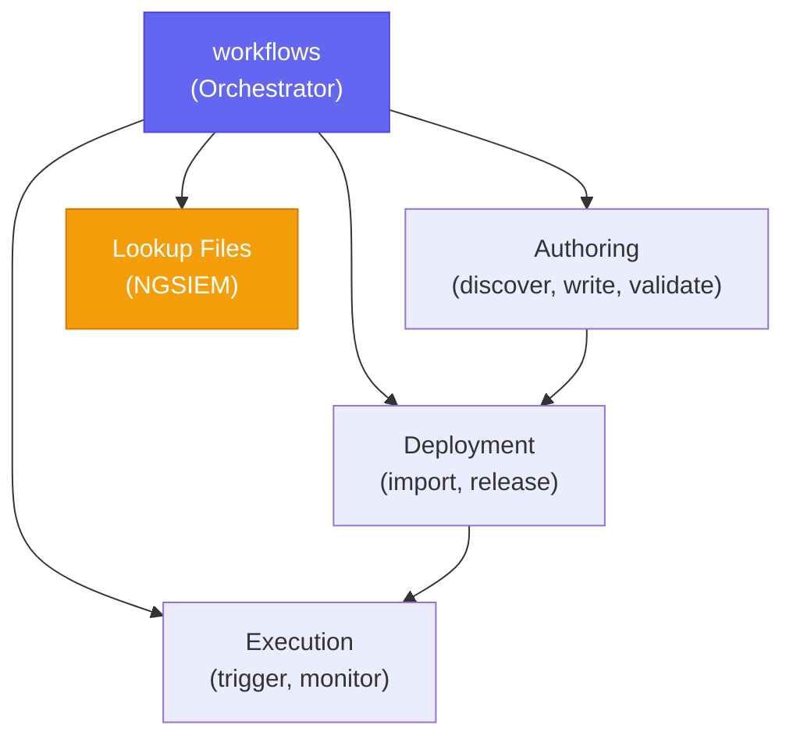

# Falcon Fusion Skills

[](https://github.com/CrowdStrike/fusion-skills/releases/tag/v1.0.1)
[](https://github.com/CrowdStrike/fusion-skills/actions/workflows/main.yml)

AI coding assistant skills for building [CrowdStrike Falcon Fusion](https://www.crowdstrike.com/en-us/platform/next-gen-siem/falcon-fusion/) workflows. Go from a natural language prompt to a working Fusion workflow — discover real action IDs from the live API, author the YAML, validate it against the platform schema, import it to a CID, and trigger and monitor its execution.

> `fusion-skills` is a community-driven, open source project, not a CrowdStrike product. As such, it carries no formal support, expressed or implied.

## Getting Started

### Prerequisites

- **CrowdStrike Account** with the **Workflow** API scope (plus **NGSIEM Lookup Files** for the lookup-files skill)
- **AI Coding Assistant**: Claude Code, Codex, Copilot CLI, Cursor, Antigravity CLI, or any tool that can read local reference documentation

### Claude Code (Tested)

Install from the [Anthropic Plugin Marketplace](https://github.com/anthropics/claude-plugins-official):

```
/plugin install crowdstrike-falcon-fusion
```

Or register this repo as a plugin marketplace, then install:

```
/plugin marketplace add CrowdStrike/fusion-skills
/plugin install crowdstrike-falcon-fusion@fusion-marketplace
```

Or install from a local clone for development:

```bash
git clone https://github.com/CrowdStrike/fusion-skills.git
claude --plugin-dir /path/to/fusion-skills
```

The `--plugin-dir` flag loads the plugin for that session. To make it permanent, add it to your `.claude/settings.json`:

```json
{
  "plugins": ["/path/to/fusion-skills"]
}
```

Changes to skill files take effect on the next Claude Code session — no reinstall needed.

#### Credentials

Configure credentials once. Run the interactive setup skill — it writes a profile to `~/.cache/crowdstrike-falcon-fusion/credentials.toml`:

```
/crowdstrike-falcon-fusion:setup
```

For CI or a one-off override, set environment variables instead:

```bash
export FALCON_CLIENT_ID=your_client_id_here
export FALCON_CLIENT_SECRET=your_client_secret_here
# export FALCON_BASE_URL=https://api.crowdstrike.com  # US-1 (default)
```

Credentials come from environment variables (checked first) or the TOML profile, and are never hardcoded. Verify your setup:

```bash
python common/scripts/auth.py
```

### Codex (Experimental)

Codex discovers skills from `~/.agents/skills/`. Clone and symlink:

```bash
git clone https://github.com/CrowdStrike/fusion-skills.git
mkdir -p ~/.agents/skills
ln -s /path/to/fusion-skills/skills ~/.agents/skills/fusion-skills
```

Restart Codex to discover the skills. See the [Codex skills docs](https://learn.chatgpt.com/docs/build-skills) for details.

### Copilot CLI (Experimental)

Copilot CLI shares the `~/.agents/skills/` discovery directory with Codex:

```bash
git clone https://github.com/CrowdStrike/fusion-skills.git
mkdir -p ~/.agents/skills
ln -s /path/to/fusion-skills/skills ~/.agents/skills/fusion-skills
```

Restart Copilot CLI to discover the skills.

### Cursor (Experimental)

Add a rule file to your project's `.cursor/rules/` directory:

```bash
git clone https://github.com/CrowdStrike/fusion-skills.git
mkdir -p .cursor/rules
cat > .cursor/rules/fusion-skills.mdc << 'EOF'
---
description: Use when building Falcon Fusion workflows — action discovery, YAML authoring, validation, deployment, execution
alwaysApply: false
---

Reference the Fusion skills in /path/to/fusion-skills/skills/ for building Fusion workflows.
The primary orchestrator is workflows/SKILL.md.
EOF
```

Cursor activates the rule automatically when your prompt matches the description.

### Antigravity CLI (Experimental)

Link the skills so Antigravity discovers them as native Agent Skills:

```bash
git clone https://github.com/CrowdStrike/fusion-skills.git
agy skills link /path/to/fusion-skills/skills --scope user
```

This creates symlinks in `~/.gemini/antigravity-cli/skills/` so all skills are available in every workspace. Use `--scope workspace` to install into the current project's `.agents/skills/` instead. Verify with `agy skills list` or `/skills list` inside a session.

Antigravity activates the right skill on demand based on your prompt.

### Other Tools

These skills are plain markdown files. Any AI coding assistant that can read local files can use them. See [AGENTS.md](AGENTS.md) for the full development guide, or point your tool at the `skills/` directory and start with `workflows/SKILL.md` as the entry point.

## Usage

### Example prompt

This prompt exercises the full lifecycle: action discovery, event queries, parallel HTTP Action enrichment, an LLM completion action, and validation:

> Generate a Falcon Fusion workflow that will trigger from a Falcon Next-Gen SIEM detection. The workflow should hydrate the detection using an event query to get the full details of the detection. If a user, host, domain, url, file indicator, or ip indicator is found, enrich each in parallel using HTTP calls to VirusTotal or DomainTools. Summarize the enrichment across all the threat intelligence providers using an LLM completion action and then send an email formatted in HTML.

Describe what you want in plain language. You don't need to name a skill. The orchestrator picks the right one.

### How skill routing works

The skills include hooks that ensure the right skills get used:

1. **`UserPromptSubmit` hook** — Matches Fusion phrases ("fusion workflow", "build a playbook", "deploy to CID") or an action verb paired with a Fusion noun ("automate crowdstrike actions"). When matched, it injects a non-blocking advisory steering toward the `workflows` orchestrator skill.

2. **`PreToolUse` hook** — While Fusion intent is active, injects a non-blocking reminder to use the Fusion workflows skill until the Skill tool is invoked. All tools remain available; nothing is blocked.

3. **`PreToolUse` hook (cross-plugin bridge)** — Advisory only. If a request needs a Foundry app (UI, functions, collections, `manifest.yml`), it suggests the sibling [`crowdstrike-falcon-foundry`](https://github.com/CrowdStrike/foundry-skills) plugin. It never blocks a skill.

The `workflows` orchestrator is the entry point: you say what you want, and it routes to `authoring` (discover actions, write and validate YAML), `deployment` (import and release to a CID), and `execution` (trigger and monitor). Hooks observe prompts and tool I/O to keyword-match Fusion actions; no data leaves the session.

## Skills

One plugin provides five skills: an orchestrator plus four focused sub-skills.

| Skill | Purpose |
|-------|---------|
| `workflows` | Primary orchestrator — routes intent and coordinates the full workflow lifecycle |
| `authoring` | Action discovery (`action_search.py`), YAML authoring, CEL expressions, schema validation (`validate.py`) |
| `deployment` | Duplicate check, import to CID, release, version management |
| `execution` | Trigger workflows with payloads, monitor status, tail logs, debug failures |
| `lookup-files` | Manage Falcon Next-Gen SIEM lookup files (CSV/JSON/TXT) for CQL `match()` queries |

### Architecture

The skills follow a hub-and-spoke pattern. `workflows` is the orchestrator that parses your intent and delegates each phase to a sub-skill; it never writes YAML or calls APIs itself. Sub-skills share API authentication through `common/scripts/auth.py`.



A typical lifecycle: `authoring` produces a validated YAML file → `deployment` imports it and returns a `definition_id` → `execution` triggers it and returns an `execution_id`. Each phase depends on the previous one's output.

```
skills/
  workflows/      orchestrator — decision tree, lifecycle coordination
  authoring/      action discovery, YAML authoring, validation
  deployment/     import, release, version management
  execution/      trigger, monitor, debug
  lookup-files/   Next-Gen SIEM lookup file management
  setup/          interactive credential setup
common/         shared API auth (auth.py)
use-cases/      pattern-matchable workflow scenarios
hooks/          intent routing + cross-plugin advisories
```

### Quick Start

A workflow goes from idea to running in five steps. The orchestrator coordinates them; here is the shape:

1. **Discover actions** — find real 32-char-hex action IDs from the live catalog:
   ```bash
   python skills/authoring/scripts/action_search.py --search "contain"
   ```
2. **Author the YAML** — write the workflow with a trigger and actions, each with a `version_constraint`. Never use placeholder IDs.
3. **Validate** — check structure against the Charlotte JSON schema:
   ```bash
   python skills/authoring/scripts/validate.py my-workflow.yml
   ```
4. **Deploy** — check for duplicates, then import and release to your CID:
   ```bash
   python skills/deployment/scripts/query_workflows.py --search "My Workflow"
   python skills/deployment/scripts/import_workflows.py --file my-workflow.yml
   python skills/deployment/scripts/release_workflow.py --id <definition_id>
   # Remove a test/duplicate workflow when you're done with it:
   python skills/deployment/scripts/delete_workflow.py --id <definition_id>
   ```
5. **Execute** — trigger and monitor:
   ```bash
   python skills/execution/scripts/trigger_workflow.py --name "My Workflow" --payload '{"device_id":"..."}'
   python skills/execution/scripts/monitor_execution.py --id <execution_id>
   ```

### Use Cases

The `use-cases/` directory contains pattern-matchable workflow scenarios. Some are drawn from [CrowdStrike Tech Hub](https://www.crowdstrike.com/tech-hub/ng-siem/) blog posts; others are grounded directly in the bundled example workflows and the community "Workflow Wednesday" series. Each names the sub-skills it needs and cites its source.

Grounded in bundled example workflows:

- [Detection Enrichment](use-cases/detection-enrichment.md): enrich a detection's indicators with VirusTotal, then comment/tag the case or blocklist
- [Detection Deduplication](use-cases/detection-deduplication.md): find and close duplicate Next-Gen SIEM detections with an Event Query dedup
- [Human-in-the-Loop Containment](use-cases/human-in-the-loop-containment.md): gate device containment behind analyst approval on a high-severity detection
- [Identity Detection Response](use-cases/identity-detection-response.md): get user context, then auto-resolve or notify on an Identity Protection detection
- [Case Management](use-cases/case-management.md): query relevant events and attach them to a Next-Gen SIEM Case
- [Lookup File Management](use-cases/lookup-file-management.md): create/overwrite/append/update a lookup file from inside a workflow
- [Notifications](use-cases/notifications.md): send a workflow notification to a chat channel (e.g. Slack)

Platform patterns:

- [HTTP Actions](use-cases/http-actions.md): call external REST APIs (VirusTotal, Slack, PagerDuty) from a workflow
- [Event Queries](use-cases/event-queries.md): schemaless queries against the event store
- [Lookup Enrichment](use-cases/lookup-enrichment.md): enrich detections with third-party data via `match()`
- [API Pagination](use-cases/api-pagination.md): page through large or unknown-size API result sets
- [Export Query Results to CSV](use-cases/export-query-results-csv.md): export Event Query results to a lookup file
- [Custom SOAR Actions](use-cases/custom-soar-actions.md): drive a shared Foundry API action from a workflow

### Recommended Companion: Superpowers

These skills pair well with [obra/superpowers](https://github.com/obra/superpowers), which adds structured planning, TDD discipline, debugging, and code review workflows. Fusion skills handle the Fusion-specific action discovery, schema, and platform knowledge while superpowers provides general software engineering best practices.

Unlike some plugins, fusion-skills does **not** block or redirect `superpowers:brainstorming`; its cross-plugin hook is advisory only. Use superpowers freely alongside it.

## Troubleshooting

### Skills not invoked

If your assistant doesn't use Fusion skills automatically, phrase your prompt with a clear Fusion noun and action verb (e.g., "create a fusion workflow", "build a playbook that…"). You can also say "Use the fusion workflows skill" at any point to redirect.

### Authentication failures

```bash
python common/scripts/auth.py          # Verify credentials resolve and a token is issued
/crowdstrike-falcon-fusion:setup        # Re-run interactive credential setup (Claude Code)
```

Confirm `FALCON_CLIENT_ID` and `FALCON_CLIENT_SECRET` are set in your environment or TOML profile, and that `FALCON_BASE_URL` points at the correct cloud (US-1 is the default; set it for US-2, EU-1, or US-GOV).

### Stale action cache

Action discovery caches results locally. If a newly shipped action type (e.g., a new native action) doesn't appear, refresh the cache:

```bash
python skills/authoring/scripts/action_search.py --search "contain" --clear-cache
```

### Workflow won't execute

A workflow must be **released** before it can be triggered. If `trigger_workflow.py` reports the workflow isn't runnable, confirm `release_workflow.py` completed for that `definition_id`. HTTP Actions also require their credential config (`config_id`) to already exist in the target CID.

## Testing

Several scripts validate changes at different levels. All require macOS or Linux (bash).

### Unit tests (Python)

The Python scripts have a comprehensive pytest suite that mocks all API calls, so no CrowdStrike credentials are needed. Run it in a virtual environment:

```bash
python -m venv .venv
source .venv/bin/activate
pip install -r requirements-test.txt
pytest tests/ -v
```

Add `--cov` to see coverage (CI enforces 90%):

```bash
pytest tests/ --cov=common/scripts --cov=skills --cov=bin --cov-report=term-missing
```

### Fast checks (no API calls)

```bash
./test-hooks.sh             # Unit-tests the skill router and cross-plugin bridge hooks
./test-validate.sh          # Validates SKILL.md frontmatter, Python syntax, and reference docs
./test-scorecard-parser.sh  # Unit-tests the verify-workflows.sh scorecard (status/PASS/FAIL parsing)
./test-skill-scorecard.sh   # Unit-tests the test-skill.sh scorecard (authoring anti-patterns + deploy-churn counting)
```

Run these after any hook, skill, or script change. They're fast and need no credentials.

### Skill test (single run)

```bash
./test-skill.sh --runs 1                  # Quick single run
./test-skill.sh --runs 5                  # Default: 5 runs
./test-skill.sh --skip-deploy             # Author + validate only (no live API)
./test-skill.sh --plugin-dir /path        # Use a different plugin directory
```

Runs the canonical prompt end-to-end: the skill authors a workflow, validates it (`skills/authoring/scripts/validate.py`), and optionally imports it (`skills/deployment/scripts/import_workflows.py`). Results are collected as structured JSON.

### Verify workflows

```bash
./verify-workflows.sh                 # full run: script phase + browser phase
./verify-workflows.sh --skip-browser  # script phase only (API, no browser)
./verify-workflows.sh --skip-deploy   # validate only (no credentials)
```

Two-phase verification that workflow YAML files actually work. Phase 1 (script-based) runs each workflow through validation, import, trigger, and monitoring using the fusion-skills Python scripts. Phase 2 (browser) drives the Falcon console to configure the VirusTotal credential, publish, and execute — the part the API cannot do — and runs by default, prompting for a console login. A workflow only passes if every phase that ran succeeds.

### A/B test (baseline vs local branch)

```bash
./run-ab-test.sh              # baseline (main) vs local skills, 5 runs each
./run-ab-test.sh 3            # 3 runs per phase
./run-ab-test.sh --ref v1.0.0 # compare local branch against a specific tag
./run-ab-test.sh --skip-deploy  # author + validate only (no live API)
```

Compares baseline ref skills (RED) against local branch skills (GREEN), with smart baseline caching. Use `tail-test.sh` in another terminal to watch the active run's tool calls in real time.

**Tip:** Wrap long-running tests with `caffeinate -i` to prevent macOS from sleeping mid-run:

```bash
caffeinate -i ./run-ab-test.sh --fresh 5
```

## Contributing

The skills improve every time someone uses them to build a workflow. If you hit a rough edge or find that your assistant struggles with a particular pattern, you can teach the skills to handle it better.

### Use the skills, then improve them

1. Clone this repo and configure your AI coding assistant (see [Getting Started](#getting-started))
2. Try the [example prompt](#example-prompt) above
3. Watch for patterns where the assistant struggles, retries, or produces incorrect output
4. At the end of the session, ask it to fix the skills directly:

```
What did you learn from this session that could improve the Fusion skills?
Clone https://github.com/CrowdStrike/fusion-skills.git,
create a branch, update the skills with this knowledge, and
create a PR on GitHub.
```

This captures the learning so the next session is faster and uses fewer tokens.

### Development workflow

1. Clone the repo (see [Getting Started](#getting-started))
2. Edit skill files in `skills/*/SKILL.md` or scripts in `skills/*/scripts/`
3. Run `pytest tests/` (for script changes) and `./test-hooks.sh` / `./test-validate.sh` to validate
4. Test with `./test-skill.sh --runs 1` for a quick end-to-end check
5. Run `./run-ab-test.sh 1` to compare against main before opening a PR

See [CONTRIBUTING.md](CONTRIBUTING.md) for the full guidelines.

### Release process

```bash
./release.sh
```

This walks you through a semantic version bump (major/minor/patch), updates the version in `plugin.json`, `marketplace.json`, the README badge, and the CHANGELOG, then creates a release branch and PR. After the PR is approved and merged, create a draft GitHub release to tag main:

```bash
gh release create v<version> --target main --title "v<version>" --generate-notes --draft
```

Review and edit the notes at [github.com/CrowdStrike/fusion-skills/releases](https://github.com/CrowdStrike/fusion-skills/releases), then click **Publish** when ready.

## Cross-Plugin: Foundry Apps

`fusion-skills` builds **standalone** workflows, authored, imported, and executed directly against Fusion with no app wrapper. When a workflow needs to be wrapped in a Falcon Foundry app (custom UI, serverless functions, collections, or a `manifest.yml`), use the sibling plugin ([foundry-skills](https://github.com/CrowdStrike/foundry-skills)):

```bash
claude plugin install crowdstrike-falcon-foundry
```

The two plugins detect each other and advise the right path. Use `fusion-skills` for standalone workflows with live action discovery; use `foundry-skills` for the full app lifecycle. Neither requires the other to function.

## Acknowledgments

`fusion-skills` builds on [security-skills](https://github.com/eth0izzle/security-skills) by Paul Price ([@eth0izzle](https://github.com/eth0izzle)), an MIT-licensed community Claude Code plugin for Fusion workflow automation. We contributed the Charlotte JSON schema reference, the structural validator, and Content Library workflow examples upstream; fusion-skills is the CrowdStrike-branded, multi-tool evolution of that work.

## License

MIT — see [LICENSE](LICENSE) for details.
