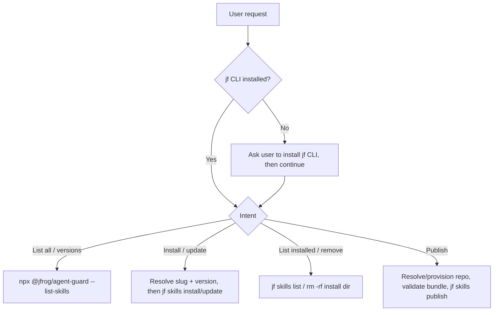

# JFrog AI Catalog Skills

Discover, install, and manage agent skills from the JFrog AI Catalog
(Artifactory skills repositories), and publish your own skills back to it, all
through the JFrog CLI (`jf skills`) and the JFrog Agent Guard.

## Choose a reference file

Pick the row matching the user's intent and read that reference file.

| Intent | Read |
|--------|------|
| "What skills are available?" / browse the catalog / list versions / search by name | [references/discovering-skills.md](references/discovering-skills.md) |
| Install or update a skill (latest or a pinned version), or a download is blocked | [references/installing-skills.md](references/installing-skills.md) |
| "What's installed?" / remove an installed skill | [references/managing-installed-skills.md](references/managing-installed-skills.md) |
| Publish / upload / release a skill to the catalog | [references/publishing-skills.md](references/publishing-skills.md) |

## Prerequisites

- **Read the base `jfrog` skill first.** [`../jfrog/SKILL.md`](../jfrog/SKILL.md)
  owns the shared guards this skill depends on, so this skill does **not** repeat
  them — follow them there:
  - The [environment check](../jfrog/SKILL.md#environment-check) — confirm `jf`
    is installed before the first `jf` call, and install it if missing.
  - The [server selection rules](../jfrog/SKILL.md#server-selection-rules-mandatory)
    — resolve the default `<SID>` once and reuse it, pass `--server-id <SID>`
    after the subcommand on every `jf` call, and use one server per request.
  - The stop-on-error rule — on any `jf` failure, stop and never switch servers.

  One addition specific to this skill: never `cat` or parse
  `~/.jfrog/jfrog-cli.conf.v6` (it can hold access tokens); list servers only
  with `jf config show`, which redacts secrets.
- **Agent Guard registry.** Catalog discovery and repo provisioning run through
  `npx --yes @jfrog/agent-guard`. `<REGISTRY_URL>` is the npm registry that
  provides the `@jfrog/agent-guard` package itself: use `JFROG_AGENT_GUARD_REPO`
  if set, otherwise
  `https://releases.jfrog.io/artifactory/api/npm/coding-agents-npm/`. Pass the
  same `<SID>` to Agent Guard as `--server "<SID>"` so it targets the same server
  as your `jf` calls. Agent Guard also reads `JFROG_URL` / `JF_URL` directly when
  set, so make sure the `<SID>` you resolved points at that same host.
- **Resolve the project (`<PROJECT>`) only when needed, and always to a key.**
  `<PROJECT>` must be the JFrog **project key**, not the display name. It is
  required for `--list-skills`, `--list-skill-versions`, and
  `--provision-skills-repository`. Take the value from `JF_PROJECT` or the user,
  then resolve it to a key against the projects list (see *List all projects* in
  the base `jfrog` skill's [`references/projects-api.md`](../jfrog/references/projects-api.md)):
  ```bash
  jf api '/access/api/v1/projects' --server-id "<SID>" \
    | jq -r '.[] | select(.project_key=="<value>" or .display_name=="<value>") | .project_key'
  ```
  Use the printed key. If it prints nothing, ask the user for the key. Never
  assume `default`, never invent one. Install, update, remove, and publishing to
  an explicit `--repo` are keyed by skill **name** and/or **repo**, not a
  project.

## Workflow overview



## Gotchas

Catalog-specific rules only. The shared `jf` guards — single server per request,
stop-on-error, and cautious mutation — live in the base
[`jfrog` skill](../jfrog/SKILL.md); follow those too. Flow-specific rules live in
the reference files above.

- **Which operations mutate**: install and list are read-mostly; remove, registry
  delete, and publish mutate state — the base skill's cautious-mutation rule
  applies to those three.
- **Session pickup**: installs, updates, and removals usually take effect only at
  the next agent session start, so tell the user to restart.
- **Don't leak the plumbing**: present skills/versions/repos to the user, never
  the `npx`/Agent Guard commands, `--registry`, flags, or cursors. Run follow-ups
  yourself.
- **Use the response templates verbatim**: where a reference file gives a "reply
  using this exact template" block, fill the placeholders and send exactly that,
  with the same wording every time and no extra preamble or commentary.