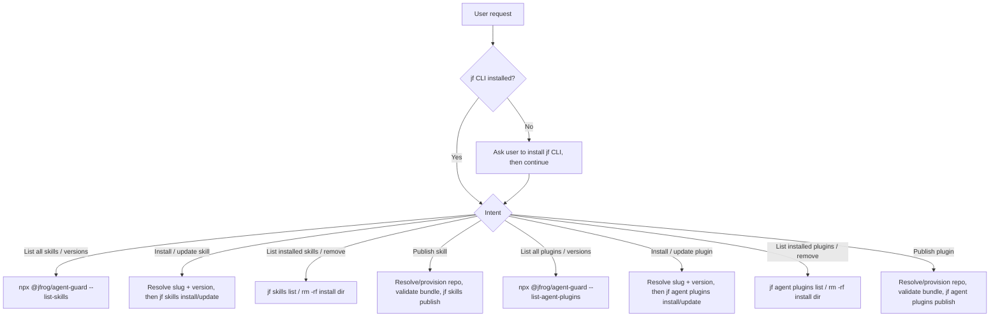

# JFrog AI Catalog

Discover, install, and manage agent skills and agent plugins from the JFrog AI
Catalog (Artifactory skills/plugins repositories), and publish your own back to
it, all through the JFrog CLI (`jf skills`, `jf agent plugins`) and the JFrog
Agent Guard.

## Choose a reference file

Pick the row matching the user's intent and read that reference file.

| Intent | Read |
|--------|------|
| "What skills are available?" / browse the catalog / list versions / search by name | [references/discovering-skills.md](references/discovering-skills.md) |
| Install or update a skill (latest or a pinned version), or a download is blocked | [references/installing-skills.md](references/installing-skills.md) |
| "What's installed?" / remove an installed skill | [references/managing-installed-skills.md](references/managing-installed-skills.md) |
| Publish / upload / release a skill to the catalog | [references/publishing-skills.md](references/publishing-skills.md) |
| "What plugins are available?" / browse the plugin catalog / list plugin versions / search plugins | [references/discovering-plugins.md](references/discovering-plugins.md) |
| Install or update a plugin (latest or a pinned version) | [references/installing-plugins.md](references/installing-plugins.md) |
| "What plugins are installed?" / remove an installed plugin | [references/managing-installed-plugins.md](references/managing-installed-plugins.md) |
| Publish / upload / release a plugin to the catalog | [references/publishing-plugins.md](references/publishing-plugins.md) |

## Prerequisites

- **Read the base `jfrog` skill first.** [`../jfrog/SKILL.md`](../jfrog/SKILL.md)
  owns the shared guards this skill depends on, so this skill does **not** repeat
  them — follow them there:
  - The [environment check](../jfrog/SKILL.md#environment-check) — confirm `jf`
    is installed before the first `jf` call, and install it if missing.
  - The [server selection rules](../jfrog/SKILL.md#server-selection-rules-mandatory)
    — resolve the default `<SID>` once and reuse it, pass `--server-id <SID>`
    after the subcommand on every `jf` call, and use one server per request.
    **Resolve it now, before any `jf` call:**
    ```bash
    jf config show 2>/dev/null \
      | awk '/^Server ID:/{id=$NF} /^Default:[[:space:]]*true/{print id; exit}'
    # stdout: the default server-id; if empty, stop and ask which server to use
    ```
  - The stop-on-error rule — on any `jf` failure, stop and never switch servers.

  One addition specific to this skill: never `cat` or parse
  `~/.jfrog/jfrog-cli.conf.v6` (it can hold access tokens); list servers only
  with `jf config show`, which redacts secrets.
- **Agent Guard registry.** Catalog discovery and repo provisioning run through
  `npx --yes @jfrog/agent-guard`. `<REGISTRY_URL>` is the npm registry that
  provides the `@jfrog/agent-guard` package itself: use `JFROG_AGENT_GUARD_REPO`
  if set, otherwise
  `https://releases.jfrog.io/artifactory/api/npm/coding-agents-npm/`. Pass the
  same `<SID>` to Agent Guard as `--server "<SID>"` so it targets the same server
  as your `jf` calls. Agent Guard also reads `JFROG_URL` / `JF_URL` directly when
  set, so make sure the `<SID>` you resolved points at that same host.
- **Resolve the project (`<PROJECT>`) only when needed.**
  It is required for `--list-skills`, `--list-skill-versions`,
  `--provision-skills-repository`, `--list-agent-plugins`,
  `--list-agent-plugin-versions`, and `--provision-agent-plugins-repository`.
  Resolve it with this priority:
  1. Parse `~/.jfrog/setup.json` (if present) and read `.servers["<SID>"].currentActiveProject`.
  2. Fall back to `$JF_PROJECT`.
  3. If still empty, ask the user for the project key - do **not** guess.

  ```bash
  PROJECT=$(jq -r --arg sid "<SID>" '.servers[$sid].currentActiveProject // empty' \
    ~/.jfrog/setup.json 2>/dev/null)
  [ -z "$PROJECT" ] && PROJECT="${JF_PROJECT:-}"
  ```
  There is no non-admin way to look up or validate project keys (the
  `/access/api/v1/projects` list endpoint needs admin), so you cannot
  silently correct a display name to a key. If the value looks like a
  display name (spaces, mixed case) rather than a short slug, ask the
  user to confirm the project **key** specifically. Never assume
  `default`, never invent one. Install, update, remove, and publishing to
  an explicit `--repo` are keyed by skill/plugin **name** and/or **repo**,
  not a project.
- **Bundle manifests differ by type.** Skill bundles require `SKILL.md`
  in the bundle root; plugin bundles require `plugin.json`. Validate the
  correct file before installing or publishing.

## Workflow overview



## Gotchas

Catalog-specific rules only. The shared `jf` guards — single server per request,
stop-on-error, and cautious mutation — live in the base
[`jfrog` skill](../jfrog/SKILL.md); follow those too. Flow-specific rules live in
the reference files above.

- **Which operations mutate**: install and list are read-mostly; remove, registry
  delete, and publish mutate state — the base skill's cautious-mutation rule
  applies to those three.
- **Session pickup**: installs, updates, and removals usually take effect only at
  the next agent session start, so tell the user to restart.
- **Don't leak the plumbing**: present skills/versions/repos to the user, never
  the `npx`/Agent Guard commands, `--registry`, flags, or cursors. Run follow-ups
  yourself.
- **Use the response templates verbatim**: where a reference file gives a "reply
  using this exact template" block, fill the placeholders and send exactly that,
  with the same wording every time and no extra preamble or commentary.
- **Plugins have no Xray support**: skip all Xray-related handling (no 403
  gating on download, no inline scan on publish, no `--skip-scan` flag) when
  performing any `jf agent plugins` operation.