# /jfrog-init — full flow diagram

Visual companion to the numbered Steps in `SKILL.md`. Every decision
node here is also fully documented — including the exact user-facing
wording — in the corresponding Step section of `SKILL.md`; this diagram
adds nothing new, it's a compressed map of that same prose for
at-a-glance orientation. `SKILL.md`'s Step-by-step text is the
authoritative source for wording and behavior — follow it literally.

```mermaid
flowchart TD
    Start(["/jfrog-init"]) --> S1

    S1["1. Node.js >= 18 installed? (no script — node --version / npx --version)"]:::stepBox
    S1 -->|no| ASKNODE["AskUserQuestion: Install Node.js now? Yes/No"]:::fixBox
    ASKNODE -->|Yes, macOS/Linux| NVMINSTALL["Install nvm (pinned version) + nvm install --lts"]:::autoBox
    ASKNODE -->|Yes, Windows| WINGETNODE["winget install OpenJS.NodeJS.LTS"]:::autoBox
    ASKNODE -->|No| STOP0["STOP: cannot proceed without Node"]:::stopBox
    NVMINSTALL -->|failed| F1["Fall back: ask user to install Node.js >= 18 manually"]:::fixBox
    NVMINSTALL -->|ok| S2
    WINGETNODE --> F1W["Tell user: open a new terminal, re-run /jfrog-init"]:::fixBox
    S1 -->|yes| S2

    S2["2. jf CLI installed and >= 2.106.0?"]:::stepBox
    S2 -->|missing| ASKJF["AskUserQuestion: Install JFrog CLI? Yes/No"]:::fixBox
    S2 -->|outdated| ASKJFU["AskUserQuestion: Update JFrog CLI? Yes/No"]:::fixBox
    ASKJF -->|Yes| INSTJF["jfrog-install-jf-cli.mjs: Plan A npm install -g jfrog-cli-v2-jf"]:::autoBox
    ASKJFU -->|Yes| INSTJF
    ASKJF -->|No| STOP0J["STOP: cannot proceed without jf"]:::stopBox
    ASKJFU -->|No| STOP0J
    INSTJF -->|npm exited 0, but resolving jf is shadowed by an earlier install on PATH| SHADOW["Report shadowing — move npm's bin ahead on PATH, or remove the other install"]:::fixBox
    SHADOW --> PLANC
    INSTJF -->|npm failed, or exited 0 but jf still isn't resolving up to date and not shadowed, and a private registry is configured| PLANB["Plan B: retry npm install against the public registry"]:::autoBox
    PLANB -->|jf now resolves up to date| S2RE
    PLANB -->|still not up to date| PLANC
    INSTJF -->|npm missing, or Plan A/B failed to leave an up-to-date jf on PATH| PLANC["Plan C: direct binary download to ~/.jfrog/bin, checksum-verified, runs jf --version to confirm"]:::autoBox
    PLANC -->|Windows| WINPS["Print PowerShell one-liner — user runs it themselves, then re-runs /jfrog-init"]:::fixBox
    PLANC -->|macOS/Linux| S2RE
    INSTJF -->|npm succeeded and jf now resolves >= 2.106.0| S2RE["Re-check: installed and >= 2.106.0?"]:::stepBox
    S2RE -->|still missing/outdated| STOP1["STOP: show raw install error"]:::stopBox
    S2RE -->|ok| S3
    S2 -->|yes| S3

    S3["3. jf connected to a server?"]:::stepBox
    S3 -->|no| ASKMETHOD["AskUserQuestion: Web login or Access token?"]:::fixBox
    ASKMETHOD -->|Web login| WEBLOGIN["Register session, show code/link, retrieve + save credentials — all in-session, this skill's own local scripts"]:::autoBox
    WEBLOGIN --> S3ASKW["AskUserQuestion: Did you finish logging in? Yes/No"]:::fixBox
    S3ASKW -->|Yes| S3
    S3ASKW -->|No| STOP0B["STOP: user cancelled"]:::stopBox
    ASKMETHOD -->|Access token| F3["Print one command, --url pre-filled — user runs it themselves in their own terminal, pastes the token"]:::fixBox
    F3 --> S3ASK["AskUserQuestion: Did you finish running that command? Yes/No"]:::fixBox
    S3ASK -->|Yes| S3
    S3ASK -->|No| STOP0B
    S3 -->|yes| S4

    S4["4. Server reachable and credentials valid?"]:::stepBox
    S4 -->|multiple servers, no default| ASKSRV["AskUserQuestion: pick server-id"]:::fixBox
    ASKSRV --> S4
    S4 -->|reachable, but token invalid/expired| F4["Print one command, --url and --server-id pre-filled (token-only, no web option — avoids a duplicate server) — user runs it themselves"]:::fixBox
    F4 --> S4ASK["AskUserQuestion: Did you finish running that command? Yes/No"]:::fixBox
    S4ASK -->|Yes| S4
    S4ASK -->|No| STOP0C["STOP: user cancelled"]:::stopBox
    S4 -->|unreachable/timeout/other| STOP2["STOP: show raw error (network/URL hint included)"]:::stopBox
    S4 -->|yes| S5

    S5["5. Plugin mcp.json has mcpServers.jfrog? (auto-substitutes a JFROG_PLATFORM_URL/JFROG_URL placeholder inline, if present)"]:::stepBox
    S5 -->|substitution needed, server-id ambiguous| ASKSRV5["AskUserQuestion: pick server-id"]:::fixBox
    ASKSRV5 --> S5
    S5 -->|missing/invalid/no entry, incl. substitution failure| F5["Note: reinstall or update the JFrog plugin, or resolve jf config (non-blocking)"]:::fixBox
    F5 --> S6
    S5 -->|yes, valid url| S6

    S6["6. Project resolved?"]:::stepBox
    S6 -->|state file has current project| ASKREUSE["AskUserQuestion: reuse CURRENT or pick different"]:::fixBox
    ASKREUSE -->|reuse| VALPROJ["Validate via authenticated GET /access/api/v1/projects/KEY"]:::stepBox
    ASKREUSE -->|different| ASKPROJ["AskUserQuestion: first 2 projects, or Other to type one"]:::fixBox
    S6 -->|no state file| ASKPROJ
    ASKPROJ --> RESOLVE["Resolve name-or-key (case-insensitive) against project list from authenticated GET /access/api/v1/projects"]:::stepBox
    RESOLVE -->|no match, 1st attempt| ASKPROJ
    RESOLVE -->|no match again, 2nd attempt: give up| F6
    RESOLVE -->|matched| VALPROJ
    VALPROJ -->|404 or 403, 1st attempt| ASKPROJ
    VALPROJ -->|404 or 403 again, 2nd attempt: give up| F6
    VALPROJ -->|401, credentials rejected| STOPCREDS["STOP: show raw error (re-auth via the Step 3/4 picker)"]:::stopBox
    VALPROJ -->|2xx| S7

    F6["Note: no project resolved after 1 retry — continue without one (non-blocking)"]:::fixBox
    F6 --> S7

    S7["7. AI Catalog reachable and user entitled?"]:::stepBox
    S7 -->|anon 404 / connection failure / 5xx, exit 1| F7U["Note: catalogReason=unreachable — JPD may not host AI Catalog, or it's down right now (non-blocking)"]:::fixBox
    F7U --> WRITE
    S7 -->|authed 401 or 403, not entitled, exit 4| F7E["Note: catalogReason=not_entitled — ask JFrog admin for AI Catalog Read role (non-blocking)"]:::fixBox
    F7E --> WRITE
    S7 -->|ambiguous server-id, exit 2| ASKSRV7["AskUserQuestion: which jf server? (server-picker.md), then re-run"]:::fixBox
    ASKSRV7 --> S7
    S7 -->|jf missing / credentials rejected / unexpected response shape, exit 3| STOP7["STOP: show raw error — no state file written"]:::stopBox
    S7 -->|yes, entitled, exit 0| WRITE["Write state file: server, jpdUrl, and currentActiveProject if resolved (else previous project, if any, is kept) — written on every NON-blocking path out of Step 7"]:::autoBox

    WRITE --> S8CHECK{"Step 7 green AND harness == Claude Code? (detectHarness() reused from Step 5)"}:::stepBox
    S8CHECK -->|no| DONE
    S8CHECK -->|yes| S8["8. Claude agent-plugin marketplace registered?"]:::stepBox
    S8 -->|exit 0, success| F8OK["Final Summary: ✅ JFrog Marketplace, plus the trailing sentence"]:::autoBox
    S8 -->|exit 1 or 3, failed| F8BAD["Final Summary: ⚠️ JFrog Marketplace — not registered, no cause"]:::fixBox
    F8OK --> DONE
    F8BAD --> DONE

    DONE(["JFrog init complete"]):::doneBox

    classDef stepBox fill:#e8f0fe,stroke:#1a73e8,color:#000
    classDef fixBox fill:#fff4e5,stroke:#f9a825,color:#000
    classDef autoBox fill:#e6f4ea,stroke:#137333,color:#000
    classDef doneBox fill:#e6f4ea,stroke:#137333,color:#000
    classDef stopBox fill:#fce8e6,stroke:#c5221f,color:#000
```

