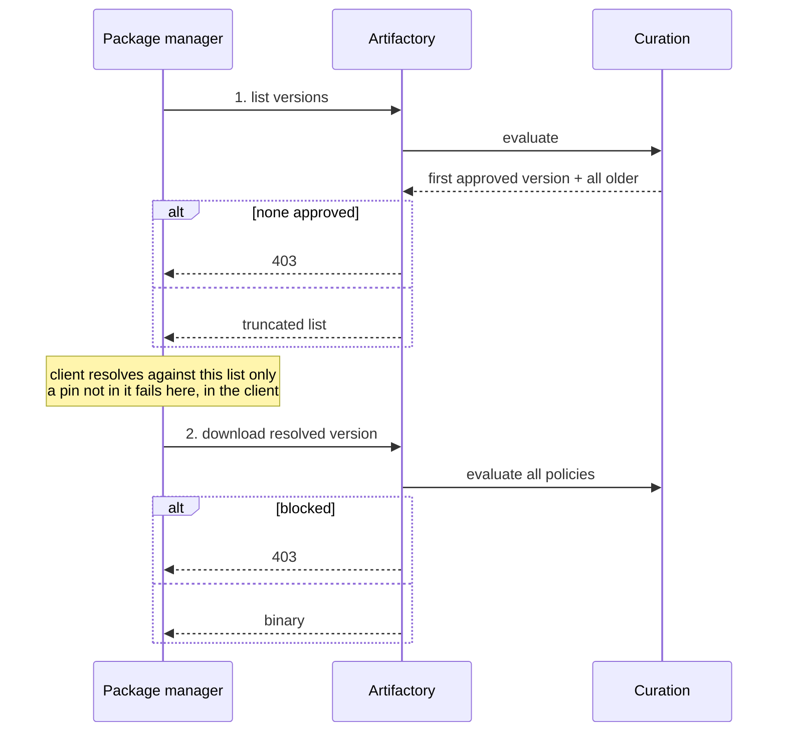

# Curation RCA procedure

> **Requires the JFrog MCP curation tools** (`jfs_curation_*`); no `jf` CLI
> equivalent is used in this path. See the skill's `compatibility` note.

> **#1 RULE — READ FIRST.** The **public catalog**
> (`catalog_packages_list_versions`) is the only authority on whether a version
> exists — quote its version list when you report existence. **Never** assert a
> version exists or doesn't from the curated registry (`npm view` / `pip index`
> against `/artifactory/...`, which is curation-filtered, so a CVS-blocked version
> is simply absent) **or from your own memory**. Decide existence from the catalog,
> and cross-check the **CVS audit** (`jfs_curation_query_cvs_audit_events`) for why a version was
> filtered.

Root-cause a curation package failure: correlate the two places Curation acts,
then report an actionable conclusion. This file is the whole workflow —
preflight, the two-gate model, symptom classification, evidence gathering,
interpretation, and the conclusion — read it in order.

This orchestrates the **JFrog MCP curation tools** (no `jf` CLI or raw
HTTP) and assumes the JFrog MCP server is connected and the tenant is
Curation-entitled. The curation tools are the **`jfs_curation_*`** family (e.g.
`jfs_curation_query_cvs_audit_events`); `catalog_packages_list_versions`
and `artifactory_repositories_get` are different tool families without the prefix.

## Preflight

**Right environment.** The MCP curation tools only ever query the
**currently connected** JFrog tenant, and a different env has different audit data —
an answer from the wrong tenant is worse than none. When the failing URL's host
matches the connected tenant, you're set — proceed. **Confirm with the user only
when it's ambiguous** (the host doesn't obviously match, or you can't tell which
tenant is connected); on a real mismatch, **stop** until the tools point at the
right tenant. Don't ask when it already matches.

**Tools must be present.** These MCP tools are gated at registration
by platform version + entitlement (min Xray **3.153.0** for the CVS tools and
`jfs_curation_get_audit_event_policies`; **3.112.0** for `jfs_curation_query_audit_events`). If the tool you
need is **not in your available tools**, split the diagnosis on what else is
present:

- **No JFrog MCP tools at all** (not even `catalog_packages_list_versions` /
  `artifactory_repositories_get`) → the JFrog MCP server isn't connected. Say
  so; never substitute a `jf` command or raw HTTP.
- **Other JFrog MCP tools work but `jfs_curation_*` is absent** → the
  platform is below the required Xray version or the tenant isn't
  Curation-entitled. **Stop gracefully:** report that the audit-based investigation
  can't run here and that it needs Xray ≥ 3.153.0 with Curation enabled.

Either way, do **not** fabricate calls or guess results.

## How Curation works

A package manager does two things: **resolve** a version, then **download** it.
Curation acts at both, with different strictness.

| | **Gate 1 — Resolution** | **Gate 2 — Download** |
|---|---|---|
| Client action | asks Artifactory for the version list | requests the binary |
| Curation evaluates | versions newest-first, **stops at the first approved one** (max evaluated is configurable, typically 1) | **all** policies, against the one requested version |
| Returns | that version **plus everything older** — or `403` if none approved | the binary — or `403` |
| Strictness | best-effort filter to reduce downstream blocks; **not a guarantee** | **hard gate** — enforcement is final here |

**The list is truncated at the top, not filtered throughout.** Versions *newer*
than the approved one are gone. Versions *older* are present but were **never
evaluated**. Every symptom below follows from that one sentence.

**Which audit records which gate:**

- **Gate 1 — resolution** → the **CVS audit**:
  `jfs_curation_query_cvs_audit_events` → `jfs_curation_get_cvs_audit_version_detail`.
- **Gate 2 — download** → the **package-download audit**:
  `jfs_curation_query_audit_events` → `jfs_curation_get_audit_event_policies`.
- A **`403` with nothing resolvable** (gate 1, every version blocked) is recorded in
  **both** audits — query both.

**Symptom → gate:**

| Symptom | Gate | Read it as |
|---|---|---|
| `ETARGET`, "no matching distribution", `NU1102` | 1 | pin is newer than the approved version, so it was never returned. The client failed locally — **Curation wrote no event for this failure** |
| `403` on a version the client could see | 2 | pin is older than the approved version: passed gate 1 unevaluated, blocked at the hard gate. Expected, not a contradiction |
| `403` with nothing resolvable | 1 | every version blocked (recorded in both audits) |
| Visible "latest" is lower than upstream | 1 | normal truncation, not a fault |

Exact error text is **manager- and command-specific** — don't assume `ETARGET`
(npm `ETARGET`, pip "no matching distribution", NuGet `NU1102`, `E403`; `npm
install` vs `npm ci`, `pip install <name>` vs `<name>==<version>`).

Gate 1 and gate 2 disagreeing is **by design** — say so rather than reconciling it.

**"CVS disabled" ≠ no gate 1.** CVS is **enabled by default** for some package types: the
**malicious** and **immature** policies run at gate 1 even when CVS is switched off
(npm today; the set grows as types onboard — don't assume it's only npm). So a
gate-1 block whose `condition_name` is malicious or immature is expected despite a
"CVS is disabled" claim; a CVE / license / ban condition means CVS is actually on.
Treat the audit as ground truth — a gate-1 event contemporaneous with the failure
settles it. Read the `condition_name` and explain it; don't argue with the claim.

> **Don't mix timelines.** The audit tools report the **past** (timestamped
> events). `jfs_curation_check_remote_package_compliance` returns a **live verdict now** — it
> runs a fresh CVS evaluation under current policy and may create a new audit row.
> Anchor the RCA on the audit timeline. Use a live compliance check only per
> Step 2, and label its result **current** — never as evidence of the
> failure-time state.

**Docs to consult** — fetch on demand, once (if blocked/airgapped, say so and
reason from the tool outputs; if the fetch itself fails for any other reason,
say so and proceed on the tool outputs alone rather than stalling):

- **CVS mechanism, supported types, waiver applicability, limits** — fetch at the
  start of a gate-1 investigation:
  `https://docs.jfrog.com/security/docs/compliant-version-selection`
- **Per-package-manager error text** — don't assume `ETARGET`; the pattern is
  manager- and command-specific:
  `https://docs.jfrog.com/security/docs/behavior-by-package`
- **Curation concepts** (what it is, features & capabilities), only to ground a
  term you cannot otherwise resolve:
  `https://docs.jfrog.com/security/docs/curation-intro` and
  `https://docs.jfrog.com/security/docs/features-and-capabilities-getting-started-5`

## Route by gate

Classify the symptom → gate → tool using the tables above:

- **Gate 1 — resolution** (not resolvable: `ETARGET`, "no matching distribution",
  `NU1102`, missing from `npm view` / `pip index`) → **CVS audit**:
  `jfs_curation_query_cvs_audit_events` → `jfs_curation_get_cvs_audit_version_detail`.
- **Gate 2 — download** (`403` on a version that *is* resolvable) → **package-download
  audit**: `jfs_curation_query_audit_events` → `jfs_curation_get_audit_event_policies`.
  Enough to root-cause the 403 on its own — don't reach for a compliance check by reflex.

A `403` with **nothing** resolvable is gate 1 and is recorded in **both** audits —
query both. The gates can **disagree** (a resolvable version that still 403s) —
surface it, don't reconcile.

## Step 0 — Capture the symptom

Collect before touching any tool. Ask the user only for what is missing:

- **package type** (npm, PyPI, Maven, Go, NuGet, …) — infer it from the failing
  URL (`/api/<type>/…`, e.g. `/api/npm/`) or the command (`npm`/`pip`/…); ask the
  user only if neither is available. `package_type` is **required** on the CVS
  audit call. If the first audit comes back
  empty, suspect a casing/token mismatch instead: canonical CVS tokens are
  `npm, PyPI, Maven, Go, NuGet, Gems, Conda, Composer, Gradle,
  AIEditorExtensions, SBT, Alpine, Docker, Cargo` (case-sensitive, not
  normalised server-side) — retry with the canonical casing, or ask the user
  to confirm the ecosystem rather than guessing.
- **package name** and the **version** in the error.
- **repository / registry** the client resolved through (from the failing URL /
  client config), and whether it's a JFrog **curated remote**, a **virtual** (some
  managers — e.g. Go — require one; npm can use either), or plain public. This
  decides how Step 1 reads a "not found" (curated vs public) and how Step 2
  identifies the remote (the audits are keyed by the remote, never a virtual). You
  often can't tell virtual from remote by name — capture it; if unknown, ask; do
  not assume.
- the **exact error text** and the **approximate date + hour** — bounds the audit
  window (Step 2). Investigate any past failure within **retention** (default ~30 days);
  the 168h cap limits one query's **width**, not recency. For an older failure,
  anchor the window near the failure time (not "now") so the query actually covers it.

**Pin the timeline before running any audit.** Read the failure's **date + hour**
from the error text / log if it's there (e.g. a timestamped log line) — don't ask
for what the provided context already shows; ask the user only if it's missing
(and don't settle for "recently"). It bounds the audit window and anchors
`created_at_end` to the failure, not "now". Then, within that window, if Step 2's
survey turns up **more than one curated remote** for the package, ask which repo
they resolved through before interpreting — see Step 2's "Identify the curated
remote".

Classify into a symptom class. This list is **open-ended** — match the closest
row; if nothing fits, use the last row (never refuse for lack of an exact match):

| Symptom | Class | Start with |
|---|---|---|
| A version can't be resolved/installed — e.g. `ETARGET` (npm), "no matching distribution" (pip), `NU1102` (NuGet), or absent from `npm view` / `pip index`. The exact pattern is **package-manager-specific** — see behavior-by-package | **NOT-RESOLVABLE** | Step 1's client-side-config check, then Gate 1 — CVS audit |
| `403` / `Forbidden` / "blocked by curation policy" on a version that *is* listed | **DOWNLOAD-BLOCKED** | Gate 2 — package-download audit |
| Every version fails because nothing resolves at all (empty/near-empty listing) | **NOT-RESOLVABLE** (package-level) | This is a resolution failure, not a download-time block — Gate 1 + both audits |
| Every version 403s at download while the package is still listed | **PACKAGE-BLOCKED** | Gate 2; expect a package-level block |
| The blocked name is a dependency of what you installed | **TRANSITIVE** | Gate 2 on the *blocked* name, not the top-level one |
| Used to install, now blocked (or was blocked, now works) | **DRIFT / TIMELINE** | both audits across time; a live compliance check is the *only* "now" signal |
| Still blocked despite an approved waiver | **WAIVER-NOT-APPLIED** | Gate 2 + `jfs_curation_query_waiver_requests` (check scope, status, expiry) |
| "Pending Catalog update" reason, or intermittent/flaky blocks | **PENDING / TRANSIENT** | the relevant audit filtered by `reason` |
| Anything else curation-related, or unclear | **OTHER** | gather from **both** audits + the client error text, then map via the Step 4 RCA table |

## Step 1 — Rule out the non-curation cause first

Don't assume curation — and for **NOT-RESOLVABLE**, decide existence per the **#1 RULE**.

**Rule out client-side config first.** A resolve failure can look identical to a
curation block while having nothing to do with curation — the package manager's
own local filters produce the same symptom shape (`ETARGET`, no matching
version). Before trusting the symptom table's default routing, check whether
the client config explains it: a date/version-age filter (npm's `before` /
`min-release-age`, surfaced via `npm config get before` and `npm config get
min-release-age`), a registry override in `.npmrc` / `pip.conf` / `nuget.config`
/ `GOPROXY`, or a CI-injected flag. This applies **regardless of the exact
error string** — don't wait for a table row that matches your specific
package manager's wording.

Settle it with **two independent reads — run BOTH, and never gate one behind the
other**:

1. **Does it exist?** Use **only** `catalog_packages_list_versions` (approved MCP
   tool). **Never** query a public/upstream registry directly, **never** the
   curated `/artifactory/...` registry, and **never** `artifactory_packages_get_versions`
   (curated/cached = **filtered** listing — same trap). Two coverage notes:
   - **Name translation:** the catalog token differs for some CVS types — **Go →
     `golang`**, **Gems → `rubygems`**. npm / PyPI / Maven / NuGet are the same.
   - The catalog covers only some types; for an **unsupported** type it returns
     nothing — a catalog miss there is **not** proof of non-existence. Fall back
     to the CVS audit (read 2); if that's also empty, say the existence check is
     unavailable rather than guessing.
2. **What did Curation decide?** For a **NOT-RESOLVABLE** symptom, **always** query
   the CVS audit (`jfs_curation_query_cvs_audit_events`, package + type) — do not
   skip it because a listing looked empty. It is the authoritative record of whether
   CVS inspected the version and blocked or approved it: it both proves the version
   existed and gives the verdict. (For a **403 / download** symptom, the reverse
   holds — do **not** query the CVS audit; use the download audit only. See Gate 2
   and the 403 worked example. A **403 with nothing resolvable** is Gate 1
   too — query **both** audits, per the two-gate model above.)

Read the cross-product:

- **In the catalog (or a CVS record exists) + CVS blocked it** → **curated-index
  filtering** (the usual answer): CVS blocked the version **and** the client can't
  resolve it. The audit proves *blocked* (a decision); the **client's ETARGET /
  absence** is what proves it's missing from the listing — the audit does not state
  listing membership, so don't claim omission unless the client listing actually
  lacks the pin. Together → **Gate 1** for the policy detail and the compliant
  version CVS selected.
- **In the catalog + no CVS record** → not (yet) curation — remote sync / virtual
  repo / cache config; investigate outside CVS.
- **Not in the catalog (and the catalog supports this package type) + no CVS
  record** → likely never existed / yanked → not curation; report the nearest
  catalog versions (e.g. `1.18.1`, `0.19.0`) and stop. If the catalog does
  **not** support this type, a miss is not proof of non-existence — report the
  existence check as unavailable (Insufficient evidence) instead.

A resolve-time ETARGET fails **in the client**: it mints **no** CVS or download
audit row and there is **no** 403 to find. The CVS evidence is a
**prior/historical** evaluation (when the package was last inspected) — never
expect a row created by this failed install, and never read its absence as
"curation not involved".

For a **403** symptom the non-curation confounders are auth / permissions / a
disabled repo — rule those out, then Gate 2.

## Step 2 — Gather evidence

Pick the branch from Step 0. When in doubt, run both; they are independent.

**Identify the curated remote.** The audits are keyed by the curated **remote**,
never a virtual — so the repo in the client URL is a lookup key, not the answer.
Capture it as `client_repo` (from the failing URL, e.g. `/api/npm/<repo>/…`); a
virtual (some managers, e.g. Go, require one) is **never** the curated remote key,
so do **not** pre-filter the audit on it. Read the candidate remotes from the
returned events (`curated_repo_name` for CVS, `curated_repository_name` for the
download audit) within the failure window.

When `client_repo` is a virtual, or more than one remote has a contemporaneous
event, resolve which remote in this order — **never infer from names**
(`npm-virtual` does not imply `npm-remote`):

1. **Artifactory join (preferred).** Call `artifactory_repositories_get(client_repo)`
   and intersect its member repositories with the candidate remotes from the audit.
   A single match is the remote.
2. **Ask (fallback).** If that tool is not accessible (e.g. a 403/permission error),
   or the intersection is empty or still more than one, **ask the user to confirm
   the underlying remote** they resolved through. Do not guess.

Until the remote is proven by (1) or (2), do **not** put a repo in the RCA
**Repository** field — and never the virtual name — and cap that field at
**Medium** confidence. The *what* (policy/verdict) can still be **High** when every
candidate remote carries the same verdict, even while the Repository stays Medium.

**Window to the failure time** (from Step 0), not the 7-day default — far fewer
day-partitions scanned on a busy tenant, and required when the failure is >7 days old.
The survey bounds `created_at_start`/`created_at_end` are **RFC3339 strings** (e.g.
`2026-08-18T03:33:00Z`), **not** epoch — epoch ms is only for
`jfs_curation_get_cvs_audit_version_detail.created_at` (Gate 1 step 3); don't carry that
format into the survey or it 400s / returns empty.

- **Gate 2 (403):** the block is contemporaneous with the failure, so window it
  **as tightly as your timestamp precision allows** — with a precise time (e.g. from
  the client log), use only a clock-skew margin (**±15 min**, at most ±1 h); widen
  toward ±1 day **only** when the failure time is approximate ("sometime that day").
  A tight window also avoids sweeping in unrelated contemporaneous events (e.g. a
  second remote's block for the same package), which is what forces the
  remote-disambiguation step — so don't widen it past what the timestamp warrants.
- **Gate 1 (CVS):** the evaluation happens when Artifactory (re)builds the
  **cached** curated metadata, so it can be **hours or days before** the failed
  resolve — its timestamp has no fixed relation to the failure clock. Do **not**
  window symmetrically or tightly: reach **back** — set `created_at_end` to just
  after the failure, `created_at_start` to **failure − 7 days** (one 168h window),
  `direction=desc`, and take the **latest event at or before the failure**. Cap the
  reach-back at 7 days; do **not** page further. If that window is empty, report
  **"no CVS record in the 7 days before the failure"** (the cached inspection is
  older than 7 days) — not "no CVS" outright.

### Gate 1 — NOT-RESOLVABLE (CVS audit)

Target the **historical** CVS evaluation — the failed install created no new row.
The pin may be **absent** from `versions[]` because resolution stopped before it
(see **How Curation works** above), not because it was "never evaluated".

1. **Survey** with `jfs_curation_query_cvs_audit_events` (do **not** set `include_versions`
   yet). `package_name` and `package_type` are **required** (no unscoped
   surveys). Add `inspection_results=no_compliant_versions,compliant_version_selected`
   (comma-separated IN — both failure buckets in one call), and use `direction=desc` with a
   small `num_of_rows` for the latest evaluation. **Never** survey
   `all_versions_compliant` to explain a failure (~99% of the data); if you ever
   query it, cap the window to **≤1 day**. Set `include_total` only when you need the
   match count or an exact `next_offset` (to gauge volume or paginate) — it adds a
   count query, so skip it for a plain latest-event lookup.
   Read `packages[].summary`, `inspection_results`, `latest_inspected_version`.
2. **Drill down** on the event you care about: call again with the same
   `package_name` + `package_type` plus `event_id=<data[i].id>`,
   `include_versions=true`, `num_of_rows` ≤ 10. Find the target version in
   `packages[].versions[]` and read its `action` + blocking `policies[]`.
3. **Explain** one version with `jfs_curation_get_cvs_audit_version_detail`
   (`version_id=versions[].id`, `created_at=` the **event's** `created_at` in
   **epoch milliseconds** — copy it verbatim).

### Gate 2 — DOWNLOAD-BLOCKED (package-download audit)

1. **Search** `jfs_curation_query_audit_events` by `package_type` + `package_name`
   (+ `package_version` if known) over the relevant window (add `include_total=true`
   only if you want the match count).
2. **Explain** the blocking event with `jfs_curation_get_audit_event_policies`
   (`event_id=data[i].id`) for the `explanation` + `remediation`. These fields can
   come back **empty** (policy/condition names and verdict only) — that does **not**
   lower confidence: when the audit's policy/condition agrees with the client's
   block notice, the finding is still **High**. Fall back to the Step 4 generic
   package-blocked remediation and note "no remediation text from the API".

### Optional live compliance check — only when it earns its place

`jfs_curation_check_remote_package_compliance` is **not** a step in the RCA. It is a live,
current-policy verdict that runs a fresh evaluation (see the
timeline note above), so it does not tell you what happened at the time of the
failure and it can muddy a clean audit-based conclusion. Call it **only** when:

- the user asks "what can I install instead?" **and** the audit did not already
  surface allowed/suggested versions (the client's own block notice often does);
- you specifically need a **current-vs-past drift** check (e.g. confirm the block
  still stands under today's policy); or
- you are about to **change a dependency or recommend a pin** and must validate
  the candidate live.

Otherwise skip it. When you do call it, report `allowed_versions` and the verdict
as **current state**, kept separate from the audit-based root cause.

## Step 3 — Interpret

Each tool's own description lists its traps; read them before concluding. The
ones that most often flip an RCA:

- **Empty CVS result → first rule out "curation not enabled".** The audit tools
  are **not** feature-gated (they need only `VIEW_POLICIES`), so a disabled feature
  writes no rows and returns `200` with empty `data` — indistinguishable from
  "nothing blocked".
- **For a 403, the download audit is the authority; CVS coverage is partial.**
  Because resolution stops at the first approved version (see **How Curation
  works** above), absence from a CVS `versions[]` does **not** mean a version
  was unevaluated, out of the index, or approved — and it must **never** weaken
  or override a `jfs_curation_query_audit_events` finding. Versions CVS did not
  (re)select stay in the index and are enforced by the download flow — that is
  the 403.
- **Bad `inspection_results`/`reason` tokens are silently ignored** → a 200
  **unfiltered** result. Verify returned rows carry the value you filtered on.
- **Do not invent or generalize a mechanism.** The audit reports the *decision*
  on a version (blocked/compliant + policy + reason), not why the client listing
  contains or omits it. Never infer a general rule from a few events — e.g.
  "CVE policies enforce at download, ban-label at resolve" from two rows. A
  policy's category does not determine listing membership or enforcement stage;
  read each event's own fields. If the behavior in question (listing/exposure,
  enforcement stage) is not stated in the audit rows or the CVS doc, report it as
  **not determined** — do not synthesize an explanation to fit the data points.

## Before Step 4 — output gate

No conclusion (even hedged) without these tool calls made and reflected in
Evidence:

- Existence in question (NOT-RESOLVABLE, or any 403 with **nothing**
  resolvable): `catalog_packages_list_versions` (the #1 RULE).
- A 403 on a version the client already **resolved/listed**: existence is
  proven by that successful listing — the catalog call isn't required; go
  straight to the download audit.
- NOT-RESOLVABLE, or any 403 with nothing resolvable: `jfs_curation_query_cvs_audit_events`.
- Any resolvable/listed 403 (DOWNLOAD-BLOCKED, PACKAGE-BLOCKED on a still-listed
  name, TRANSITIVE): `jfs_curation_query_audit_events`.
- WAIVER-NOT-APPLIED: + `jfs_curation_query_waiver_requests`.

Missing/unavailable tool ≠ license to guess — use Insufficient evidence instead.

## Step 4 — Conclude the RCA

Map the evidence to a root cause. Report the **first** row that matches.

| Evidence | Root cause | Remediation |
|---|---|---|
| Version not in the public catalog (for a package type the catalog supports) and no CVS record | **Not curation** — version does not exist | Correct the version; nothing to unblock. |
| ETARGET on a curated registry; version present in the **public catalog** but absent from the **curated** listing; CVS history shows it filtered / not selected | **Curated-index filtering** — CVS omitted the version from the curated listing, so the client can't resolve it (fails at resolve, no 403, no fresh audit row) | Use a version present in the curated listing (one CVS selected / `allowed_versions`); or waiver and re-index. |
| CVS event: target version `action=blocked` + policy P | **CVS non-compliant** — CVS found the version non-compliant under policy P (this is the decision; it does not by itself explain listing membership) | Apply the version's `remediation` from `jfs_curation_get_cvs_audit_version_detail`; pin to an `action=approved` version from the same event (or `allowed_versions`). For waiver applicability under CVS, consult the CVS doc — do not assume. |
| CVS event: `inspection_results=no_compliant_versions` | **No compliant version found** in the audit | Check `jfs_curation_check_remote_package_compliance` for any allowed version; otherwise raise a waiver (see the CVS doc for applicability). Do not recommend changing the policy. |
| Package-audit event: version `action=blocked` + policy P | **Download-time block** — the 403 comes from policy P at download | Apply the policy's `remediation` from `jfs_curation_get_audit_event_policies`; use an allowed version; or raise a waiver. |
| Locked/older pin 403s at download; the recent CVS record selected a *newer* compliant version and has no (or only a stale/earlier) record for the pin | **Pin bypasses CVS selection** — CVS returned a newer compliant version and did not (re)select the pinned one, so the pin stays in the index and is enforced by the download-time policy (the 403). The CVS absence is expected, **not** evidence of anything | Use the compliant version CVS selected (or `allowed_versions`), or waiver the pin. The download audit + `jfs_curation_get_audit_event_policies` is the authority for the block. |
| Block covers the package itself, not a single version | **Package-blocked** — a policy blocks the whole package | Use a different package, or waiver the package if policy allows (see the block's `remediation`). |
| The blocked package name ≠ the one the user installed | **Transitive dependency block** — a dependency was blocked | Re-run the RCA on the *blocked* dependency; remediate it (pin/override the transitive) rather than the top-level package. |
| Approved waiver exists (`jfs_curation_query_waiver_requests`) yet the block persists | **Waiver not effective** — wrong scope/repo, expired, not yet applied, or the index has not refreshed | Verify the waiver's scope, status, and expiry against the failing repo/version. If it's valid, the index likely hasn't re-evaluated — no MCP tool here can force this; tell the **user** to reindex / zap the cache on the curated remote and retry after they do. |
| `reason = "Pending Catalog update"` | **Transient / pending** — the verdict awaits catalog data | Retry after the catalog updates; treat as not-final, not a hard block. |
| CVS `approved` **and** a download-time block exist for the same version | **Divergence** — the version is CVS-approved yet blocked at download; causes include a policy change between evaluation and download, or a different policy set on the download path (see the CVS doc) | Confirm current status via `jfs_curation_check_remote_package_compliance`; use a curation-compliant version or raise a waiver. Do not recommend changing the policy. |
| No CVS **and** no package-audit record, version exists upstream | **Likely not curation** (write lag, CVS disabled or not applicable, no scoped policy, unsupported type) | For the CVS audit, confirm the window already reached the full 7 days (Gate 1's cap) — do not widen past 168h or drop `package_name`/`package_type`. For the download audit, you may widen using the multi-window probe strategy and drop optional filters, but keep `package_type`. If still empty at those caps, investigate outside curation. |

**Failure Reason lookup** — map the matched root cause above to the one **Failure
Reason** you print below (several root causes map to the same label):

- **Version not available — removed by curation:** Curated-index filtering; CVS
  non-compliant; No compliant version found.
- **Download blocked by a curation policy:** Download-time block; Pin bypasses CVS
  selection; Divergence (CVS-approved yet blocked at download); Waiver not effective
  (add "waiver not applied" in Failure Details).
- **Whole package blocked by curation:** Package-blocked.
- **Curation check still pending:** Transient / pending ("Pending Catalog update").
- **Not caused by curation:** version does not exist; likely-not-curation (remote
  sync / cache / no scoped policy / unsupported type); a client-side date/version
  filter (`min-release-age` / `before`, registry override, CI flag) explains it.
- **No curation record found:** no CVS and no package-audit record in window.
- **Transitive** is not its own label — re-run the RCA on the *blocked dependency*
  and use whichever Failure Reason its own root-cause row maps to.

**If the root cause is "Not caused by curation" or "No curation record
found," skip the table below — use the "Not a curation problem" block after
Insufficient evidence instead.** The table's fields are curation-specific
(Repository, Audit event links) and don't apply to a non-curation cause.

For the other four Failure Reasons, present the conclusion as a **table** —
render exactly these rows, in this order. Frame every value in **curation**
terms (this is a curation RCA, not a generic one):

| Field | Value |
| --- | --- |
| **Confidence** | **High** / **Medium** / **Low** — `<why>`. Report **Low** when a step returned an ambiguous empty result rather than a positive record; the *what* can stay **High** while **Repository** is **Medium** until the virtual→remote join is proven (Step 2). |
| **Package** | `<name>` |
| **Version** | `<version>` (or `all` / the failing pin) |
| **Failure Reason** | one of: **Version not available — removed by curation** · **Download blocked by a curation policy** · **Whole package blocked by curation** · **Curation check still pending** · **Not caused by curation** · **No curation record found** |
| **Failure Details** | Failed due to curation policy `<policy_name>` — `<condition_name>` (e.g. "Failed due to curation policy `cve` — cve more than 7 and Half") |
| **Repository** | the remote from whichever audit you used — `<curated_repo_name>` (CVS) or `<curated_repository_name>` (download audit) |
| **Failure Timestamp** | the exact failure timestamp, e.g. `2026-08-18T03:33:00Z` |
| **Audit event links** | the Curation **UI audit page** — `<host>/ui/package-curation/audit` (`<host>` = the platform host from the failing URL / connected tenant) — plus the event(s) that locate the record there: CVS `jfs_curation_query_cvs_audit_events` event `id=<id>` (`created_at=<epoch>`), download `jfs_curation_query_audit_events` event `id=<id>` |

Then, **below the table, as bullet points** (not table rows):

- **Ruled out:** the non-curation causes you checked — auth / permissions, repo or remote config, a version that never existed.
- **Evidence:** discrete `key=value` tokens on one line, each individually searchable/copyable — e.g. `tool=jfs_curation_query_cvs_audit_events` `event_id=1290` `created_at=1786000000000` `action=blocked` `policy=cve`. Emit only the tokens you have.
- **Remediation** *(High confidence only — omit entirely at Medium/Low):* use a curation-**compliant** version (the one CVS selected, or an `allowed_versions` entry), or **raise a waiver** scoped to the curated remote(s) you resolve through. **Never** propose changing or loosening a curation policy (e.g. "lower the CVE threshold in policy `cve`") — a policy change is out of scope for this RCA; the waiver is the only sanctioned exception.

**Insufficient evidence** *(use instead of the table above when the output
gate stopped you)*: state **Cannot conclude** — name the missing tool call(s)
or ambiguity (tenant, repo, tool unavailable) — and what's needed to proceed.
Never fill the table with a guess to avoid this.

**Not a curation problem** *(use instead of the table above for "Not caused
by curation" / "No curation record found")*: state the actual cause and the
evidence that rules out curation — e.g. `npm config get before` /
`min-release-age` returned a value matching the error, or no CVS/download
record exists in a widened window. No curation-specific fields — Repository
and Audit event links don't apply here.

**Consistency gate — before you finalize.** Re-check the conclusion against
**every** event you retrieved, not just the ones that fit. If any row contradicts
it, the conclusion is wrong — revise it to fit all the data. A conclusion that
requires an invented mechanism to reconcile two rows is a red flag: prefer "not
determined from the audit (see the CVS doc)" over a synthesized rule.

## Worked examples (illustrative)

Two end-to-end illustrations. They are **not** the supported set — apply the same
method (Step 0 → Step 4) to any curation symptom, including the classes above
that have no example here.

### npm `ETARGET`

> `No matching version found for @vitest/eslint-plugin@1.6.27`

`ETARGET` → NOT-RESOLVABLE (Gate 1). **First** apply Step 1's two reads — do
**not** trust `npm view` against the curated registry (that's the filtered
view). (1) Existence via `catalog_packages_list_versions` (the only approved
oracle — do not query public npm directly) — absent there → "version does not
exist", report the nearest catalog versions, stop. (2) **Always** survey the CVS audit
`jfs_curation_query_cvs_audit_events(package_name, package_type="npm")` with
`direction=desc` for the latest **historical** evaluation (this failed install minted
no row). Drill down (`event_id`, `include_versions=true`) and look for `1.6.27`:
`action=blocked` → CVS found it non-compliant; combined with the client's ETARGET
(the pin is absent from the curated listing), that's curated-index filtering
— get `explanation`/`remediation` via `jfs_curation_get_cvs_audit_version_detail` and pin to
the version CVS selected (check the CVS doc before assuming a waiver applies);
**absent** from `versions[]` → likely CVS stopped after selecting its compliant
version(s) and never recorded this pin (Step 3), not "never evaluated". Conclude
per Step 4.

### 403 on a version that `npm view` lists

> `npm view` lists `axios@1.15.1`, but `npm install axios@1.15.1` fails with
> 403 "blocked by JFrog Packages Curation Service" (policy: CVE). User claim:
> "it's listed, so CVS approved it — why does download fail?"

403 on a **resolvable** version → **DOWNLOAD-BLOCKED (Gate 2)**. The version
is already listed, so resolvability — and therefore existence, for this
purpose — is proven by the client's own successful listing; Step 1's
catalog/CVS existence check is for when resolvability itself is in question,
so it doesn't apply here. Then Gate 2 **alone**:
`jfs_curation_query_audit_events(package_type="npm", package_name="axios", package_version="1.15.1")`
returns the blocked download event with the policy and CVEs — that **is** the
root cause. If the user wants the remediation prose, add
`jfs_curation_get_audit_event_policies(event_id)`.

Answer the misconception without a compliance call: a `npm view` listing is what
the client resolves against, **not** a per-version CVS approval — a locked/exact
pin to a non-compliant version is refused at download with no fallback (fetch the
CVS doc to cite this). You do **not** need `jfs_curation_check_remote_package_compliance` to
conclude this, and you should not query the CVS audit to "prove approval" — CVS
audit answering `all_versions_compliant` is a *different timeline and mechanism*
and will confuse the 403 RCA. Only if the user then asks "what should I install
instead?" and no allowed versions are already in hand does a compliance check (or
the client's own suggested-versions notice) earn its place.

## Gotchas

- **MCP tools only.** Never substitute a `jf` command or raw HTTP for any
  `jfs_curation_*` call. If a curation tool specifically is unavailable while
  other JFrog MCP tools work, that's a version/entitlement gap, not a
  disconnected server — see Preflight.
- **Disjoint id-spaces / repo-name spelling.** CVS event ids go to
  `jfs_curation_get_cvs_audit_version_detail`, package-audit ids to
  `jfs_curation_get_audit_event_policies` (crossing them returns nothing). CVS uses
  `curated_repo_name`; package audit uses `curated_repository_name`.
- **Don't over-attribute to curation.** The most common `ETARGET` cause is a
  version that never existed, or a client-side config filter — always complete
  Step 1 before blaming curation.
