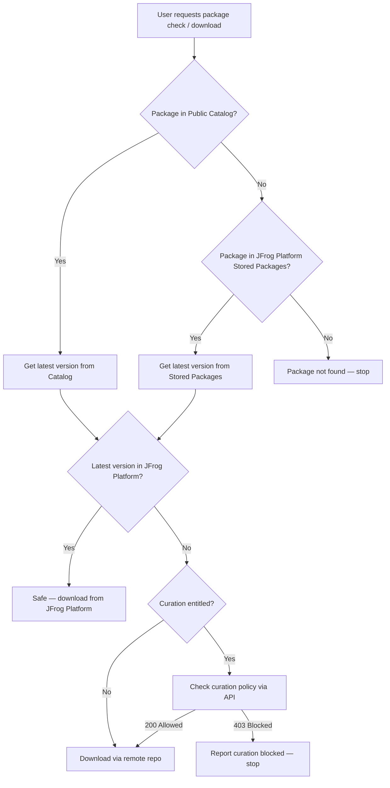

# JFrog Package Safety and Download

## Prerequisites

- Read `../jfrog/SKILL.md` for JFrog Platform concepts, domain model, CLI setup, and API patterns.
- **OneModel shapes drift by server version.** Before inventing GraphQL fields or `where` filters, read `../jfrog/references/onemodel-graphql.md` (schema fetch workflow) and `../jfrog/references/onemodel-query-examples.md` (**Public packages**, **Stored packages**). Regenerate or verify queries against `GET "$JFROG_URL/onemodel/api/v1/supergraph/schema"` when examples fail validation.

## Workflow

# Package safety check and download workflow

When to read this file:

- User asks to **check if a package is safe** and/or **download** it.
- User asks to **download a package** from Artifactory.
- User mentions checking a package for **curation** approval.
- User wants to know if a package is **allowed** or **approved** for use.

## Workflow overview



### Parallelization opportunities

Several steps in this workflow are independent and can run in parallel to
reduce total latency:

- **Step 1 + Step 1 fallback**: When package type is known, query both the
  Public Catalog (`getPackage`) and Stored Packages (`getPackage`) in
  parallel. Use whichever returns data; if the Public Catalog returns a hit,
  prefer its `latestVersion` for Step 2.
- **Step 3 + Step 5**: After determining the version, query stored package
  versions (JFrog Platform check) and curation entitlement
  (`/api/system/version`) in parallel. Both are independent reads — the
  curation result is needed immediately if the JFrog Platform check returns
  empty.

When issuing parallel Shell calls, each `jf api` call authenticates
independently against the active `jf config` server; no shell state needs
to be passed between calls.

## Step 1: Find the package

Search the **Public Catalog** first via OneModel GraphQL, then fall back to
**Stored Packages** if not found.

Execute the query through `jf api` as described in
`../jfrog/references/onemodel-graphql.md`; refer to
`../jfrog/references/onemodel-query-examples.md` for concrete query shapes.

**When package type is known** (e.g. `npm`, `maven`, `pypi`), use
`publicPackages.getPackage(type:, name:)` (see *Get a public package*).
Include the `latestVersion { version }` selection set — `latestVersion` is
an object, not a scalar.

**When type is unknown**, use `publicPackages.searchPackages` with
`nameContains` (see *Search public packages*). Add `type:` when the user
narrows the ecosystem.

- **Found** → note `type` and `latestVersion.version`. Proceed to Step 2.
- **Not found** → the package may be 1st/2nd party. Search **Stored Packages**
  using `storedPackages.searchPackages` or `storedPackages.getPackage` (see
  *Stored packages domain* in `onemodel-query-examples.md`). Prefer
  filtering by `type` when known; if not, use `nameContains` alone.
  - **Found** → note `type` and `latestVersionName` (or derive a version from
    `versionsConnection`). Proceed to Step 2.
  - **Not found in either** → report "package not found" and stop.

If multiple results with different `type` values, ask the user which package
type they mean.

## Step 2: Determine latest version

| Source | Version field |
|--------|--------------|
| Public Catalog | `latestVersion.version` (object selection required) |
| JFrog Platform Stored Packages | `latestVersionName` on `StoredPackage`, or highest entry from `versionsConnection` |

## Step 3: Check if package + latest version exists in JFrog Platform

Query stored package versions using `storedPackages.searchPackageVersions`
with a `hasPackageWith` filter (see `../jfrog/references/onemodel-query-examples.md`
→ *Search stored package versions*). Add a `version` filter for the specific
version from Step 2, and request `locationsConnection` to get repository
details (`repositoryKey`, `repositoryType`, `leadArtifactPath`).

Execute the query through `jf api` (see
`../jfrog/references/onemodel-graphql.md` for the invocation pattern).

- **Found with locations** → package is in the JFrog Platform. Report as **safe to
  download**. Proceed to Step 4.
- **Not found** → proceed to Step 5.

## Step 4: Download from JFrog Platform

Use the location info from Step 3. Binary artifact downloads go through
`jf rt dl` — **not** `jf api`. `jf api` is the unified entry point for the
JFrog REST APIs (metadata, admin, curation, etc.) and does not expose the
`-L` / `-o` flags needed to stream binary content through a redirect chain.

**`<target>` must be a full file path** (e.g.
`./downloads/lodash-4.18.1.tgz`), not a bare directory. `jf rt dl --flat`
treats the target as a file name; passing a directory causes a misleading
"open path: is a directory" error.

| `repositoryType` | Strategy |
|-------------------|----------|
| `local` or `federated` | `jf rt dl "<repositoryKey>/<leadArtifactPath>" <target-file> --flat` |
| `remote` | `jf rt dl` against the **base** remote repo (strip any trailing `-cache`) — it transparently triggers the remote fetch when the artifact is not yet cached |

**local / federated / remote download:**

```bash
jf rt dl "<baseRepoKey>/<leadArtifactPath>" <target-file> --flat
```

**Resolving the remote repo key:** The `repositoryKey` returned by OneModel
for remote locations often already ends in `-cache` (e.g.
`devNPM-remote-cache`). `jf rt dl` needs the **base remote repo name**
(without `-cache`). Strip the `-cache` suffix when present (e.g.
`devNPM-remote-cache` → `devNPM-remote`). If the key does not end in
`-cache`, use it as-is.

See the **Protocol endpoints** table below for the package-type-specific
path format inside the repo.

## Step 5: Check curation entitlement

```bash
jf api /artifactory/api/system/version \
  | jq '.addons | index("curation") != null'
```

- `true` → curation is entitled. Proceed to Step 6a.
- `false` → curation not available. Proceed to Step 6b.

## Step 6a: Check curation policy and download

When curation is entitled, use the Xray curation API to check whether the
package version is allowed across all repositories before downloading.

```bash
RESPONSE_FILE="/tmp/curation-status-$$.json"
PAYLOAD_FILE="/tmp/curation-payload-$$.json"
STDERR_FILE="/tmp/curation-err-$$.log"

jq -n \
  --arg type    "<TYPE>"    \
  --arg name    "<NAME>"    \
  --arg version "<VERSION>" \
  '{packageType:$type, packageName:$name, packageVersion:$version}' \
  > "$PAYLOAD_FILE"

set +e
jf api /xray/api/v1/curation/package_status/all_repos \
  -X POST -H "Content-Type: application/json" \
  --input "$PAYLOAD_FILE" \
  > "$RESPONSE_FILE" 2> "$STDERR_FILE"
RC=$?
set -e
echo "RC=$RC"; echo "$RESPONSE_FILE"
```

Supported `packageType` values: `npm`, `pypi`, `maven`, `go`, `nuget`,
`docker`, `gradle`.

**Interpreting the result with `jf api`**: unlike plain `curl`, `jf api`
surfaces the HTTP result through its **exit code** and a
`"<hh:mm:ss> [Warn] ... returned 4xx/5xx"` line on **stderr** (not a
`%{http_code}` suffix in stdout). The response body is always written to
stdout. Parse both:

```bash
if [ "$RC" -eq 0 ]; then
  echo "Package is allowed by curation."
elif grep -q 'returned 403' "$STDERR_FILE"; then
  echo "Blocked by curation policy:"
  cat "$RESPONSE_FILE"
else
  echo "Curation check failed (rc=$RC):"
  cat "$STDERR_FILE"
fi
```

**Evaluate the outcome:**

- **exit 0** → package is **allowed** by curation policy. Proceed to
  download via a remote repo (same as Step 6b).
- **`returned 403` on stderr** → package is **blocked** by a curation
  policy. The response body explains which policy rule blocked it. Report
  the block reason to the user and stop — do not attempt to download.
- **Any other non-zero exit** → treat as an operational failure (auth, DNS,
  endpoint disabled) and report.

## Step 6b: Download without curation

When curation is not entitled and the package is not in the JFrog Platform,
download directly through a remote repo.

1. **Find a remote repo** of the right package type:

   ```bash
   jf api \
     "/artifactory/api/repositories?type=remote&packageType=<TYPE>" \
     | jq '.[].key'
   ```

2. **Download** — use `jf rt dl` against the base remote repo (without
   `-cache`); it handles both cached and uncached artifacts:

   ```bash
   jf rt dl "<repo>/<artifact-path>" <target-file> --flat
   ```

## Artifact paths by package type

Use these path patterns when `leadArtifactPath` is not available from
OneModel. The leading `<repo>/` is the base repo key you pass to `jf rt dl`.

| Type   | `jf rt dl` target pattern                                               |
|--------|-------------------------------------------------------------------------|
| `npm`  | `<repo>/<pkg>/-/<pkg>-<version>.tgz`                                    |
| `pypi` | `<repo>/<pkg>/<version>/<pkg>-<version>.tar.gz`                         |
| `maven`| `<repo>/<group-path>/<artifact>/<version>/<artifact>-<version>.jar`     |
| `go`   | `<repo>/<module>/@v/<version>.zip`                                      |

## Gotchas

- **Binary downloads vs. `jf api`**: `jf api` is for REST APIs, not binary
  content. It does not follow redirects transparently into a binary payload
  and does not expose `-L` / `-o`. Always use `jf rt dl` (against the base
  remote repo, not the `-cache` one) for the actual artifact download.
- **`jf rt dl` and uncached remotes**: `jf rt dl "<remote>/<path>"` —
  targeting the **base** remote repo rather than `<remote>-cache/<path>` —
  transparently triggers the remote fetch and caches the artifact. Do not
  try to pre-query the proxy via `jf api`.
- **`jf rt dl --flat` target must be a file path**: When downloading a
  single artifact, pass a full output **file** path (e.g.
  `./downloads/lodash-4.18.1.tgz`), not a directory. The CLI opens the target
  path as a file; a directory causes a cryptic "open path: is a directory"
  error that retries four times before failing. Derive the filename from
  `leadArtifactPath` (take the segment after the last `/`).
- **Package type detection**: If the user doesn't specify the package type,
  the Public Catalog search by name alone may return multiple types. Ask the
  user to disambiguate before proceeding.
- **Curation endpoint lives under Xray**: use
  `/xray/api/v1/curation/package_status/all_repos` (via `jf api`). Do not
  prefix it with `/artifactory`.
- **Curation result discrimination with `jf api`**: the 200/403 signal comes
  from `jf api`'s **exit code** plus a `returned NNN` line on **stderr**,
  not from a `%{http_code}` appended to stdout. Capture stderr to a file
  (`2> "$STDERR_FILE"`) and branch on `RC` + `grep 'returned 403'` as shown
  in Step 6a.
- **Curation API package type values**: Must be lowercase and match one of
  `npm`, `pypi`, `maven`, `go`, `nuget`, `docker`, `gradle`. Other values
  will return an error.