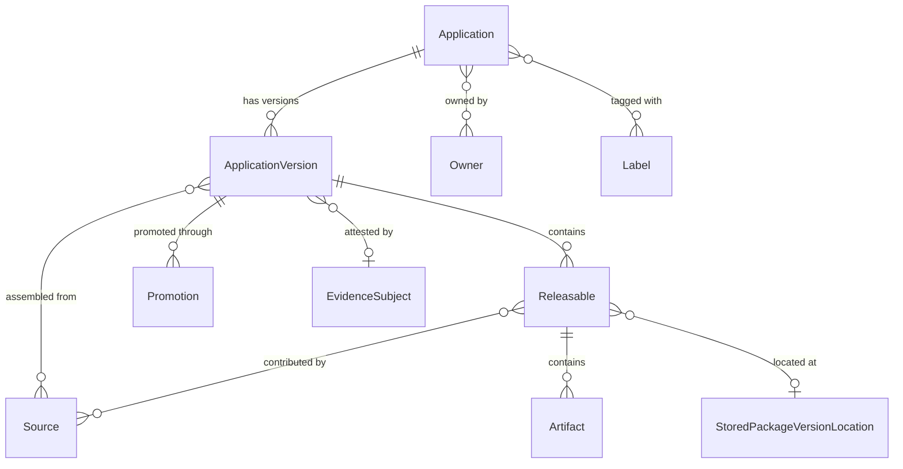

# AppTrust entities

When to read this file:

- Working with **applications**, **application versions**, or **releasables**.
- Querying or managing **application version promotions** through stages.
- Understanding **sources** (builds, release bundles, other app versions) feeding an application version.
- OneModel GraphQL with `applications` query root.

AppTrust via **OneModel GraphQL API** (`/onemodel/api/v1/graphql`). No CLI.

OneModel workflow (credentials, schema fetch, validation, execution):
`references/onemodel-graphql.md`.

## Entity relationship overview

## Application

Top-level software application in AppTrust. Belongs to a JFrog Project;
container for versions, ownership, criticality.

| Field | Description |
|-------|-------------|
| `key` | Unique ID (`applicationKey` / `appKey` elsewhere) |
| `projectKey` | JFrog Project |
| `displayName` | Human-readable name |
| `criticality` | `unspecified`, `low`, `medium`, `high`, `critical` |
| `maturityLevel` | `unspecified`, `experimental`, `production`, `end_of_life` |
| `owners` | Owning users/groups |
| `labels` | Key-value categorization |

Query: `applications.getApplication(key: "...")` or
`applications.searchApplications(where: {...})`.

## Application version

Versioned instance of an application — releasable artifacts, sources, promotion
history through lifecycle stages.

| Field | Description |
|-------|-------------|
| `application` | Parent application |
| `version` | Version identifier (semantic or custom) |
| `tag` | Optional tag |
| `status` | Processing status: `STARTED`, `FAILED`, `COMPLETED`, `DELETING` |
| `releaseStatus` | Release maturity: `PRE_RELEASE`, `RELEASED`, `TRUSTED_RELEASE` |
| `currentStageName` | Latest promoted stage (null if never promoted) |
| `createdBy`, `createdAt` | Audit fields |
| `evidenceSubject` | Evidence attestation anchor (shared across domains) |

`releaseStatus` ≠ `status`: `status` = creation process; `releaseStatus` = release maturity.

Query: `applications.getApplicationVersion(applicationKey: "...", version: "...")`
or `applications.searchApplicationVersions(where: {...})`.

## Releasable

Deployable unit within an application version — **package version** or individual **artifact**.

| Field | Description |
|-------|-------------|
| `name` | Package name or artifact file name |
| `version` | Package version (empty for non-package artifacts) |
| `packageType` | Repository package type (docker, maven, generic, etc.) |
| `releasableType` | `artifact` or `package_version` |
| `sha256` | Leading file checksum (e.g. manifest for Docker images) |
| `totalSize` | Sum of all artifact sizes in bytes |
| `sources` | Sources that contributed to this releasable |
| `artifacts` | Individual files that make up the releasable |
| `packageVersionLocation` | Link to `StoredPackageVersionLocation` for package releasables |
| `vcsCommit` | VCS commit details (for AppTrust-bound package versions) |

Releasables bridge application model to Artifactory storage. `packageVersionLocation`
→ Stored Packages domain (`stored-packages-entities.md`).

## Application version promotion

Promotion of application version between stages. All attempts recorded including failures.

| Field | Description |
|-------|-------------|
| `sourceStageName` | Stage being promoted from (empty for first promotion) |
| `targetStageName` | Stage being promoted to |
| `status` | `SUBMITTED`, `STARTED`, `PENDING`, `COMPLETED`, `FAILED`, `REJECTED` |
| `createdBy`, `createdAt` | Who initiated and when |
| `artifacts` | Artifacts included in this promotion (repo + path) |
| `messages` | Error messages if the promotion failed |

Same environment/stage model as Release Bundle promotions
(`release-lifecycle-entities.md`), at application level.

## Sources

How releasables were assembled into an application version. Four types:

| Source type | Fields | Description |
|-------------|--------|-------------|
| **Build** | `name`, `number`, `startedAt`, `repositoryKey` | A CI/CD build that produced releasables |
| **ReleaseBundle** | `name`, `version` | A release bundle whose artifacts were included |
| **ApplicationVersion** | `applicationKey`, `version` | Another application version (composition) |
| **Direct** | (none) | Directly included without an associated build or bundle |

At application version level (all sources) and releasable level (per-releasable sources).

## Artifacts (within application versions)

Individual files within releasables.

| Field | Description |
|-------|-------------|
| `filePath` | Path in the repository (excluding repo key) |
| `downloadPath` | Full path for downloading from a Release Bundle repository |
| `sha256` | Checksum |
| `size` | Size in bytes |
| `evidenceSubject` | Evidence attestation anchor |

## Cross-domain connections

Via OneModel GraphQL:

- **Evidence** — `ApplicationVersion.evidenceSubject` and
  `ApplicationVersionArtifact.evidenceSubject` → Evidence domain via
  `EvidenceSubject.fullPath`.
- **Stored Packages** — `Releasable.packageVersionLocation` →
  `StoredPackageVersionLocation` (physical Artifactory location).
- **Release Bundles** — source type `ReleaseBundle` → Release Lifecycle name/version.
- **Builds** — source type `Build` → Artifactory build-info records.
