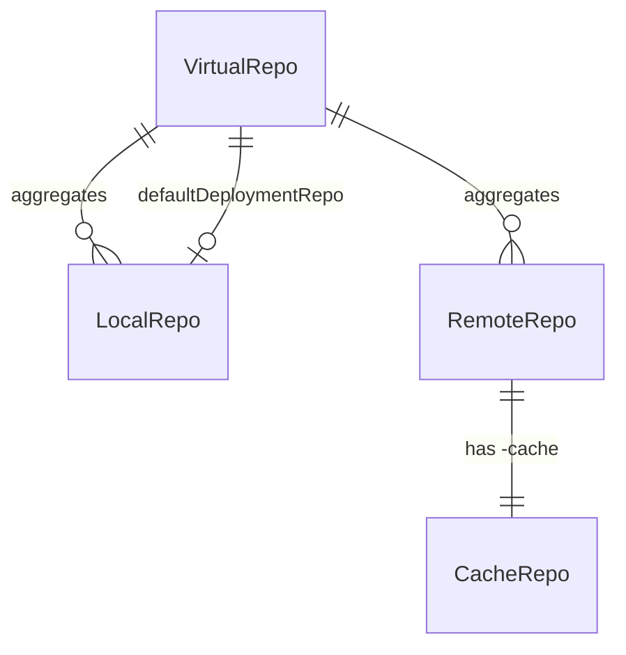

# Artifactory entities

When to read this file:

- Working with **repositories** — need local/remote/virtual/federated type differences.
- Managing **artifacts**, **properties**, or **package types**.
- Working with **builds**, **build promotion**, or **permission targets**.
- Debugging repo-type issues (e.g. upload failures, missing search results).

CLI: `artifactory-operations.md`. API gaps: `artifactory-api-gaps.md`. AQL: `artifactory-aql-syntax.md`.

## Repositories

Repository = primary storage/resolution unit in Artifactory. Each repo has **key** (unique id), **package type** (immutable after creation), **repository class** (`rclass`) determining behavior.

### Repository types

| Type | `rclass` | Behavior | Stores artifacts? |
|------|----------|----------|-------------------|
| **Local** | `local` | Hosts artifacts deployed directly (upload, promote, copy, move) | Yes |
| **Remote** | `remote` | Proxies external URL; downloads cached in companion `-cache` repo | Only in `-cache` repo |
| **Virtual** | `virtual` | Aggregates local + remote repos under single URL for resolution | No (resolves from underlying repos) |
| **Federated** | `federated` | Local repo bi-directionally syncs across Platform Deployments | Yes (replicated across sites) |

### Key relationships and fields

- `key` — unique repo identifier (e.g. `libs-release-local`)
- `packageType` — layout + protocol (see Package types below)
- `rclass` — `local`, `remote`, `virtual`, or `federated`
- `url` — (remote only) external source URL being proxied
- `repositories` — (virtual only) ordered list of local/remote repos to aggregate
- `projectKey` — links repo to JFrog Project (see `platform-access-entities.md`)
- `environments` — repo environment assignment (RBAC + lifecycle)

### System repositories

Artifactory + Xray maintain **system repositories** for internal platform metadata. Not user-created — exclude when iterating repos for reporting, scanning, or auditing:

| Pattern | Purpose |
|---------|---------|
| `release-bundles` | Release Bundles V1 metadata |
| `release-bundles-v2` | Release Bundles V2 metadata |
| `artifactory-build-info` | Default build info storage |
| `*-release-bundles` | Project-scoped Release Bundles V1 |
| `*-release-bundles-v2` | Project-scoped Release Bundles V2 |
| `*-build-info` | Project-scoped build info storage |
| `*-application-versions` | AppTrust application version metadata |

Including these in aggregate queries (violation counts, storage reports, etc.) produces misleading results — platform metadata, not user artifacts.

### Remote repository cache

When Artifactory downloads via remote repo, cached copy stored in **separate local repo** named `<remote-key>-cache`. Critical for:

- **AQL queries** — search `-cache` repo, not remote repo key
- **Properties** — cached artifact properties live on `-cache` repo
- **Storage calculations** — cached artifacts consume storage under `-cache` repo

Remote repo key used for **configuration** (URL, credentials, inclusion/exclusion patterns) — does not directly contain artifacts.

### Virtual repository resolution

Virtual repo aggregates **local + remote repos** under single URL. Resolves by searching underlying repos in configured **order** — same artifact in multiple repos → first match wins.

Virtual repo may designate underlying **local** repo as **default deployment repository**. Uploads through virtual URL routed there. Without default deployment repo → read-only.

## Artifacts

Artifact = file in repository. Uniquely identified by **repo + path + name**.

Key attributes:
- `repo`, `path`, `name` — location identifier
- `size` — bytes
- `sha256`, `sha1`, `md5` — checksums (build-info records all three; Xray cross-references by sha256, AQL item↔build joins by sha1)
- `created`, `modified`, `created_by`, `modified_by` — audit fields

Artifacts are **content-addressable** — build info + Xray reference by checksum, not path. Move/copy changes path, not checksum → build associations follow artifact.

## Properties

Key-value metadata on artifacts or folders.

- Keys = strings; values = strings or string arrays
- Set via `jf rt set-props`, query via AQL or properties API
- Common uses: build metadata, maturity labels, promotion tracking, cleanup policies
- Remote-cached artifact properties live on `-cache` repo

## Package types

`packageType` on repo determines how Artifactory interprets contents — directory layout, metadata extraction, client protocols (Docker registry API, npm registry, Maven layout).

Common types: `maven`, `gradle`, `npm`, `docker`, `pypi`, `nuget`, `go`,
`helm`, `rpm`, `debian`, `generic`.

Package type **immutable** — cannot change after repo creation. Use `generic` when no specific type applies.

## Build info

Build info record captures CI/CD metadata: produced artifacts, consumed dependencies, build environment.

| Field | Description |
|-------|-------------|
| `name` + `number` | Unique build run identifier |
| `modules` | Modules, each with artifacts + dependencies |
| `vcs` | VCS metadata (revision, URL, branch) |
| `buildAgent`, `agent` | CI tool info |
| `properties` | Custom build-level properties |

Build info references artifacts **by checksum** (AQL item↔build joins by sha1; Xray cross-references by sha256):
- Build can reference artifacts across multiple repos
- Moving artifact does not break build association
- Xray scans build info by resolving checksums → components

Lifecycle: collect → publish → (optionally) promote → (optionally) scan.

## Build promotion

Promotion changes build **status**; can copy/move artifacts from source repo → target repo.

| Field | Description |
|-------|-------------|
| `status` | Target status label (e.g. `staged`, `released`) |
| `sourceRepo` | Where artifacts currently reside |
| `targetRepo` | Where artifacts should be moved/copied |
| `copy` | If `true`, copy instead of move |

Promotion records queryable via AQL (`build.promotions` domain) + build promotion API.

## Permissions

Permissions = RBAC policies mapping **resources** + **principals** (users, groups) → **actions**. Two models:

### Permissions V2 (Access Permissions) — current model

**Access service** (since 7.72.0, recommended 7.77.2+). All resource types.

| Component | Description |
|-----------|-------------|
| `name` | Permission name |
| `resources` | Map of resource type → targets + actions |

Resource types: `artifact` (repositories), `build`, `release_bundle`,
`destination` (Edge nodes), `pipeline_source`.

Each resource contains:
- `targets` — target names/patterns → include/exclude patterns
- `actions.users` — username → action list
- `actions.groups` — group name → action list

Actions uppercase: `READ`, `ANNOTATE`, `DEPLOY/CACHE`, `DELETE/OVERWRITE`,
`MANAGE_XRAY_METADATA`, `MANAGE`.

API: `POST/PUT/GET/DELETE /access/api/v2/permissions/{permissionName}`.

Documentation: [Permissions](https://docs.jfrog.com/administration/docs/permissions).

### Permission targets (V1) — legacy model

**Artifactory**-managed. Functional + backwards compatible; prefer V2 for new work. CLI: `jf rt permission-target-*`.

| Component | Description |
|-----------|-------------|
| `repositories` | Repo keys or patterns |
| `actions.users` | Username → action list |
| `actions.groups` | Group name → action list |

Actions lowercase: `read`, `write`, `annotate`, `delete`, `manage`.

Does **not** support `destination` or `pipeline_source` resource types.

API: `PUT /artifactory/api/security/permissions/{permissionName}`.

### Key differences

| Aspect | V1 (Permission Targets) | V2 (Access Permissions) |
|--------|------------------------|------------------------|
| Managed by | Artifactory | Access service |
| API base | `/artifactory/api/security/permissions/` | `/access/api/v2/permissions/` |
| Actions | lowercase (`read`, `write`) | uppercase (`READ`, `WRITE`) |
| Resource types | repos, builds, release bundles | + destinations, pipeline sources |
| Pattern fields | `includes_pattern` / `excludes_pattern` | `include_patterns` / `exclude_patterns` |
| CLI support | `jf rt permission-target-*` | No direct CLI commands (use REST) |

Project-scoped RBAC: see Project roles in `platform-access-entities.md`.

## Replication

Replication syncs artifacts + properties between repos — same instance or across Platform Deployments.

| Type | Direction | Trigger |
|------|-----------|---------|
| **Push** | Source → target | Scheduled or event-based |
| **Pull** | Target ← source | Scheduled |

Replication configs = JSON templates per repository. Both artifact content + properties replicated. Federated repos → automatic bi-directional replication across member nodes.
