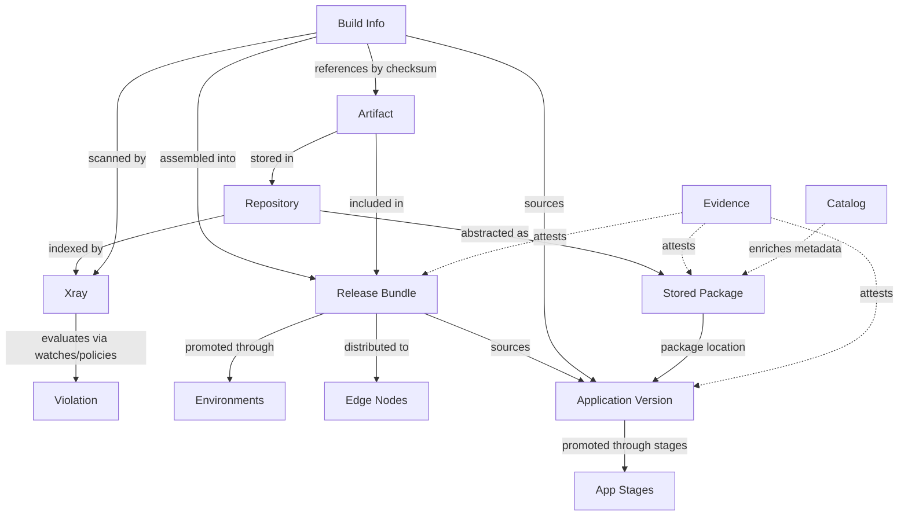

# JFrog entity index

When to read this file:

- User mentions JFrog entity — need to identify **domain**.
- Planning operation spanning **multiple products** (e.g. build → scan → release).
- Need quick **one-line definition** before loading full domain reference.
- Need **GraphQL (OneModel)** entry points (workflow, examples, patterns) —
  see [GraphQL (OneModel)](#graphql-onemodel) below.

After identifying domain, follow **Reference** column pointer for detailed definitions, relationships, agent rules.

## Cross-product flow

Key takeaway: **artifacts** = atomic unit. Builds reference them, Xray scans them, release bundles collect them, distribution delivers them. **Applications** orchestrate top-level release flow. **Stored Packages** bridge artifacts → package abstraction. **Catalog** enriches packages with global security, legal, operational metadata. **Evidence** attests entities across all domains.

## GraphQL (OneModel)

Unified **OneModel GraphQL** API (cross-product list/search over applications, packages, evidence, release bundles, catalog, related entities on platform base URL):

- **Workflow** — mandatory per-server supergraph schema, validation, execution, errors: `onemodel-graphql.md`
- **Query templates + domain examples** — `onemodel-query-examples.md`
- **Pagination, variables, date formats** — `onemodel-common-patterns.md`

Also see **GraphQL (OneModel)** in base `SKILL.md` (Tier 3 curl).

## Entity lookup

| Entity | Domain | Definition | Reference |
|--------|--------|------------|-----------|
| **Local repository** | Artifactory | Direct artifact storage (upload, promote, move) | `artifactory-entities.md` |
| **Remote repository** | Artifactory | External proxy/cache; artifacts in `-cache` repo | `artifactory-entities.md` |
| **Virtual repository** | Artifactory | Aggregates local + remote repos under one resolution URL | `artifactory-entities.md` |
| **Federated repository** | Artifactory | Local repo synced across Platform Deployments | `artifactory-entities.md` |
| **Artifact** | Artifactory | Repo file; id = repo + path + name | `artifactory-entities.md` |
| **Property** | Artifactory | Key-value metadata on artifact/folder | `artifactory-entities.md` |
| **Package type** | Artifactory | Repo setting: layout, indexing, client protocol | `artifactory-entities.md` |
| **Build info** | Artifactory | CI/CD build metadata → produced artifacts | `artifactory-entities.md` |
| **Build promotion** | Artifactory | Build status change; move/copy artifacts between repos | `artifactory-entities.md` |
| **Permission** | Artifactory / Access | RBAC: resources → user/group actions. V2=Access, V1=Artifactory permission targets | `artifactory-entities.md` |
| **Replication** | Artifactory | Sync config for artifacts/properties between repos | `artifactory-entities.md` |
| **Indexed resource** | Xray | Repo, build, or release bundle indexed for scanning | `xray-entities.md` |
| **Component** | Xray | Package identified + tracked during Xray scan | `xray-entities.md` |
| **Vulnerability** | Xray | Known CVE on component version | `xray-entities.md` |
| **Contextual analysis** | Xray | Vulnerability reachability in usage context | `xray-entities.md` |
| **License** | Xray | Component license metadata for compliance | `xray-entities.md` |
| **Watch** | Xray | Links repos/builds → policies for monitoring | `xray-entities.md` |
| **Policy** | Xray | Component rules → violations when matched | `xray-entities.md` |
| **Violation** | Xray | Component in watched resource matches policy rule | `xray-entities.md` |
| **Ignore rule** | Xray | Suppresses violations by component, CVE, path, etc. | `xray-entities.md` |
| **Exposure** | Xray (Advanced Security) | Exposures scan finding — secrets, IaC, misconfigs, appsec risks | `xray-entities.md` |
| **Curation audit event** | Xray (Curation) | Curated repo package check — approved/blocked + policy; dry-run supported | `xray-entities.md` |
| **Report** | Xray | On-demand security/license/operational analysis | `xray-entities.md` |
| **Release Bundle** | Release Lifecycle | Immutable versioned artifact set for promotion + distribution | `release-lifecycle-entities.md` |
| **Lifecycle stage** | Release Lifecycle | Bundle progression through environments (DEV → PROD) | `release-lifecycle-entities.md` |
| **Distribution** | Release Lifecycle | Bundle delivery to Edge nodes / Platform Deployments | `release-lifecycle-entities.md` |
| **Evidence** | Release Lifecycle | Crypto attestation on bundles, apps, packages (cross-domain) | `release-lifecycle-entities.md` |
| **Evidence subject** | Release Lifecycle | Cross-domain evidence anchor via `fullPath` | `release-lifecycle-entities.md` |
| **Application** | AppTrust | App with versions, owners, criticality, maturity | `apptrust-entities.md` |
| **Application version** | AppTrust | Versioned instance: releasables, sources, promotion history, status | `apptrust-entities.md` |
| **Releasable** | AppTrust | Deployable unit — package version or artifact | `apptrust-entities.md` |
| **Application version promotion** | AppTrust | Stage-to-stage app version progression + status | `apptrust-entities.md` |
| **Application version source** | AppTrust | Releasable source: Build, ReleaseBundle, ApplicationVersion, Direct | `apptrust-entities.md` |
| **Stored package** | Stored Packages | Artifactory metadata package (name + type + versions) | `stored-packages-entities.md` |
| **Stored package version** | Stored Packages | Version: locations, artifacts, tags, qualifiers, stats | `stored-packages-entities.md` |
| **Stored package version location** | Stored Packages | Package version location (repo key + path); bridge to Apps + Evidence | `stored-packages-entities.md` |
| **Stored package artifact** | Stored Packages | Package version binary (checksums, size, mime type) | `stored-packages-entities.md` |
| **Public package** | Catalog | JFrog global package + security/legal/operational metadata | `catalog-entities.md` |
| **Public package version** | Catalog | Version: vulns, licenses, operational info, dependencies | `catalog-entities.md` |
| **Public vulnerability** | Catalog | CVE: CVSS v2/v3/v4, EPSS, advisories (NVD, GHSA, JFrog), exploits | `catalog-entities.md` |
| **Public license** | Catalog | License: permissions, limitations, patent conditions | `catalog-entities.md` |
| **Custom package** | Catalog | Org private catalog package + custom labels | `catalog-entities.md` |
| **Custom catalog label** | Catalog | Org label for packages (manual/automatic) | `catalog-entities.md` |
| **MCP service** | Catalog | MCP service in public catalog | `catalog-entities.md` |
| **Project** | Platform / Access | Org container: members, roles, resources | `platform-access-entities.md` |
| **Project role** | Platform / Access | Per-project role scoped to environments | `platform-access-entities.md` |
| **Project member** | Platform / Access | User/group + project role | `platform-access-entities.md` |
| **Environment** | Platform / Access | Resource grouping + RBAC scope; projects + lifecycle | `platform-access-entities.md` |
| **User** | Platform / Access | Platform identity + permissions | `platform-access-entities.md` |
| **Group** | Platform / Access | User collection for permission management | `platform-access-entities.md` |
| **Access token** | Platform / Access | Scoped bearer credential + optional expiry | `platform-access-entities.md` |
