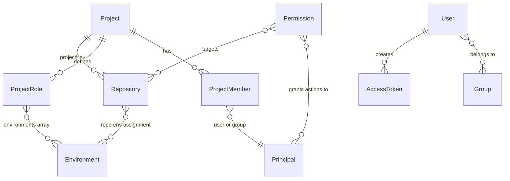

# Platform / Access entities

When to read this file:

- Explaining how **Projects**, **repositories**, **members**, **roles**,
  **environments** fit together.
- Working with **users**, **groups**, or **access tokens** at platform level.
- Building **inventories or reports** joining Artifactory data with Access / Projects.
- Avoiding two common mistakes: inferring project membership from
  **repository name**, or assuming **roles** identical across projects.

Endpoint-level curl examples: `projects-api.md`. List-vs-detail API patterns + batching: `general-bulk-operations-and-agent-patterns.md`.

## Entity relationship overview

## Project

Organizational container grouping members, roles, resources.

| Field | Description |
|-------|-------------|
| `project_key` | Unique identifier (short string; APIs + repo assignment) |
| `display_name` | Human-readable name |
| `description` | Project description |
| `admin_privileges` | Project-level admin behavior flags |
| `storage_quota` | Storage limits |

Project hosts **members** (users/groups with roles) + **resources**
(repositories, builds, Release Bundles) assigned to it.

API: `GET /access/api/v1/projects`, `GET /access/api/v1/projects/<project-key>`.

Documentation: [Get Started with Projects](https://docs.jfrog.com/projects/docs),
[Basic Projects Terminology](https://docs.jfrog.com/projects/docs/basic-projects-terminology).

## Project role

Per-project role scoping what members may do.

| Field | Description |
|-------|-------------|
| `name` | Role name (e.g. `Developer`, `Release Manager`) |
| `type` | `PREDEFINED` or `CUSTOM` |
| `environments` | Environments where role applies (e.g. `["DEV", "PROD"]`) |
| `actions` | Permitted actions in those environments |

Predefined role templates exist; projects can define **custom roles**.
Two projects may have different custom roles or different definitions for
same-named roles — always fetch per project when reporting.

API: `GET /access/api/v1/projects/<project-key>/roles`.

## Project member

User or group with role in project.

| Field | Description |
|-------|-------------|
| `name` | Username or group name |
| `roles` | Role names assigned in this project |

Membership ≠ global platform administration. Roles evaluated in project context — user can be Developer in one project, Release Manager in another.

API: `GET /access/api/v1/projects/<project-key>/users`,
`GET /access/api/v1/projects/<project-key>/groups`.

## Environment

Environments group resources + scope RBAC so roles have different permissions per environment (e.g. separate DEV vs PROD behavior).

| Field | Description |
|-------|-------------|
| `name` | Environment name (e.g. `DEV`, `STAGING`, `PROD`) |

Defined at **global** scope (cross-project) or **project** scope. Repositories assignable to one or more environments. Also used in release bundle promotion + application version promotion (see `release-lifecycle-entities.md`, `apptrust-entities.md`).

API: `GET /access/api/v1/environments`.

Documentation: [Environments](https://docs.jfrog.com/administration/docs/environments).

## User

Platform identity authenticating + granted permissions.

| Field | Description |
|-------|-------------|
| `username` | Unique login name |
| `email` | Email address |
| `status` | `enabled` or `disabled` |
| `admin` | Platform admin privileges |
| `groups` | User's groups |
| `realm` | Authentication realm (e.g. `internal`, `ldap`, `saml`) |

Managed via REST API or synced from external IdPs (LDAP, SAML, SCIM).

API: `GET /access/api/v2/users/`, `GET /access/api/v2/users/<username>`.

## Group

Named user collection simplifying permission management.

| Field | Description |
|-------|-------------|
| `name` | Group name |
| `description` | Group description |
| `auto_join` | Whether new users auto-join |
| `admin_privileges` | Whether members have admin privileges |
| `realm` | Source realm (e.g. `internal`, `ldap`) |
| `external_id` | External IdP ID (synced groups) |

Groups assignable to permissions + project roles — applies to all members at once.

API: `GET /access/api/v2/groups/`, `GET /access/api/v2/groups/<group-name>`.

## Access token

Bearer credential with scoped permissions + optional expiry.

| Field | Description |
|-------|-------------|
| `token_id` | Unique token identifier |
| `subject` | User or service token represents |
| `scope` | Permission scope (e.g. `applied-permissions/admin`, `applied-permissions/groups:readers`) |
| `expires_in` | TTL in seconds (0 = non-expiring) |
| `refreshable` | Whether token refreshable |
| `description` | Human-readable description |

Primary auth mechanism for API + CLI. Scopeable to specific groups, projects, or admin-level permissions.

CLI: `jf access-token-create [username] [options]`.

API: `POST /access/api/v1/tokens`.

## Repository–Project assignment

Repository linked to **at most one** project via `projectKey` in configuration.

| Rule | Detail |
|------|--------|
| **Authoritative field** | `projectKey` on repository configuration |
| **Not authoritative** | Repository name — pattern like `<project-key>-<suffix>` = convention, not guarantee |
| **Unassigned** | Missing/empty `projectKey` = not tied to any project |

## Agent rules

### 1. Repository to project (authoritative)

1. Obtain repo keys from `GET /api/repositories` (lite list).
2. Per key: `GET /api/repositories/<repo-key>` → read `projectKey`.
3. Missing/empty `projectKey` = **unassigned**, regardless of name looking like `<project-key>-...`.

Do **not** infer project membership from naming alone. Name-prefix filter = heuristic only when detail calls impossible — not authoritative.

Cost: one list + N detail calls. Batch in one Shell invocation; reuse captured JSON per SKILL.md "Preserving command output" when iterating with `jq`.

### 2. Project roles (per project)

Per `project_key` in multi-project report/comparison:

`GET /access/api/v1/projects/<project-key>/roles`

Do **not** reuse one project's role payload as representative of all projects.

## Further reading

See `jfrog-url-references.md`, the inline Documentation links above
(Projects, Environments), the Projects API interactive reference at
`docs.jfrog.com/projects/reference`, and [Projects API (this skill)](projects-api.md).
