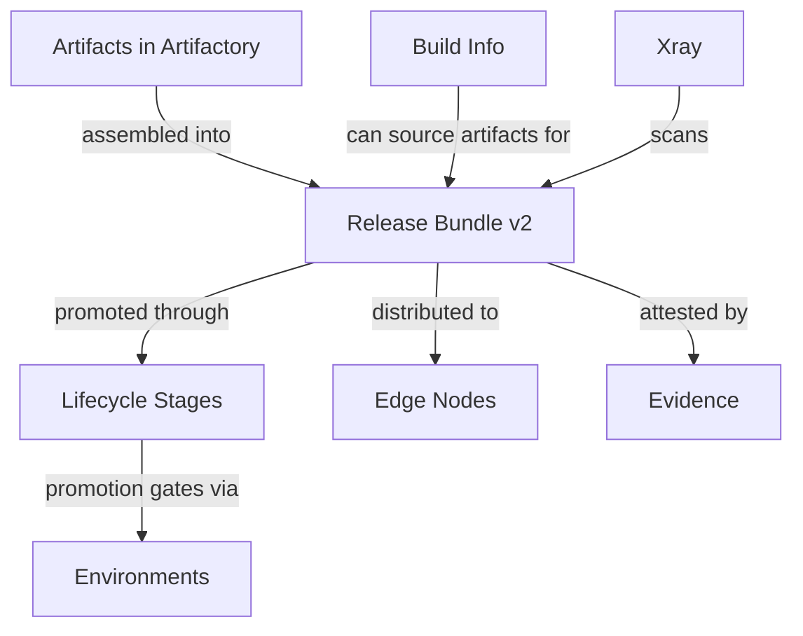

# Release lifecycle entities

When to read this file:

- Working with **release bundles** (create, promote, distribute, delete).
- Understanding **lifecycle stages** release bundle passes through.
- Setting up **distribution** to Edge nodes or other Platform Deployments.
- Working with **evidence** (supply chain attestations).
- Mapping CLI commands (`rbc`, `rbp`, `rbd`, etc.) → lifecycle meaning.

## Entity relationship overview



## Release Bundles (v2)

Release bundle = **immutable, versioned artifact collection** assembled from Artifactory. Releasable unit moving through lifecycle stages → production.

| Field | Description |
|-------|-------------|
| `name` | Bundle name (e.g. `my-app`) |
| `version` | Semantic or custom version string (e.g. `1.2.0`) |
| `artifacts` | Artifacts by repo path + checksum |
| `created` | Creation timestamp |
| `status` | Current lifecycle status |

Assembly sources:
- **AQL queries** — dynamically select matching artifacts
- **Build info** — all artifacts from published build
- **Explicit list** — specify repo paths directly

Once created, artifact list **immutable** — same version = exact same artifacts (enforced by checksums).

> **v1 vs v2:** Release Bundle v1 managed by Distribution service — deprecated. v2 managed by Lifecycle service — current model. CLI `rbc`/`rbp`/`rbd` default to v2.

### CLI commands

| Command | Operation | Description |
|---------|-----------|-------------|
| `jf rbc` | Create | Assemble new release bundle version |
| `jf rbp` | Promote | Move bundle to next lifecycle stage |
| `jf rbd` | Distribute | Deliver bundle to target nodes |
| `jf rbs` | Sign | (v1 only — v2 signs on creation) |
| `jf rbdell` | Delete local | Remove bundle version locally |
| `jf rbdelr` | Delete remote | Remove distributed bundle from targets |

## Lifecycle stages

Release bundle progresses through **stages** typically matching environments (DEV → STAGING → PROD). Each transition = **promotion**.

```
Created ──promote──▶ DEV ──promote──▶ STAGING ──promote──▶ PROD
                                                    │
                                              distribute
                                                    ▼
                                              Edge Nodes
```

Promotion (`jf rbp`):
- Moves bundle to target **environment**
- Requires bundle passed required quality gates (Xray scans, approvals)
- Each promotion **recorded** with timestamp, user, source + target environment
- Promotions auditable — full history preserved

Promotion environments = platform environments (see `platform-access-entities.md`). Scope repo access + roles per stage.

## Distribution

Distribution delivers release bundle to **Edge nodes** or other JFrog Platform Deployments.

| Concept | Description |
|---------|-------------|
| **Distribution target** | JFrog Edge node or Platform Deployment registered to receive bundles |
| **Distribution rules** | Config mapping targets → bundle version being delivered |
| **Site** | Named destination in distribution rule |

Distribution (`jf rbd`) copies bundle artifacts to target nodes, preserving checksums + metadata. Target nodes receive artifacts in local repositories.

Typically **final step** after bundle promoted to production-ready stage.

## Release Bundles in GraphQL (OneModel)

Release bundle versions also queryable via OneModel GraphQL — additional relationships beyond CLI:

| Field | Description |
|-------|-------------|
| `createdBy`, `createdAt` | Audit fields |
| `artifactsConnection` | Paginated artifacts with path, name, sha256, packageType, packageName, packageVersion, size, properties |
| `evidenceConnection` | Evidence on bundle version |
| `fromBuilds` | Builds sourcing bundle (name, number, startedAt, repositoryKey) |

Each bundle artifact has own `evidenceConnection` — per-artifact attestation queries.

OneModel query workflow (credentials, schema fetch, validation, execution): `references/onemodel-graphql.md`.

Query: `releaseBundleVersion.getReleaseBundleVersion(name: "...", version: "...", ...)`.

## Evidence

Evidence = **cryptographic attestations** about artifacts, builds, release bundles, application versions, stored packages for supply chain integrity.

### Evidence entity

| Field | Description |
|-------|-------------|
| `evidenceId` | Unique identifier |
| `subject` | Entity attested (see Evidence subjects below) |
| `predicateCategory` | Category (e.g. `distribution`) |
| `predicateType` | Full type URI (e.g. `https://jfrog.com/evidence/distribution/v1`) |
| `predicateSlug` | Short form (e.g. `distribution-v1`) |
| `predicate` | Predicate data as JSON |
| `verified` | Whether evidence signature verified |
| `signingKey` | Signing key with `alias` + `publicKey` for DSSE verification |
| `providerId` | Evidence provider ID |
| `stageName` | Stage evidence created (release bundles + app versions) |
| `createdBy`, `createdAt` | Audit fields |
| `attachments` | File attachments (e.g. legal documents) with name, sha256, type, downloadPath |

Evidence records = verifiable chain of trust:
- Build systems → build provenance
- Test frameworks → test results
- Approvers → manual reviews
- Security scans → vulnerability status
- Distribution → delivery records

### Evidence subjects

Evidence subjects **cross-domain** — `EvidenceSubject` type shared across domains via `fullPath` key:

| Subject type | Domain | Example |
|-------------|--------|---------|
| Release bundle version | Release Lifecycle | Bundle attestation before distribution |
| Release bundle artifact | Release Lifecycle | Per-artifact attestation in bundle |
| Application version | AppTrust | App version attestation before promotion |
| Application version artifact | AppTrust | Per-artifact attestation in app version |
| Stored package version location | Stored Packages | Package attestation at specific repo location |

Evidence queryable from any entry point — no need to start from Evidence query root. Example: `applications.getApplicationVersion(...).evidenceSubject` = same evidence as `evidence.searchEvidence(where: {...})`.

### CLI and GraphQL access

- **CLI**: `jf evd` namespace. `jf evd --help` for commands.
- **GraphQL**: `evidence.searchEvidence(where: {...})`,
  `evidence.getEvidenceById(id: "...")`, or
  `evidence.getEvidence(repositoryKey: "...", path: "...", name: "...")`.

Query evidence to verify required attestations exist before promotion or distribution.
