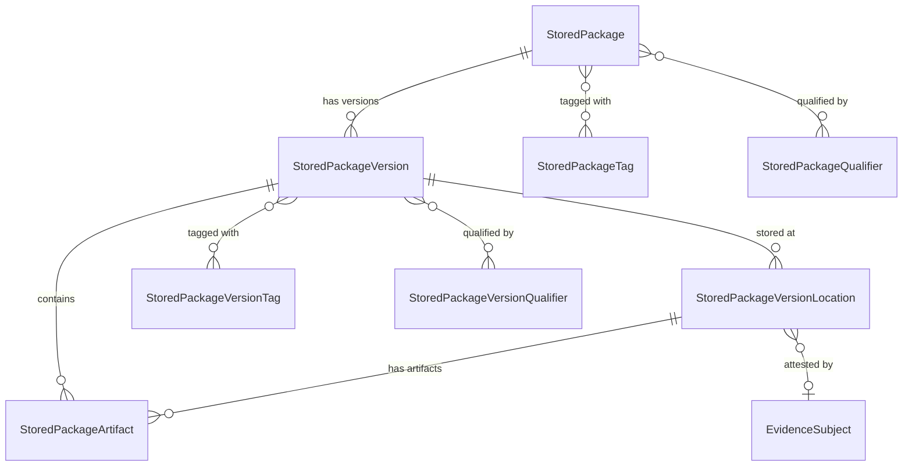

# Stored Packages entities (Metadata)

When to read this file:

- Querying **packages stored in Artifactory** at package level (not raw artifacts).
- Finding **where a package version lives** (repository, path).
- **Download statistics**, **tags**, or **qualifiers** on packages.
- OneModel GraphQL with `storedPackages` query root.
- How **Metadata layer bridges** Artifactory storage with Applications and Catalog.

Stored Packages via **OneModel GraphQL API** (`/onemodel/api/v1/graphql`).

OneModel workflow (credentials, schema fetch, validation, execution):
`references/onemodel-graphql.md`.

## Entity relationship overview

## StoredPackage

Package in Artifactory metadata — **package-centric abstraction** over raw storage.

| Field | Description |
|-------|-------------|
| `name` | Package name (e.g. `lodash`, `spring-boot-starter-web`) |
| `type` | Package type (`npm`, `maven`, `docker`, `pypi`, etc.) |
| `repositoryPackageType` | Canonicalized Artifactory repo type enum (see below) |
| `description` | Package description |
| `versionsCount` | Number of known versions |
| `latestVersionName` | Most recent version string |
| `respectsSemver` | Whether versions follow semver |
| `tags` | Package-level tags |
| `qualifiers` | Key-value qualifiers |
| `stats` | Download count |
| `createdAt`, `modifiedAt` | Timestamps |

Query: `storedPackages.getPackage(name: "...", type: "...")` or
`storedPackages.searchPackages(where: {...})`.

### Repository package type mapping

`repositoryPackageType` canonicalizes Artifactory repo types. Notable aliases:

| Artifactory type | Enum value |
|------------------|------------|
| `golang` | `GO` |
| `rpm` | `YUM` |
| `rubygems` | `GEMS` |
| `deb`, `dsc` | `DEBIAN` |
| `terraformprovider`, `terraformmodule` | `TERRAFORM` |
| `hfdataset` | `HUGGINGFACEML` |

Full enum: 40+ types. Use `repositoryPackageType` when Artifactory repo type
≠ canonical form.

## StoredPackageVersion

Specific package version with location and artifact details.

| Field | Description |
|-------|-------------|
| `package` | Parent StoredPackage |
| `version` | Version string |
| `versionSize` | Total size in bytes |
| `tags` | Version-level tags |
| `qualifiers` | Version-level key-value qualifiers |
| `stats` | Download count |
| `createdAt`, `modifiedAt` | Timestamps |

Connections:
- `locationsConnection` — where this version is stored (repos + paths)
- `artifactsConnection` — binary artifacts in this version

Query: `storedPackages.searchPackageVersions(where: {...})`.

### Filtering capabilities

Filter by: version (exact/prefix/contains), project key, date ranges, size,
tags, qualifiers, locations, artifacts, licenses; `ignorePreRelease` excludes pre-release.

## StoredPackageVersionLocation

**Bridge entity** — package version → physical repository location. Key for
"where does package X version Y live?"

| Field | Description |
|-------|-------------|
| `repositoryKey` | Artifactory repository key |
| `repositoryType` | Repository class |
| `packageVersion` | Parent version |
| `leadArtifactPath` | Path of the primary artifact |
| `leadArtifactSha256` | Checksum of the primary artifact |
| `evidenceSubject` | Evidence attestation anchor (shared across domains) |
| `stats` | Location-specific download count and last-downloaded timestamps |

`evidenceSubject` → Evidence domain — evidence per package version in specific repo.

`stats`: `downloadCount`, `lastDownloadedAt`, `remoteLastDownloadedAt` (last fetch from remote source).

## StoredPackageArtifact

Individual binary file within a package version.

| Field | Description |
|-------|-------------|
| `name` | File name |
| `sha256` | SHA-256 checksum (primary identifier) |
| `sha1`, `md5` | Additional checksums |
| `size` | Size in bytes |
| `mimeType` | Content type |
| `qualifiers` | Artifact-level key-value qualifiers |

Filtering: `isLeadArtifact` (primary artifact), `projectKey` (project-scoped queries).

## Cross-domain connections

Stored Packages bridge Artifactory storage to higher-level domains:

- **Applications (AppTrust)** — `ApplicationVersionReleasable.packageVersionLocation`
  → `StoredPackageVersionLocation` (where package releasables reside).
- **Evidence** — `StoredPackageVersionLocation.evidenceSubject` → Evidence via
  `EvidenceSubject.fullPath` (attestation at specific repo location).
- **Catalog** — Stored Packages = what's *in Artifactory*; Catalog = global
  knowledge *about* packages. Join on `type` + `name`.

## Stored Packages vs. raw Artifactory

| Aspect | Stored Packages | Artifactory (REST/CLI) |
|--------|------------------------|------------------------|
| **Abstraction** | Package-centric (name + type + version) | File-centric (repo + path + name) |
| **Access** | GraphQL only | REST + CLI (`jf rt`) |
| **Versioning** | Built-in version model | Directory conventions per package type |
| **Locations** | Explicit location entity per version | Implicit via file path |
| **Use case** | Package inventory, cross-repo queries, application binding | File operations, repo management, builds |
