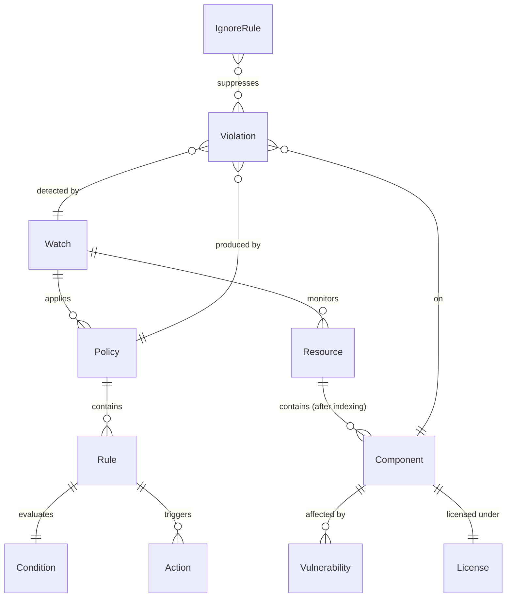

# Xray entities

When to read this file:

- Working with **security scanning**, **vulnerabilities**, or **license compliance**.
- Configuring or querying **watches**, **policies**, or **violations**.
- Debugging why a scan produced unexpected results or why violations are missing.
- Generating **security reports** or **SBOM** data.
- Searching for **artifacts impacted by a CVE** or containing a specific package.

For CLI commands: `jf xr --help`, `jf audit --help`, `jf scan --help`.
For REST fallback: `jf api /xray/api/v2/...` (see the base skill's *Invoking platform APIs with `jf api`* section).

## Entity relationship overview



The core chain: **Watch** monitors **Resources** using **Policies**. When a
**Component** in a resource matches a policy **Rule**, Xray generates a
**Violation**.

## Indexed resources

Before Xray can scan or monitor a resource, it must be **indexed**. Indexing
tells Xray to decompose artifacts in that resource into components and track
them continuously.

Indexable resource types:
- **Repositories** — local and remote repos (Xray indexes the `-cache` for remote repos)
- **Builds** — build info records published to Artifactory
- **Release Bundles** — release bundle versions

Indexing is configured in the Xray UI or via the
`PUT /api/v1/binMgr/builds` / `PUT /api/v1/binMgr/repos` endpoints.

## Components

A component is a software package that Xray identifies during scanning.
Xray decomposes artifacts (JARs, Docker layers, npm tarballs, etc.) into
their constituent components and maps each to its vulnerability and license
data.

Component identifiers vary by package type:
- Maven: `gav://group:artifact:version`
- npm: `npm://package:version`
- Docker: `docker://image:tag`
- Python: `pypi://package:version`
- Go: `go://module:version`
- Generic: identified by checksum

## Vulnerabilities

A vulnerability is a known security issue associated with specific component
versions.

| Field | Description |
|-------|-------------|
| `cve` | CVE identifier (e.g. `CVE-2021-44228`) |
| `xray_id` | JFrog-assigned identifier |
| `severity` | `Critical`, `High`, `Medium`, `Low`, `Unknown` |
| `cvss_v3` | Numeric score extracted from the CVSS v3 string (e.g. `"7.2/CVSS:3.1/..."` → `7.2`) |
| `fixed_versions` | Component versions where the vulnerability is resolved |
| `references` | Links to advisories and patches |

When asked about CVSS score, always use 'cvss_v3' field. 
Xray maintains its own vulnerability database, updated continuously.

## Contextual analysis

Contextual analysis evaluates whether a vulnerability is **actually
reachable** in the specific usage context, going beyond the raw CVE data.
It considers factors like whether vulnerable code paths are invoked, whether
mitigating configurations are present, and whether the component is used in a
way that exposes the vulnerability.

The result is an **applicability** status that helps prioritize remediation:
a Critical CVE that is not applicable in context is lower priority than a
High CVE that is confirmed applicable.

Available for supported package types and vulnerability types; check Xray
documentation for current coverage.

### Response fields: `applicability` vs `applicability_details`

The summary artifact API returns **two** contextual analysis fields per issue.
They are not interchangeable — use the correct one for the task:

| Field | Scope | Use for |
|-------|-------|---------|
| `applicability` | Top-level array; only populated when a scanner ran and produced a definitive `true`/`false` result. Many issues have `applicability: null`. | Checking whether a specific CVE is confirmed applicable or not applicable, and reading the `info` field for the human-readable reason. |
| `applicability_details` | Array present on every issue with exactly one entry per component-vulnerability pair. Always has a `result` string. | **Counting and summarizing** contextual analysis across all issues. This is the authoritative source for breakdowns. |

**Always use `applicability_details[].result` for counts and summaries.** The
top-level `applicability` field is null for issues where no scanner exists or
where the result is undetermined, which leads to incorrect "not analyzed"
buckets if used for aggregation.

### `applicability_details` result values

| `result` | Meaning | Action |
|----------|---------|--------|
| `applicable` | Vulnerable code path is confirmed reachable | Prioritize remediation |
| `not_applicable` | Vulnerable code path is confirmed unreachable (reason in `applicability[].info`) | Deprioritize; document reason |
| `undetermined` | Scanner ran but could not determine applicability | Investigate manually |
| `rescan_required` | Scanner exists but needs a fresh scan to produce a result | Trigger rescan |
| `upgrade_required` | Scanner needs an Xray version upgrade to analyze this CVE | Upgrade Xray |
| `not_scanned` | Artifact has not been scanned for contextual analysis yet | Trigger scan |
| `technology_unsupported` | The artifact's technology/language is not supported by contextual analysis | Rely on severity alone |
| `not_covered` | No contextual analysis scanner exists for this specific CVE | Rely on severity alone |

Report all eight values as distinct categories — do not merge them.

### Summarizing contextual analysis with jq

```bash
jq '[.artifacts[0].issues[] | .applicability_details[]? | .result]
    | group_by(.) | map({result: .[0], count: length})
    | sort_by(.count) | reverse' /tmp/xray-summary.json
```

For Docker images, the path format is
`default/<repo>/<image>/<tag>/manifest.json`:

```bash
jf api /xray/api/v2/summary/artifact \
  -X POST -H "Content-Type: application/json" \
  -d '{"paths": ["default/my-docker-repo/my-image/my-tag/manifest.json"]}'
```

## Licenses

License metadata associated with a component, identified by SPDX identifier
or license name (e.g. `Apache-2.0`, `MIT`, `GPL-3.0`).

Used in **license compliance policies** — organizations define which licenses
are approved, restricted, or banned, and Xray enforces these rules through
watches and policies.

## Watches

A watch is the central **monitoring configuration** that connects resources to
policies.

| Field | Description |
|-------|-------------|
| `name` | Unique watch identifier |
| `resources` | List of resources to monitor (repos, builds, release bundles, or `all-repos`/`all-builds`) |
| `assigned_policies` | List of policies to evaluate against the watched resources |
| `active` | Whether the watch is enabled |
| `project_key` | Optional project scope |

When an indexed resource changes (new artifact, updated component data), Xray
re-evaluates all watches that include that resource.

API: `GET/POST/PUT/DELETE /api/v2/watches`

## Policies

A policy defines **rules** that Xray evaluates against components found in
watched resources.

| Policy type | Rule evaluates | Common conditions |
|-------------|---------------|-------------------|
| **Security** | Vulnerabilities | Min severity, specific CVEs, CVSS score range |
| **License** | Licenses | Allowed/banned license list |
| **Operational risk** | Package metadata | End-of-life, no new versions, low activity |

Each rule has:
- **Condition** — what triggers the rule (severity ≥ High, license in banned list, etc.)
- **Actions** — what happens on match: generate violation, block download, fail build, send notification

API: `GET/POST/PUT/DELETE /api/v2/policies`

## Violations

A violation is generated when a component in a watched resource matches a
policy rule.

| Field | Description |
|-------|-------------|
| `violation_type` | `Security`, `License`, or `Operational_Risk` |
| `watch_name` | Watch that detected the violation |
| `policy_name` | Policy whose rule matched |
| `infected_components` | Array of affected component IDs (e.g. `["npm://lodash:4.17.19"]`) |
| `impacted_artifacts` | Array of artifact paths affected |
| `severity` | Inherited from the vulnerability or rule |
| `issue_id` | Xray issue ID (e.g. `XRAY-140562`) |
| `created` | Timestamp |
| `description` | Violation description (markdown from Xray 3.42.3+) |
| `matched_policies` | Policies that matched |

Violations are the primary output that security teams act on. They accumulate
until the underlying component is updated, the artifact is removed, or the
violation is suppressed via an ignore rule.

Starting from Xray 3.42.3, JFrog Security CVE Research and Enrichment data is
included in the response. The `short_description`, `full_description`, and
`remediation` fields are markdown.

### API: `POST /api/v1/violations`

Search violations with filters and pagination. Requires Read permissions.

**Performance warning:** On large or shared instances the violations API can
hang indefinitely when called without narrowing filters. Always include at
least one of `watch_name` or `created_from` (or both) to avoid timeouts. There
is no server-side query timeout — the request simply never returns. If you need
violations across all watches, iterate per-watch rather than issuing a single
unfiltered call. The API also has no `package_type` filter, so filtering by
component type (e.g. npm-only) must be done client-side on `infected_components`
or by querying watches that cover specific repository types.

```bash
jf api /xray/api/v1/violations \
  -X POST -H "Content-Type: application/json" \
  -d '{
    "filters": {
      "violation_type": "Security",
      "watch_name": "<watch-name>",
      "min_severity": "High",
      "cve_id": "CVE-2021-23337"
    },
    "pagination": {
      "limit": 50,
      "offset": 1
    }
  }'
```

To scope to a project, add `?projectKey=<key>` as a query parameter.

#### Filter fields

| Filter | Type | Description |
|--------|------|-------------|
| `name_contains` | string | Filter where description contains this string |
| `include_details` | boolean | Include additional violation detail properties |
| `violation_type` | enum | `Security`, `License`, or `Operational_Risk` |
| `watch_name` | string | Filter by watch name |
| `min_severity` | enum | `Critical`, `High`, `Medium`, `Low`, `Information`, `Unknown` |
| `created_from` | date-time | RFC 3339 timestamp — violations created after this time |
| `created_until` | date-time | RFC 3339 timestamp — violations created before this time |
| `issue_id` | string | Filter by Xray issue ID (e.g. `XRAY-94620`) |
| `cve_id` | string | Filter by CVE ID (e.g. `CVE-2019-17531`) |
| `resources` | object | Filter by specific resources (see below) |

#### Resource filters

Narrow violations to specific artifacts, builds, or release bundles:

```json
{
  "filters": {
    "violation_type": "Security",
    "resources": {
      "artifacts": [{ "repo": "npm-local", "path": "lodash/-/lodash-4.17.19.tgz" }],
      "builds": [{ "name": "my-build", "number": "42", "project": "my-proj" }],
      "release_bundles_v2": [{ "name": "my-rb", "version": "1.0", "project": "my-proj" }]
    }
  }
}
```

| Resource type | Fields |
|---------------|--------|
| `artifacts` | `repo`, `path` |
| `builds` | `name`, `number`, `project` |
| `release_bundles` | `name`, `version` |
| `release_bundles_v2` | `name`, `version`, `project` |

**There is no `component` filter.** To find violations for a specific component
(e.g. `npm://lodash:4.17.19`), filter by the resource that contains it
(artifact path, build, or release bundle) or use `cve_id`/`issue_id` to
narrow by vulnerability, then inspect `infected_components` in the response.

## Ignore rules

An ignore rule suppresses specific violations so they no longer surface in
reports or block downloads.

Ignore rules can be scoped by:
- **Vulnerability** — specific CVE or Xray ID
- **Component** — specific component and version
- **Artifact** — specific repo path
- **Docker layer** — specific layer in a Docker image
- **Build** — specific build name
- **Release bundle** — specific bundle name/version

Each rule has optional `expires_at` and `notes` fields.

API: `GET/POST/DELETE /api/v1/ignore_rules`

**Version note:** The ignore rules API uses **v1** only. The `/api/v2/ignore_rules`
endpoint does not exist and returns 404.

## Summary APIs

On-demand security, license, and operational risk lookups for artifacts
stored in Artifactory. Use **only for security and compliance queries**.

**Which endpoint to use:**
- Know the Artifactory path and the repo is indexed → `/api/v2/summary/artifact`
- Know the component ID (GAV, npm, pypi) or the artifact is not indexed → `/api/v1/summary/component`
- Not sure if indexed → try component summary first (always works if the component exists in Xray's DB)

**Prerequisite — Xray indexing:** These endpoints return data only if the
artifact's repository is indexed by Xray **and** Xray has already scanned
the artifact. An artifact can exist in Artifactory while Xray knows nothing
about it — either because the repository was not marked for indexing, or
because Xray has not yet processed it. Empty results do **not** mean the
artifact is clean; they mean Xray has no data. When results are empty,
report that the artifact may not be indexed rather than declaring it
vulnerability-free.

### `/api/v1/summary/component`

**v1 only — there is no `/api/v2/summary/component`.** Calling v2 returns 404.

Query by component identifier. Returns `issues[]`, `licenses[]`, and
`operational_risks[]` per component. Useful for looking up vulnerabilities
affecting a specific package version without needing to know its Artifactory
path, or when the artifact's repository is not indexed by Xray (making the
artifact summary endpoint return empty).

The request body uses `component_details` (an array of objects with
`component_id`), **not** `component_ids`.

```bash
jf api /xray/api/v1/summary/component \
  -X POST -H "Content-Type: application/json" \
  -d '{"component_details": [{"component_id": "npm://lodash:4.17.19"}]}'
```

Component ID format follows the same convention as component identifiers
elsewhere in Xray (see [Components](#components) above):
- npm: `npm://package:version`
- Maven: `gav://group:artifact:version`
- Python: `pypi://package:version`
- Go: `go://module:version`
- Docker: `docker://image:tag`

### `/api/v1/summary/artifact` and `/api/v2/summary/artifact`

Query by Artifactory path or SHA-256 checksum. Returns `issues[]`,
`licenses[]`, and `operational_risks[]` per artifact.

- **v1** — base response with vulnerability, license, and operational risk data
- **v2** — same structure plus `components[]` inside each issue, containing
  `component_id`, `version`, `pkg_type`, and `fixed_versions[]`

Use v2 when you need to know which component is affected and what version
fixes the vulnerability. Use v1 when fixed-version data is not needed.

Either `paths` or `checksums` must be provided in the request body. If both
are provided, checksums are ignored.

**Paths must point to specific artifacts, not repositories.** A path like
`default/my-repo/com/example/lib-1.0.jar` works; a repo-level path like
`default/my-repo` returns empty results. To get a security summary for an
entire repository, query individual artifact paths (discovered via AQL or
`jf rt search`) or use the violations API / reports API instead.

```bash
# v1 — by path
jf api /xray/api/v1/summary/artifact \
  -X POST -H "Content-Type: application/json" \
  -d '{"paths": ["default/npm-local/moment-2.29.3.tar.gz"]}'

# v2 — by checksum
jf api /xray/api/v2/summary/artifact \
  -X POST -H "Content-Type: application/json" \
  -d '{"checksums": ["8240b88c..."]}'
```

See `SKILL.md` § *Invoking platform APIs with `jf api`* for the full response schema.

## Impacted resources search

`GET /api/v2/search/impactedResources` — find all resources (artifacts, builds,
release bundles) impacted by a specific CVE **or** containing a specific
package. **Preferred over `/api/v1/component/searchByCves`** when you need
artifact paths, repos, and scan dates rather than just component identifiers.

Requires the **Reports Manager** permission and the **SBOM Service** (returns
403 if SBOM is disabled on self-hosted). Available since Xray 3.131.

### Search modes

| Mode | Required params | Use case |
|------|----------------|----------|
| By vulnerability | `vulnerability` | "Which artifacts are affected by CVE-2021-23337?" |
| By package version | `name` + `type` + `version` | "Where is log4j-core 2.14.1 used?" |
| By package (all versions) | `name` + `type` | "Where is lodash used, any version?" |

All parameters are **query string** params (not request body):

| Param | Description |
|-------|-------------|
| `vulnerability` | CVE ID (`CVE-YYYY-NNNNN`) or Xray ID (`XRAY-N`) |
| `name` | Package name |
| `type` | Package type (`npm`, `maven`, `pypi`, `go`, etc.) |
| `version` | Package version (optional — omit for all versions) |
| `namespace` | Package namespace (default: `public`; use for Maven group IDs) |
| `ecosystem` | Package ecosystem (default: `generic`) |
| `limit` | Max results per page (default 1000, max 10000) |
| `last_key` | Pagination cursor from previous response |

### Response structure

```json
{
  "result": [
    {
      "type": "Artifact",
      "name": "app.jar",
      "path": "libs-release-local/com/example/app/1.0.0/app-1.0.0.jar",
      "repo": "libs-release-local",
      "scan_date": "2024-01-15T10:30:00Z",
      "artifact_pkg_version": {
        "type": "maven",
        "name": "app",
        "namespace": "com.example",
        "version": "1.0.0",
        "ecosystem": "generic"
      },
      "impacted_pkg_version": {
        "type": "maven",
        "name": "log4j-core",
        "namespace": "org.apache.logging.log4j",
        "version": "2.14.1",
        "ecosystem": "generic"
      }
    }
  ],
  "last_key": "eyJwcmltYXJ5S2V5..."
}
```

Key response fields:

| Field | Description |
|-------|-------------|
| `type` | `Artifact`, `Build`, `ReleaseBundle`, `ReleaseBundleV2`, `AppVersion`, or `Component` |
| `name` | Resource name |
| `path` | Artifact path in repo (artifacts only) |
| `repo` | Repository name (artifacts only) |
| `scan_date` | ISO 8601 timestamp of last scan |
| `artifact_pkg_version` | Package identity of the artifact itself |
| `impacted_pkg_version` | The vulnerable/searched package found inside the artifact |
| `last_key` | Pagination cursor — empty string means no more pages |

### CLI examples

```bash
# Mode 1: all artifacts affected by a CVE
jf api "/xray/api/v2/search/impactedResources?vulnerability=CVE-2021-23337&limit=100"

# Mode 2: artifacts containing a specific package version
jf api "/xray/api/v2/search/impactedResources?name=log4j-core&type=maven&version=2.14.1&namespace=org.apache.logging.log4j"

# Mode 3: artifacts containing any version of a package
jf api "/xray/api/v2/search/impactedResources?name=lodash&type=npm"
```

### Pagination

Page through results using `last_key`:

```bash
# First page
RESP=$(jf api "/xray/api/v2/search/impactedResources?vulnerability=CVE-2021-23337&limit=1000")
LAST_KEY=$(echo "$RESP" | jq -r '.last_key')

# Subsequent pages (loop until last_key is empty)
jf api "/xray/api/v2/search/impactedResources?vulnerability=CVE-2021-23337&limit=1000&last_key=$LAST_KEY"
```

## Exposures (Advanced Security)

Exposures are actionable security findings produced by JFrog Advanced Security
that go beyond traditional vulnerability scanning. While vulnerabilities
identify known CVEs in software components, exposures detect **real-world
exploitable threats** in binaries, source code, and configurations — such as
hard-coded secrets, insecure Infrastructure-as-Code templates, and service
misconfigurations. This helps prioritize critical fixes over theoretical risks.

Exposures require **JFrog Advanced Security** to be enabled on the Xray
instance. Artifacts must be in an indexed repository and already scanned.

After getting results, keep only results with status==`to_fix` unless asked otherwise.

### Exposure categories

| Category | Path segment | What it detects |
|----------|-------------|-----------------|
| **Secrets** | `secrets` | Hard-coded credentials, API keys, tokens, private keys embedded in code or binaries |
| **Applications** | `applications` | Application-level security risks (e.g. insecure code patterns, vulnerable configurations) |
| **Services** | `services` | Service misconfigurations (e.g. open ports, insecure protocols, weak TLS settings) |
| **IaC** | `iac` | Infrastructure-as-Code issues in Terraform, CloudFormation, Kubernetes manifests, etc. |

### Exposure result fields

| Field | Description |
|-------|-------------|
| `id` | Exposure identifier (e.g. `EXP-1519-00001`) |
| `status` | Current status (e.g. `to_fix`) |
| `jfrog_severity` | JFrog-assigned severity: `critical`, `high`, `medium`, `low` |
| `description` | Human-readable description of the finding |
| `abbreviation` | Short rule identifier (e.g. `REQ.PYTHON.HARDCODED-SECRETS`) |
| `cwe` | Associated CWE (`cwe_id` and `cwe_name`) |
| `outcomes` | Potential impact if exploited (e.g. `["Credential extraction"]`) |
| `fix_cost` | Estimated remediation effort: `low`, `medium`, `high` |

### API: Get exposure results

`GET /api/v1/{category}/results` — returns a paginated list of exposure scan
results for a specific artifact. Available since Xray 3.59.4.

| Parameter | Required | Description |
|-----------|----------|-------------|
| `{category}` (path) | Yes | One of: `secrets`, `applications`, `services`, `iac` |
| `repo` (query) | Yes | Repository name |
| `path` (query) | Yes | Path to the artifact within the repository |
| `page_num` (query) | No | Page number, starting from 1 (default: 1) |
| `num_of_rows` (query) | No | Results per page (default: 10) |
| `order_by` (query) | No | Sort field: `status`, `jfrog_severity`, `exposure_id`, `description`, `file_path`, `cve`, `fix_cost`, `outcomes` |
| `direction` (query) | No | Sort direction: `asc` or `desc` |
| `search` (query) | No | Free-text search matched against descriptions |

Response:

```json
{
  "data": [
    {
      "status": "to_fix",
      "jfrog_severity": "low",
      "id": "EXP-1519-00001",
      "description": "Hardcoded random buffer was found (Python)",
      "abbreviation": "REQ.PYTHON.HARDCODED-SECRETS",
      "cwe": { "cwe_id": "CWE-798", "cwe_name": "Use of Hard-coded Credentials" },
      "outcomes": ["Credential extraction"],
      "fix_cost": "low"
    }
  ],
  "total_count": 1
}
```

### CLI examples

```bash
# Secrets exposures for an artifact
jf api "/xray/api/v1/secrets/results?repo=my-docker-local&path=my-image/latest/manifest.json&num_of_rows=50"

# IaC exposures, sorted by severity descending
jf api "/xray/api/v1/iac/results?repo=my-repo&path=terraform/main.tf&order_by=jfrog_severity&direction=desc"

# Application exposures with search filter
jf api "/xray/api/v1/applications/results?repo=npm-local&path=app-1.0.0.tgz&search=injection"

# Service misconfigurations
jf api "/xray/api/v1/services/results?repo=docker-local&path=my-service/1.0/manifest.json"
```

### Paginating exposure results

```bash
PAGE=1
while true; do
  RESP=$(jf api "/xray/api/v1/secrets/results?repo=my-repo&path=my-artifact&page_num=$PAGE&num_of_rows=100")
  echo "$RESP" | jq '.data[]'
  TOTAL=$(echo "$RESP" | jq '.total_count')
  COUNT=$(echo "$RESP" | jq '.data | length')
  [ "$COUNT" -eq 0 ] && break
  PAGE=$((PAGE + 1))
done
```

### Discovering artifact paths for exposures

The exposures API requires a specific artifact `path` — it cannot scan an
entire repository in one call. For Docker images the scannable artifact is
the **manifest**: `<image>/<tag>/manifest.json`. For other package types use
the artifact filename (e.g. `app-1.0.0.tgz`, `lib-2.3.jar`).

When the caller doesn't know the artifact paths, discover them first with AQL
and then fan out to the exposures endpoint.

**Docker repos** — find all manifests:

```bash
OUT=/tmp/manifests-$$.json
jf api /artifactory/api/search/aql \
  -X POST -H "Content-Type: text/plain" \
  -d 'items.find({"repo":"my-docker-local","name":"manifest.json","path":{"$nmatch":"*_uploads*"}}).include("repo","path","name")' \
  > "$OUT"
echo "$OUT"
jq -r '.results[] | .path + "/" + .name' "$OUT"
```

The `$nmatch` filter excludes temporary upload layers. Each result path
(e.g. `my-image/latest/manifest.json`) can be passed directly to the
exposures API's `path` parameter.

**Non-Docker repos** — find scannable artifacts:

```bash
jf api /artifactory/api/search/aql \
  -X POST -H "Content-Type: text/plain" \
  -d 'items.find({"repo":"npm-local","type":"file"}).include("repo","path","name").sort({"$desc":["size"]}).limit(20)'
```

## Curation audit events

Curation audits every package check that passes through a curated repository
and records whether the download was **approved** or **blocked**. The audit
log also captures **dry-run** policy evaluations (policies configured in
dry-run mode).

### Get audit logs

```
GET /xray/api/v1/curation/audit/packages
```

Since 3.82.x. Requires `VIEW_POLICIES` permission.

**Time-range limit:** The maximum allowed window between `created_at_start` and
`created_at_end` is **168 hours (7 days)**. Requests exceeding this return an
error (`"Maximum allowed duration is 168 hours"`). To query longer periods,
split into consecutive 7-day (or shorter) chunks and merge results client-side.
Use 6-day windows to avoid edge-case overflows from hour-level rounding.

| Parameter | Type | Default | Description |
|-----------|------|---------|-------------|
| `order_by` | string | `id` | Column to sort by |
| `direction` | string | `desc` | Sort direction (`asc` / `desc`) |
| `num_of_rows` | int | `100` | Max rows (1–2000) |
| `created_at_start` | datetime | 7 days ago | Start of time range (ISO 8601, e.g. `2023-08-13T22:00:00.000Z`). Max span to `created_at_end`: 168 hours |
| `created_at_end` | datetime | today | End of time range. Max span from `created_at_start`: 168 hours |
| `offset` | int | `0` | Pagination offset |
| `include_total` | boolean | `false` | Include `total_count` in response metadata |
| `dry_run` | boolean | `false` | `false` = real audit events (non-dry-run policies, including blocking/bypassed/waived — the Blocked/Approved tab in the UI). `true` = dry-run policy events (one per policy — the Dry Run tab in the UI) |
| `format` | string | `json` | `json` or `csv`. With `csv`: response is a zip containing `audit_packages.csv` (or `audit_packages_incomplete.csv` if >500k events). `include_total=true` is not allowed with csv. Pagination counts events, not csv rows — each event can flatten into multiple rows (one per policy) |

Example request:

```bash
jf api "/xray/api/v1/curation/audit/packages?order_by=id&direction=desc&num_of_rows=100&created_at_start=2023-07-20T22:00:00.000Z&created_at_end=2023-07-26T22:00:00.000Z&include_total=true&offset=0"
```

Response shape (key fields):

```json
{
  "data": [
    {
      "id": 174,
      "created_at": "2023-08-30T05:45:52Z",
      "action": "blocked",
      "package_type": "Docker",
      "package_name": "pumevnezdiroorg/drupal",
      "package_version": "latest",
      "curated_repository_name": "aviv-docker1",
      "username": "admin",
      "origin_repository_server_name": "z0curdocktest",
      "public_repo_url": "https://registry-1.docker.io",
      "public_repo_name": "Docker Hub",
      "policies": [
        {
          "policy_name": "onlyOffical",
          "policy_id": 3,
          "dry_run": false,
          "condition_name": "Image is not Docker Hub official",
          "condition_category": "operational"
        }
      ]
    }
  ],
  "meta": {
    "total_count": 174,
    "result_count": 1,
    "next_offset": 1,
    "order_by": "id",
    "direction": "desc",
    "num_of_rows": 1,
    "offset": 0,
    "include_total": true
  }
}
```

The `action` field is either `"blocked"` or `"approved"`. Each event includes
the `policies` array listing every non-dry-run policy that affected the
decision (blocking, bypassed, and waived).

### Pagination

Use `offset` + `num_of_rows` for pagination. The `meta.next_offset` field
gives the offset for the next page. Set `include_total=true` on the first
request to know the total number of events.

### Common use cases

- **Export all blocked packages**: paginate with `num_of_rows=2000`, filter
  results by `action == "blocked"`.
- **Dry-run analysis**: set `dry_run=true` to see what *would* be blocked if
  dry-run policies were enforced.
- **CSV export**: set `format=csv` for bulk export. Narrow the time range if
  the response indicates incomplete data (`audit_packages_incomplete.csv`).

## Reports

On-demand analysis over a defined scope, produced asynchronously.

| Report type | Analyzes |
|-------------|----------|
| **Vulnerabilities** | CVEs affecting components in scope |
| **Licenses** | License compliance across components |
| **Violations** | Policy violations across watched resources |
| **Operational risks** | Package health metrics |

Reports can be scoped to repositories, builds, release bundles, or projects.
They are generated via `POST /api/v1/reports/{type}` and retrieved after
completion.
