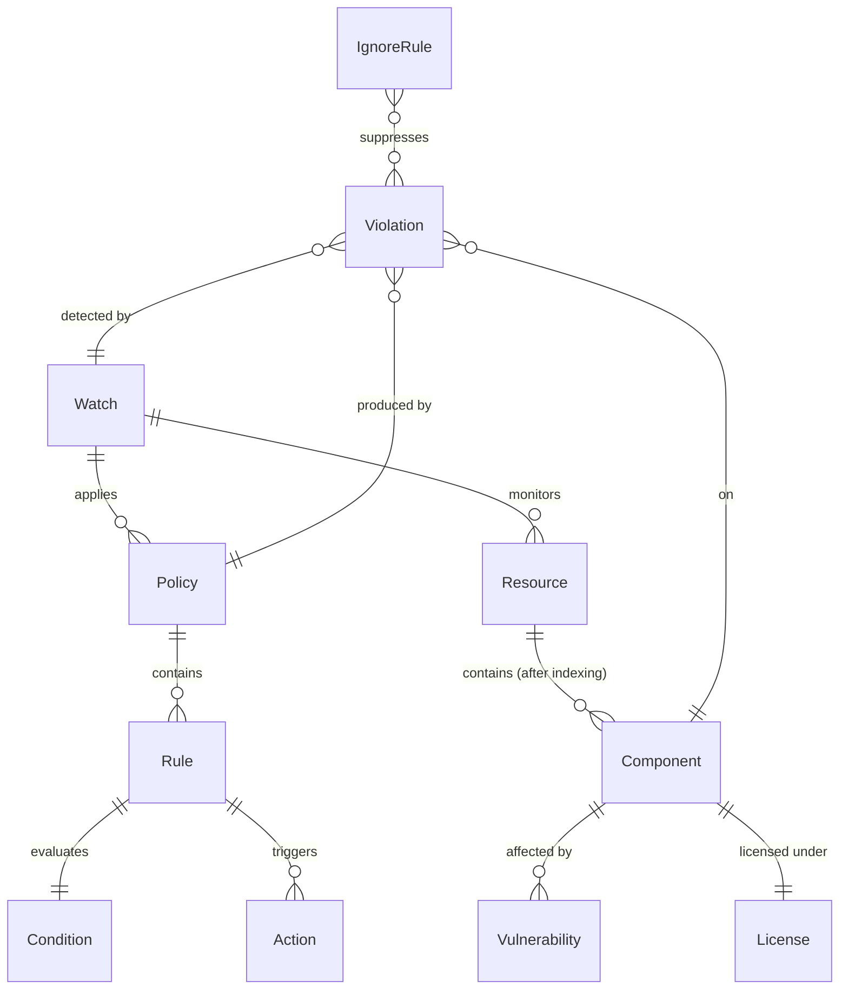

# Xray entities

Read when working with:

- **Security scanning**, **vulnerabilities**, or **license compliance**
- **Watches**, **policies**, or **violations** (configure / query / debug missing results)
- **Security reports** or **SBOM** data
- **Artifacts impacted by a CVE** or containing a specific package

CLI: `jf xr --help`, `jf audit --help`, `jf scan --help`.
REST: `jf api /xray/api/v2/...` (see base skill *Invoking platform APIs with `jf api`*).

## Entity relationship overview


```mermaid
erDiagram
    Watch ||--o{ Resource : "monitors"
    Watch ||--o{ Policy : "applies"
    Policy ||--o{ Rule : "contains"
    Rule ||--|| Condition : "evaluates"
    Rule ||--o{ Action : "triggers"
    Resource ||--o{ Component : "contains (after indexing)"
    Component ||--o{ Vulnerability : "affected by"
    Component ||--|| License : "licensed under"
    Violation }o--|| Policy : "produced by"
    Violation }o--|| Component : "on"
    Violation }o--|| Watch : "detected by"
    IgnoreRule }o--o{ Violation : "suppresses"
```

Core chain: **Watch** monitors **Resources** via **Policies**. When a
**Component** matches a policy **Rule** → Xray generates a **Violation**.

## Indexed resources

Xray must **index** a resource before scan/monitor. Indexing decomposes
artifacts into components and tracks them continuously.

Indexable types:
- **Repositories** — local and remote (Xray indexes the `-cache` for remotes)
- **Builds** — build info published to Artifactory
- **Release Bundles** — release bundle versions

Configure via Xray UI or `PUT /api/v1/binMgr/builds` / `PUT /api/v1/binMgr/repos`.

## Components

Software package Xray identifies during scanning. Artifacts (JARs, Docker
layers, npm tarballs, …) decompose into components mapped to vulnerability
and license data.

IDs by package type:
- Maven: `gav://group:artifact:version`
- npm: `npm://package:version`
- Docker: `docker://image:tag`
- Python: `pypi://package:version`
- Go: `go://module:version`
- Generic: by checksum

## Vulnerabilities

Known security issue tied to specific component versions.

| Field | Description |
|-------|-------------|
| `cve` | CVE identifier (e.g. `CVE-2021-44228`) |
| `xray_id` | JFrog-assigned identifier |
| `severity` | `Critical`, `High`, `Medium`, `Low`, `Unknown` |
| `cvss_v3` | Numeric score from CVSS v3 string (e.g. `"7.2/CVSS:3.1/..."` → `7.2`) |
| `fixed_versions` | Component versions where the vulnerability is resolved |
| `references` | Links to advisories and patches |

CVSS score → always use `cvss_v3`. Xray maintains its own continuously updated DB.

## Contextual analysis

Evaluates whether a vulnerability is **actually reachable** in this usage
context (beyond raw CVE data): invoked code paths, mitigating configs,
exposure via how the component is used.

**Applicability** status drives remediation priority: Critical + not
applicable ≺ High + confirmed applicable.

Coverage varies by package/vulnerability type — check Xray docs.

### Response fields: `applicability` vs `applicability_details`

Summary artifact API returns **two** contextual fields per issue — not
interchangeable:

| Field | Scope | Use for |
|-------|-------|---------|
| `applicability` | Top-level array; only populated when a scanner ran and produced a definitive `true`/`false` result. Many issues have `applicability: null`. | Checking whether a specific CVE is confirmed applicable or not applicable, and reading the `info` field for the human-readable reason. |
| `applicability_details` | Array present on every issue with exactly one entry per component-vulnerability pair. Always has a `result` string. | **Counting and summarizing** contextual analysis across all issues. This is the authoritative source for breakdowns. |

**Always use `applicability_details[].result` for counts and summaries.**
Top-level `applicability` is null when no scanner exists or result is
undetermined — aggregating on it mis-buckets "not analyzed".

### `applicability_details` result values

| `result` | Meaning | Action |
|----------|---------|--------|
| `applicable` | Vulnerable code path is confirmed reachable | Prioritize remediation |
| `not_applicable` | Vulnerable code path is confirmed unreachable (reason in `applicability[].info`) | Deprioritize; document reason |
| `undetermined` | Scanner ran but could not determine applicability | Investigate manually |
| `rescan_required` | Scanner exists but needs a fresh scan to produce a result | Trigger rescan |
| `upgrade_required` | Scanner needs an Xray version upgrade to analyze this CVE | Upgrade Xray |
| `not_scanned` | Artifact has not been scanned for contextual analysis yet | Trigger scan |
| `technology_unsupported` | The artifact's technology/language is not supported by contextual analysis | Rely on severity alone |
| `not_covered` | No contextual analysis scanner exists for this specific CVE | Rely on severity alone |

Report all eight values as distinct categories — do not merge them.

### Summarizing contextual analysis with jq

```bash
jq '[.artifacts[0].issues[] | .applicability_details[]? | .result]
    | group_by(.) | map({result: .[0], count: length})
    | sort_by(.count) | reverse' /tmp/xray-summary.json
```

For Docker images, the path format is
`default/<repo>/<image>/<tag>/manifest.json`:

```bash
jf api /xray/api/v2/summary/artifact \
  -X POST -H "Content-Type: application/json" \
  -d '{"paths": ["default/my-docker-repo/my-image/my-tag/manifest.json"]}'
```

## Licenses

Component license metadata (SPDX ID or name, e.g. `Apache-2.0`, `MIT`,
`GPL-3.0`). Feeds **license compliance policies** — approved / restricted /
banned lists enforced via watches and policies.

## Watches

Central **monitoring config** linking resources to policies.

| Field | Description |
|-------|-------------|
| `name` | Unique watch identifier |
| `resources` | List of resources to monitor (repos, builds, release bundles, or `all-repos`/`all-builds`) |
| `assigned_policies` | List of policies to evaluate against the watched resources |
| `active` | Whether the watch is enabled |
| `project_key` | Optional project scope |

Indexed resource change (new artifact, updated component data) → Xray
re-evaluates watches that include that resource.

API: `GET/POST/PUT/DELETE /api/v2/watches`

## Policies

**Rules** Xray evaluates against components in watched resources.

| Policy type | Rule evaluates | Common conditions |
|-------------|---------------|-------------------|
| **Security** | Vulnerabilities | Min severity, specific CVEs, CVSS score range |
| **License** | Licenses | Allowed/banned license list |
| **Operational risk** | Package metadata | End-of-life, no new versions, low activity |

Each rule:
- **Condition** — trigger (severity ≥ High, license in banned list, …)
- **Actions** — on match: violation, block download, fail build, notify

API: `GET/POST/PUT/DELETE /api/v2/policies`

## Violations

Generated when a watched component matches a policy rule.

| Field | Description |
|-------|-------------|
| `violation_type` | `Security`, `License`, or `Operational_Risk` |
| `watch_name` | Watch that detected the violation |
| `policy_name` | Policy whose rule matched |
| `infected_components` | Array of affected component IDs (e.g. `["npm://lodash:4.17.19"]`) |
| `impacted_artifacts` | Array of artifact paths affected |
| `severity` | Inherited from the vulnerability or rule |
| `issue_id` | Xray issue ID (e.g. `XRAY-140562`) |
| `created` | Timestamp |
| `description` | Violation description (markdown from Xray 3.42.3+) |
| `matched_policies` | Policies that matched |

Primary security-team output. Accumulates until the component is updated, the
artifact is removed, or an ignore rule suppresses it.

From Xray 3.42.3+: JFrog Security CVE Research/Enrichment in the response;
`short_description`, `full_description`, `remediation` are markdown.

### API: `POST /api/v1/violations`

Search with filters + pagination. Requires Read permissions.

**Performance warning:** On large/shared instances, violations API can hang
indefinitely without narrowing filters. Always include at least `watch_name`
or `created_from` (or both). No server-side query timeout — request may never
return. For all watches: iterate per-watch; do not issue one unfiltered call.
No `package_type` filter — filter client-side on `infected_components`, or
query watches covering specific repo types.

```bash
jf api /xray/api/v1/violations \
  -X POST -H "Content-Type: application/json" \
  -d '{
    "filters": {
      "violation_type": "Security",
      "watch_name": "<watch-name>",
      "min_severity": "High",
      "cve_id": "CVE-2021-23337"
    },
    "pagination": {
      "limit": 50,
      "offset": 1
    }
  }'
```

To scope to a project, add `?projectKey=<key>` as a query parameter.

#### Filter fields

| Filter | Type | Description |
|--------|------|-------------|
| `name_contains` | string | Filter where description contains this string |
| `include_details` | boolean | Include additional violation detail properties |
| `violation_type` | enum | `Security`, `License`, or `Operational_Risk` |
| `watch_name` | string | Filter by watch name |
| `min_severity` | enum | `Critical`, `High`, `Medium`, `Low`, `Information`, `Unknown` |
| `created_from` | date-time | RFC 3339 timestamp — violations created after this time |
| `created_until` | date-time | RFC 3339 timestamp — violations created before this time |
| `issue_id` | string | Filter by Xray issue ID (e.g. `XRAY-94620`) |
| `cve_id` | string | Filter by CVE ID (e.g. `CVE-2019-17531`) |
| `resources` | object | Filter by specific resources (see below) |

#### Resource filters

Narrow violations to specific artifacts, builds, or release bundles:

```json
{
  "filters": {
    "violation_type": "Security",
    "resources": {
      "artifacts": [{ "repo": "npm-local", "path": "lodash/-/lodash-4.17.19.tgz" }],
      "builds": [{ "name": "my-build", "number": "42", "project": "my-proj" }],
      "release_bundles_v2": [{ "name": "my-rb", "version": "1.0", "project": "my-proj" }]
    }
  }
}
```

| Resource type | Fields |
|---------------|--------|
| `artifacts` | `repo`, `path` |
| `builds` | `name`, `number`, `project` |
| `release_bundles` | `name`, `version` |
| `release_bundles_v2` | `name`, `version`, `project` |

**No `component` filter.** For a component (e.g. `npm://lodash:4.17.19`),
filter by containing resource (artifact path, build, release bundle) or by
`cve_id`/`issue_id`, then inspect `infected_components`.

## Ignore rules

Suppress specific violations so they no longer surface or block downloads.

Scope by: **Vulnerability** (CVE / Xray ID), **Component**, **Artifact**,
**Docker layer**, **Build**, **Release bundle**. Optional `expires_at`, `notes`.

API: `GET/POST/DELETE /api/v1/ignore_rules`

**Version note:** Ignore rules are **v1 only**. `/api/v2/ignore_rules` → 404.

## Summary APIs

On-demand security, license, and operational-risk lookups for Artifactory
artifacts. Use **only for security/compliance queries**.

**Which endpoint:**
- Know Artifactory path + repo indexed → `/api/v2/summary/artifact`
- Know component ID (GAV, npm, pypi) or artifact not indexed → `/api/v1/summary/component`
- Unsure if indexed → try component summary first (works if component is in Xray DB)

**Prerequisite — Xray indexing:** Data only if the repo is indexed **and**
Xray has scanned the artifact. Artifact may exist in Artifactory while Xray
knows nothing (repo not marked for indexing, or not yet processed). Empty
results ≠ clean — means no Xray data. Report possibly not indexed; do not
declare vulnerability-free.

### `/api/v1/summary/component`

**v1 only — no `/api/v2/summary/component`.** v2 → 404.

Query by component ID. Returns `issues[]`, `licenses[]`,
`operational_risks[]` per component. Use when you know the package version
but not the Artifactory path, or when the repo is not indexed (artifact
summary would be empty).

Body uses `component_details` (array of `{component_id}`), **not**
`component_ids`.

```bash
jf api /xray/api/v1/summary/component \
  -X POST -H "Content-Type: application/json" \
  -d '{"component_details": [{"component_id": "npm://lodash:4.17.19"}]}'
```

Component ID format matches [Components](#components) above:
- npm: `npm://package:version`
- Maven: `gav://group:artifact:version`
- Python: `pypi://package:version`
- Go: `go://module:version`
- Docker: `docker://image:tag`

### `/api/v1/summary/artifact` and `/api/v2/summary/artifact`

Query by Artifactory path or SHA-256. Returns `issues[]`, `licenses[]`,
`operational_risks[]` per artifact.

- **v1** — vulnerability, license, operational risk
- **v2** — same + `components[]` per issue (`component_id`, `version`,
  `pkg_type`, `fixed_versions[]`)

Prefer v2 when you need affected component + fix version; v1 otherwise.

Provide `paths` or `checksums` (if both, checksums ignored).

**Paths must be specific artifacts, not repos.**
`default/my-repo/com/example/lib-1.0.jar` works; `default/my-repo` → empty.
For a whole repo: query individual paths (AQL / `jf rt search`) or use
violations / reports APIs.

```bash
# v1 — by path
jf api /xray/api/v1/summary/artifact \
  -X POST -H "Content-Type: application/json" \
  -d '{"paths": ["default/npm-local/moment-2.29.3.tar.gz"]}'

# v2 — by checksum
jf api /xray/api/v2/summary/artifact \
  -X POST -H "Content-Type: application/json" \
  -d '{"checksums": ["8240b88c..."]}'
```

See `SKILL.md` § *Invoking platform APIs with `jf api`* for the full response schema.

## Impacted resources search

`GET /api/v2/search/impactedResources` — resources (artifacts, builds, release
bundles) impacted by a CVE **or** containing a package. **Prefer over
`/api/v1/component/searchByCves`** when you need paths, repos, scan dates
(not just component IDs).

Needs **Reports Manager** + **SBOM Service** (403 if SBOM disabled
self-hosted). Since Xray 3.131.

### Search modes

| Mode | Required params | Use case |
|------|----------------|----------|
| By vulnerability | `vulnerability` | "Which artifacts are affected by CVE-2021-23337?" |
| By package version | `name` + `type` + `version` | "Where is log4j-core 2.14.1 used?" |
| By package (all versions) | `name` + `type` | "Where is lodash used, any version?" |

All params are **query string** (not body):

| Param | Description |
|-------|-------------|
| `vulnerability` | CVE ID (`CVE-YYYY-NNNNN`) or Xray ID (`XRAY-N`) |
| `name` | Package name |
| `type` | Package type (`npm`, `maven`, `pypi`, `go`, etc.) |
| `version` | Package version (optional — omit for all versions) |
| `namespace` | Package namespace (default: `public`; use for Maven group IDs) |
| `ecosystem` | Package ecosystem (default: `generic`) |
| `limit` | Max results per page (default 1000, max 10000) |
| `last_key` | Pagination cursor from previous response |

### Response structure

```json
{
  "result": [
    {
      "type": "Artifact",
      "name": "app.jar",
      "path": "libs-release-local/com/example/app/1.0.0/app-1.0.0.jar",
      "repo": "libs-release-local",
      "scan_date": "2024-01-15T10:30:00Z",
      "artifact_pkg_version": {
        "type": "maven",
        "name": "app",
        "namespace": "com.example",
        "version": "1.0.0",
        "ecosystem": "generic"
      },
      "impacted_pkg_version": {
        "type": "maven",
        "name": "log4j-core",
        "namespace": "org.apache.logging.log4j",
        "version": "2.14.1",
        "ecosystem": "generic"
      }
    }
  ],
  "last_key": "eyJwcmltYXJ5S2V5..."
}
```

Key response fields:

| Field | Description |
|-------|-------------|
| `type` | `Artifact`, `Build`, `ReleaseBundle`, `ReleaseBundleV2`, `AppVersion`, or `Component` |
| `name` | Resource name |
| `path` | Artifact path in repo (artifacts only) |
| `repo` | Repository name (artifacts only) |
| `scan_date` | ISO 8601 timestamp of last scan |
| `artifact_pkg_version` | Package identity of the artifact itself |
| `impacted_pkg_version` | The vulnerable/searched package found inside the artifact |
| `last_key` | Pagination cursor — empty string means no more pages |

### CLI examples

```bash
# Mode 1: all artifacts affected by a CVE
jf api "/xray/api/v2/search/impactedResources?vulnerability=CVE-2021-23337&limit=100"

# Mode 2: artifacts containing a specific package version
jf api "/xray/api/v2/search/impactedResources?name=log4j-core&type=maven&version=2.14.1&namespace=org.apache.logging.log4j"

# Mode 3: artifacts containing any version of a package
jf api "/xray/api/v2/search/impactedResources?name=lodash&type=npm"
```

### Pagination

Page with `last_key`:

```bash
# First page
RESP=$(jf api "/xray/api/v2/search/impactedResources?vulnerability=CVE-2021-23337&limit=1000")
LAST_KEY=$(echo "$RESP" | jq -r '.last_key')

# Subsequent pages (loop until last_key is empty)
jf api "/xray/api/v2/search/impactedResources?vulnerability=CVE-2021-23337&limit=1000&last_key=$LAST_KEY"
```

## Exposures (Advanced Security)

Actionable findings from JFrog Advanced Security beyond CVE scanning:
hard-coded secrets, insecure IaC, service misconfigs — real exploitable
threats in binaries, source, and configs (vs theoretical CVEs).

Requires **JFrog Advanced Security** enabled. Artifact must be in an indexed
repo and already scanned.

After results: keep only `status==to_fix` unless asked otherwise.

### Exposure categories

| Category | Path segment | What it detects |
|----------|-------------|-----------------|
| **Secrets** | `secrets` | Hard-coded credentials, API keys, tokens, private keys embedded in code or binaries |
| **Applications** | `applications` | Application-level security risks (e.g. insecure code patterns, vulnerable configurations) |
| **Services** | `services` | Service misconfigurations (e.g. open ports, insecure protocols, weak TLS settings) |
| **IaC** | `iac` | Infrastructure-as-Code issues in Terraform, CloudFormation, Kubernetes manifests, etc. |

### Exposure result fields

| Field | Description |
|-------|-------------|
| `id` | Exposure identifier (e.g. `EXP-1519-00001`) |
| `status` | Current status (e.g. `to_fix`) |
| `jfrog_severity` | JFrog-assigned severity: `critical`, `high`, `medium`, `low` |
| `description` | Human-readable description of the finding |
| `abbreviation` | Short rule identifier (e.g. `REQ.PYTHON.HARDCODED-SECRETS`) |
| `cwe` | Associated CWE (`cwe_id` and `cwe_name`) |
| `outcomes` | Potential impact if exploited (e.g. `["Credential extraction"]`) |
| `fix_cost` | Estimated remediation effort: `low`, `medium`, `high` |

### API: Get exposure results

`GET /api/v1/{category}/results` — paginated exposure results for one
artifact. Since Xray 3.59.4.

| Parameter | Required | Description |
|-----------|----------|-------------|
| `{category}` (path) | Yes | One of: `secrets`, `applications`, `services`, `iac` |
| `repo` (query) | Yes | Repository name |
| `path` (query) | Yes | Path to the artifact within the repository |
| `page_num` (query) | No | Page number, starting from 1 (default: 1) |
| `num_of_rows` (query) | No | Results per page (default: 10) |
| `order_by` (query) | No | Sort field: `status`, `jfrog_severity`, `exposure_id`, `description`, `file_path`, `cve`, `fix_cost`, `outcomes` |
| `direction` (query) | No | Sort direction: `asc` or `desc` |
| `search` (query) | No | Free-text search matched against descriptions |

Response:

```json
{
  "data": [
    {
      "status": "to_fix",
      "jfrog_severity": "low",
      "id": "EXP-1519-00001",
      "description": "Hardcoded random buffer was found (Python)",
      "abbreviation": "REQ.PYTHON.HARDCODED-SECRETS",
      "cwe": { "cwe_id": "CWE-798", "cwe_name": "Use of Hard-coded Credentials" },
      "outcomes": ["Credential extraction"],
      "fix_cost": "low"
    }
  ],
  "total_count": 1
}
```

### CLI examples

```bash
# Secrets exposures for an artifact
jf api "/xray/api/v1/secrets/results?repo=my-docker-local&path=my-image/latest/manifest.json&num_of_rows=50"

# IaC exposures, sorted by severity descending
jf api "/xray/api/v1/iac/results?repo=my-repo&path=terraform/main.tf&order_by=jfrog_severity&direction=desc"

# Application exposures with search filter
jf api "/xray/api/v1/applications/results?repo=npm-local&path=app-1.0.0.tgz&search=injection"

# Service misconfigurations
jf api "/xray/api/v1/services/results?repo=docker-local&path=my-service/1.0/manifest.json"
```

### Paginating exposure results

```bash
PAGE=1
while true; do
  RESP=$(jf api "/xray/api/v1/secrets/results?repo=my-repo&path=my-artifact&page_num=$PAGE&num_of_rows=100")
  echo "$RESP" | jq '.data[]'
  TOTAL=$(echo "$RESP" | jq '.total_count')
  COUNT=$(echo "$RESP" | jq '.data | length')
  [ "$COUNT" -eq 0 ] && break
  PAGE=$((PAGE + 1))
done
```

### Discovering artifact paths for exposures

Exposures API needs a specific artifact `path` — cannot scan a whole repo in
one call. Docker: scannable artifact is the **manifest**
`<image>/<tag>/manifest.json`. Other types: artifact filename
(e.g. `app-1.0.0.tgz`, `lib-2.3.jar`).

Unknown paths → discover with AQL, then fan out to exposures.

**Docker repos** — find all manifests:

```bash
OUT=/tmp/manifests-$$.json
jf api /artifactory/api/search/aql \
  -X POST -H "Content-Type: text/plain" \
  -d 'items.find({"repo":"my-docker-local","name":"manifest.json","path":{"$nmatch":"*_uploads*"}}).include("repo","path","name")' \
  > "$OUT"
echo "$OUT"
jq -r '.results[] | .path + "/" + .name' "$OUT"
```

`$nmatch` excludes temporary upload layers. Each result path
(e.g. `my-image/latest/manifest.json`) → exposures API `path` param.

**Non-Docker repos** — find scannable artifacts:

```bash
jf api /artifactory/api/search/aql \
  -X POST -H "Content-Type: text/plain" \
  -d 'items.find({"repo":"npm-local","type":"file"}).include("repo","path","name").sort({"$desc":["size"]}).limit(20)'
```

## Curation audit events

Curation logs every package check through a curated repo as **approved** or
**blocked**, plus **dry-run** policy evaluations.

### Get audit logs

```
GET /xray/api/v1/curation/audit/packages
```

Since 3.82.x. Requires `VIEW_POLICIES`.

**Time-range limit:** Max window `created_at_start`→`created_at_end` is
**168 hours (7 days)**. Longer → error `"Maximum allowed duration is 168 hours"`.
Split into ≤7-day chunks (prefer 6-day to avoid hour-rounding overflow) and
merge client-side.

| Parameter | Type | Default | Description |
|-----------|------|---------|-------------|
| `order_by` | string | `id` | Column to sort by |
| `direction` | string | `desc` | Sort direction (`asc` / `desc`) |
| `num_of_rows` | int | `100` | Max rows (1–2000) |
| `created_at_start` | datetime | 7 days ago | Start of time range (ISO 8601, e.g. `2023-08-13T22:00:00.000Z`). Max span to `created_at_end`: 168 hours |
| `created_at_end` | datetime | today | End of time range. Max span from `created_at_start`: 168 hours |
| `offset` | int | `0` | Pagination offset |
| `include_total` | boolean | `false` | Include `total_count` in response metadata |
| `dry_run` | boolean | `false` | `false` = real audit events (non-dry-run policies, including blocking/bypassed/waived — the Blocked/Approved tab in the UI). `true` = dry-run policy events (one per policy — the Dry Run tab in the UI) |
| `format` | string | `json` | `json` or `csv`. With `csv`: response is a zip containing `audit_packages.csv` (or `audit_packages_incomplete.csv` if >500k events). `include_total=true` is not allowed with csv. Pagination counts events, not csv rows — each event can flatten into multiple rows (one per policy) |

Example request:

```bash
jf api "/xray/api/v1/curation/audit/packages?order_by=id&direction=desc&num_of_rows=100&created_at_start=2023-07-20T22:00:00.000Z&created_at_end=2023-07-26T22:00:00.000Z&include_total=true&offset=0"
```

Response shape (key fields):

```json
{
  "data": [
    {
      "id": 174,
      "created_at": "2023-08-30T05:45:52Z",
      "action": "blocked",
      "package_type": "Docker",
      "package_name": "pumevnezdiroorg/drupal",
      "package_version": "latest",
      "curated_repository_name": "aviv-docker1",
      "username": "admin",
      "origin_repository_server_name": "z0curdocktest",
      "public_repo_url": "https://registry-1.docker.io",
      "public_repo_name": "Docker Hub",
      "policies": [
        {
          "policy_name": "onlyOffical",
          "policy_id": 3,
          "dry_run": false,
          "condition_name": "Image is not Docker Hub official",
          "condition_category": "operational"
        }
      ]
    }
  ],
  "meta": {
    "total_count": 174,
    "result_count": 1,
    "next_offset": 1,
    "order_by": "id",
    "direction": "desc",
    "num_of_rows": 1,
    "offset": 0,
    "include_total": true
  }
}
```

`action` is `"blocked"` or `"approved"`. `policies` lists every non-dry-run
policy that affected the decision (blocking, bypassed, waived).

### Pagination

`offset` + `num_of_rows`. `meta.next_offset` → next page. First request:
`include_total=true` for total event count.

### Common use cases

- **Export blocked packages**: paginate `num_of_rows=2000`, filter
  `action == "blocked"`.
- **Dry-run analysis**: `dry_run=true` → what *would* block if enforced.
- **CSV export**: `format=csv`. Narrow time range if
  `audit_packages_incomplete.csv`.

## Reports

On-demand scoped analysis, async.

| Report type | Analyzes |
|-------------|----------|
| **Vulnerabilities** | CVEs affecting components in scope |
| **Licenses** | License compliance across components |
| **Violations** | Policy violations across watched resources |
| **Operational risks** | Package health metrics |

Scope: repos, builds, release bundles, or projects.
`POST /api/v1/reports/{type}` → retrieve after completion.
