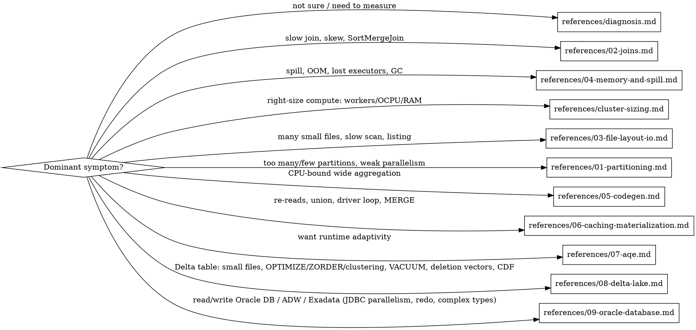

# Spark Optimization

Field-tested techniques for optimizing **open-source Apache Spark 3.5.0** (and open-source Delta Lake) workloads. Every technique lists what it does, why it matters, **patterns** (when it helps), **anti-patterns** (when it does not help or hurts), the exact config/code, and impact evidence from real reproductions.

Applies to plain OSS Spark 3.5.0. Vendor-only features (Databricks Photon / predictive optimization / Delta disk cache, AWS Glue/EMR runtime tricks) are excluded or explicitly flagged. (Note: Delta Lake liquid clustering, OPTIMIZE/ZORDER, deletion vectors, CDF are open-source — GA in Delta 3.2.0 — see `references/08-delta-lake.md`.) Some examples run on the Oracle AI Data Platform (AIDP); AIDP-specific execution rules are in `references/aidp-notes.md`.

> **In this plugin (`oracle-ai-data-platform-workbench-engineer-agent`):** measure/apply on AIDP via the
> bundled `scripts/aidp_sql.py` (one SparkSession per cluster -- set/revert `spark.conf` explicitly; see
> `references/aidp-notes.md`); pull Spark-UI stage/task metrics via the **`aidp-spark-debugging`** skill;
> right-size compute + set cluster-create-only configs (e.g. `spark.memory.fraction`) via **`aidp-cluster-ops`**;
> run Delta `OPTIMIZE`/`VACUUM`/`ZORDER` DDL via **`aidp-sql-ddl`** / **`aidp-table-management`**. *Adapted from
> the `ai-data-engineer-agent` `spark-optimization` skill (Oracle).*

## Core principle

> **Optimization is a measurement loop, not a guess.** Detect → diagnose → propose → apply → re-run on the same data → compare the same metrics.

Most Spark time is lost to **moving data** (shuffle), **waiting on a straggler** (skew), **spilling** (under-memory), **doing redundant work** (re-reads, re-materialization, repeated actions), or **per-row execution overhead** (wide codegen). Almost every win below reduces one of those.

## When to use

- A job/notebook is slow, missing an SLA, or its cost is too high.
- Spark UI shows: a single slow stage, task `p100/p50 > 2x` skew, large shuffle read/write, memory/disk spill, high GC, or thousands of tiny tasks/files.
- You see code smells: `union` of the same table, a driver loop calling `collect()`/`head()`/`count()` repeatedly, `MERGE` on a huge table, wide `groupBy` (100+ fields), reading 100k+ small files, an un-filtered join with a big dimension.
- You read from / write to an **Oracle database** (ADW/ATP/Exadata): a single-task JDBC read, a slow or redo-saturating multi-TB write, or unsupported array/map/struct columns. (`references/09-oracle-database.md`)
- Before launching a large ingest/transform so the cluster + configs are right the first time.

**When NOT to use:** correctness bugs (use debugging), or sub-second jobs where tuning effort exceeds the payoff. Structured Streaming *engine* tuning (trigger interval, `maxOffsetsPerTrigger`, state store) is out of scope here — but each micro-batch is batch-shaped, so the join/skew/partition/file/codegen techniques below apply per batch.

## How to find the opportunity → which reference to read

Then consult `references/config-matrix.md` for the exact key, default, impact, and **where it can be set** (notebook / cluster-create-only / non-modifiable), and `references/quick-reference.md` for the impact-ranked checklist.

## Reference index

| File | Covers |
|---|---|
| `references/diagnosis.md` | How to find & measure opportunities from the Spark UI: symptom→cause, skew ratio, which metrics, query→stage timing. |
| `references/01-partitioning.md` | Partition counts, parallelism, `shuffle.partitions`, AQE coalescing, tiny/empty partitions, `repartition` vs `coalesce`. |
| `references/02-joins.md` | Broadcast join, Shuffle-Hash vs Sort-Merge, skew handling, semi-join pre-filter, salting. |
| `references/03-file-layout-io.md` | Small-file problem, `openCostInBytes`/`maxPartitionBytes`, compaction/OPTIMIZE, `partitionOverwriteMode`, gzip splittability, compression (zstd). |
| `references/04-memory-and-spill.md` | Spark memory model, `memory.fraction`, spill detection/fix, off-heap, the gzip-4x rule. |
| `references/cluster-sizing.md` | Right-size AIDP compute: workers x OCPU x RAM, parallelism vs memory, observed-run → recommendation. |
| `references/05-codegen.md` | WholeStage codegen, `codegen.maxFields`, when generated code is *slower*. |
| `references/06-caching-materialization.md` | Caching & cache layout, avoid unnecessary materialization, union-of-same-table, driver-loop, JOIN-over-MERGE. |
| `references/07-aqe.md` | Adaptive Query Execution: coalesce, skew join, the threshold interplay. |
| `references/08-delta-lake.md` | Delta Lake 3.2.0: OPTIMIZE/compaction (+VACUUM dependency), optimized writes, auto-compaction, ZORDER, liquid clustering, deletion vectors, CDF, data skipping, file sizing; the optimizeWrite+zstd+binSize recipe. |
| `references/09-oracle-database.md` | Oracle DB (ADW/ATP/Exadata): parallel JDBC reads (`partitionColumn`, `fetchsize`), bulk (COPY_DATA, ADW-only) vs conventional-JDBC writes, the redo-log / NOLOGGING field case + tradeoffs, complex types (JSON-as-VARCHAR2), Storage Partition Join. |
| `references/config-matrix.md` | Master config table: default, impact, and where-settable classification. |
| `references/case-studies.md` | Real before/after numbers (field engagements + AIDP reproductions). |
| `references/quick-reference.md` | Impact-ranked checklist + symptom→technique lookup. |
| `references/aidp-notes.md` | AIDP execution model + how to set/revert configs safely (one SparkSession per cluster) + collect-metrics-early. |

## The 80/20: highest-impact moves first

Ranked by typical payoff (full details + caveats in the referenced files):

1. **Eliminate avoidable shuffle on joins** — raise `spark.sql.autoBroadcastJoinThreshold` so a small/medium side broadcasts; or **semi-join pre-filter** the big dimension down to broadcastable size. (`02-joins.md`)
2. **Fix the small-file problem** — compact sources / size output files; tune `maxPartitionBytes` + `openCostInBytes`. Listing+opening 100k+ files can cost more than the data. (`03-file-layout-io.md`)
3. **Right-size memory to stop spill** — raise `spark.memory.fraction` (cluster-create-only on AIDP) when there are no user data structures; spill to disk is a silent multiplier. (`04-memory-and-spill.md`, `cluster-sizing.md`)
4. **Address skew** — AQE skew-join, or semi-join pre-filter + broadcast; a `p100/p50 > 2x` join stage serializes the whole stage on a straggler. (`02-joins.md`, `07-aqe.md`)
5. **Avoid redundant work** — don't `union` the same table, don't loop `collect()`/`head()` on the driver, treat intermediates as views (don't materialize), prefer JOIN over MERGE for full reloads. (`06-caching-materialization.md`)
6. **Compress shuffle/spill/output with zstd** — `spark.io.compression.codec=zstd` + `spark.sql.parquet.compression.codec=zstd`: tight like gzip, fast like snappy; cuts spill-disk and output size. (`03-file-layout-io.md`)
7. **Tune parallelism** — `shuffle.partitions` ≈ 2–3× total cores for large shuffles; pair with AQE coalescing to avoid small output files. (`01-partitioning.md`)
8. **Constrain codegen on very wide aggregations** — lower `spark.sql.codegen.maxFields` when a wide `groupBy` is CPU-bound; generated code can be *slower* than the fallback. (`05-codegen.md`)

## Workflow

1. **Measure** — run the workload, collect stage metrics + task quantiles (`diagnosis.md`). On AIDP, see `aidp-notes.md` for collecting Spark UI data.
2. **Diagnose** — read `explain(True)`/the SQL plan; map the dominant symptom to a technique.
3. **Propose** — pick the technique; check `config-matrix.md` for where the config can be set.
4. **Apply** — change code or config. On a shared cluster, remember: **one SparkSession per cluster — a `spark.conf.set` leaks to other notebooks; revert it explicitly** (`aidp-notes.md`).
5. **Re-run** on the same cluster + data, prove the workload is logically identical (same rows/columns/result), and **compare the same metrics** (wall time, shuffle, spill, task skew).

## Common mistakes

- Comparing wall time of two runs that aren't logically identical (different data/cache state). Prove equivalence first.
- Reading summed task metrics as wall-clock — stage duration is start→end timestamps; cumulative task time is summed across tasks.
- Counting AQE-skipped stages as time spent.
- `repartition()` "to be safe" — it forces a shuffle; only repartition with a reason (see `01-partitioning.md`).
- Lowering AQE skew/advisory partition size so far that you create a new small-file problem.
- Setting a cluster-create-only config (e.g. `spark.memory.fraction`) from a notebook and assuming it took effect — it didn't. Verify with `spark.conf.get` / the Environment tab (`config-matrix.md`).