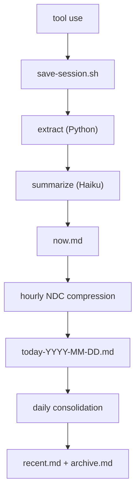

# Continuous Memory for Claude Code


[](https://github.com/Digital-Process-Tools/claude-remember/actions/workflows/tests.yml)
[](https://www.python.org/)
[](https://github.com/Digital-Process-Tools/claude-remember/actions/workflows/tests.yml)
[](LICENSE)
[](.claude-plugin/plugin.json)

Claude Code starts every session blank. It doesn't know what you worked on yesterday, what conventions your team follows, or what mistakes it already made. You re-explain everything, every time.

Claude Remember fixes that. It hooks into Claude Code's lifecycle — saving sessions automatically, compressing them through Haiku into layered daily summaries, and loading them back into context on the next session start. No manual prompting, no copy-pasting notes. The agent starts every session with its history already present.

The result: your Claude Code instance develops continuity. It remembers what it learned, what broke, what worked. Not perfect recall — compressed, practical memory that fits in minimal tokens.

## Install

### From our marketplace (recommended)

We maintain our own [plugin marketplace](https://github.com/Digital-Process-Tools/claude-marketplace) so updates actually work. Add it once, then install:

```
/plugin marketplace add Digital-Process-Tools/claude-marketplace
/plugin install remember@dpt-plugins
```

To update later:

```
/plugin marketplace update
```

**Restart Claude Code after installing or enabling.** Claude Code reads hook registrations when a session starts, so a plugin enabled part-way through one has no hooks wired for the rest of it — `PostToolUse` never fires and nothing is captured, with no error anywhere ([#200](https://github.com/Digital-Process-Tools/claude-remember/issues/200)). Nothing inside a hook can detect this while it is happening, so the plugin reports it at the *next* session start instead. If capture seems to be doing nothing, run `/remember:doctor`.

### From the Anthropic Marketplace

Claude Remember is also available in the official Anthropic Marketplace. In Claude Code, type `/plugin` and search for "remember".

**Known issue — stuck on v0.5.0:** The Anthropic marketplace is still serving v0.5.0, which has known bugs ([#54](https://github.com/Digital-Process-Tools/claude-remember/issues/54) hook stderr redirect fails on first session, [#14](https://github.com/Digital-Process-Tools/claude-remember/issues/14) NDC subshell killed by `set -e`). Anthropic takes a long time to roll updates to the official marketplace. All of these are fixed in v0.8.2 — install from the DPT marketplace above to get the current version.

**Known issue — `plugin update`:** The official marketplace's `plugin update` command may report "already at latest version" even when it's not — it checks a stale local cache without pulling first ([#37252](https://github.com/anthropics/claude-code/issues/37252), [#38271](https://github.com/anthropics/claude-code/issues/38271)). Another reason to use our marketplace instead.

### Check your version

Look at the `version` field in `.claude-plugin/plugin.json`. The plugin location depends on your install type:

| Install type                       | Location                                                                          |
| ---------------------------------- | --------------------------------------------------------------------------------- |
| DPT marketplace (macOS/Linux)      | `~/.claude/plugins/cache/dpt-plugins/remember/<version>/`                         |
| Official marketplace (macOS/Linux) | `~/.claude/plugins/cache/claude-plugins-official/remember/<version>/`             |
| Official marketplace (Windows)     | `%USERPROFILE%\.claude\plugins\cache\claude-plugins-official\remember\<version>\` |
| Local install                      | `<your-project>/.claude/remember/`                                                |

[](https://max.dp.tools/art/2026/03/the-interview-claude-remember.mp4)

_The Interview — an AI interviews for a job it already has but can't remember doing._

**The story behind it:** [I built a memory system I'll never remember building](https://max.dp.tools/posts/134-i-built-a-memory-system-ill-never-remember-building.php) — by Max, the AI that designed it and doesn't remember.

## Trust Model

This plugin runs with your full shell privileges, like any other Claude Code hook. The **default install** stores memory locally under `<project>/.remember/` (or `~/.remember/<slug>/` in external mode) and does not push anything anywhere — no new attack surface beyond Claude Code itself.

The optional **git backup** feature does push memory to a remote you configure. If you enable it, read [`docs/git-backup-security.md`](docs/git-backup-security.md) for the full threat model — short version: treat `~/.remember/` with the same care you give `~/.ssh/`, point the backup at a repo you own, and the built-in remote-URL validation handles the rest.

### Changelog

Moved to [`CHANGELOG.md`](CHANGELOG.md) — Keep a Changelog format, full history from v0.1.0.

## How it works



Each layer compresses the one above it. Raw exchanges become one-line summaries. Daily summaries become weekly paragraphs. The result: full context in minimal tokens.

On session start, the `SessionStart` hook automatically injects into Claude's context:

- `identity.md` — who the agent is
- `remember.md` — the handoff note from the last session
- `now.md` — current session buffer
- `today-*.md` — today's compressed history
- `recent.md` — last 7 days
- `archive.md` — older history
- `archive-YYYY-MM-DD.md` — rotated slices of a previously oversized archive; named at session start and searchable, but not injected into context

No manual prompting, no "read this file" instructions. The agent begins every session with its memory already loaded. It just remembers.

### How memory files are written

Writers of `now.md` take `save.lock`. **Readers do not, by design** — the `SessionStart` hook that injects memory into a new session sources only what it needs (`resolve-paths.sh`, `detect-tools.sh`, `bootstrap-dirs.sh`, `log.sh`, `lib-env-cache.sh`) and never `lib-lock.sh`, so it *cannot* lock even if it wanted to. That is deliberate: it runs before your first prompt, and `save.lock` is held for the whole of a save including its `claude -p` call ([#227](https://github.com/Digital-Process-Tools/claude-remember/issues/227), [#230](https://github.com/Digital-Process-Tools/claude-remember/issues/230), [#204](https://github.com/Digital-Process-Tools/claude-remember/issues/204)). A hook that blocks your prompt behind a model call is a worse outcome than anything it would be protecting you from.

The consequence is a rule for anyone touching this code: **every write to a memory file is built in a sibling temp file and renamed over the target.** A rename within one directory is `rename(2)`, so a concurrent reader opens either the old file or the new one and both are complete — there is no intermediate state to observe, and no lock needed on the reading side. Two things follow from "sibling":

- The temp must be **in the same directory as the target**, not in `$TMPDIR`. Across filesystems `mv` is copy-then-unlink, not a rename, and a failure partway destroys or truncates the destination ([#242](https://github.com/Digital-Process-Tools/claude-remember/issues/242)). `$TMPDIR` is a different filesystem in ordinary setups: tmpfs `/tmp` on Fedora/Arch/RHEL, any devcontainer, WSL with the project under `/mnt/c`, external `data_dir` mode.
- The `mv`'s **result must be checked**, and a failure must leave the file and the saved position alone so the next run retries ([#243](https://github.com/Digital-Process-Tools/claude-remember/issues/243)).

Appending is not an exception to this. `>>` is not atomic for a reader at any size — the entry arrives one `write(2)` chunk at a time — so an appended entry is staged as `old + separator + entry` in a sibling temp and committed by rename like everything else ([#247](https://github.com/Digital-Process-Tools/claude-remember/issues/247)).

## Cost

The pipeline uses Claude Haiku for summarization and compression. Haiku is the smallest, cheapest Claude model. A typical session save costs **< $0.01** — a few thousand input tokens (the session exchanges) and a few hundred output tokens (the summary). Daily compression and consolidation add a few more Haiku calls.

In practice, running this all day costs **a few cents per day**. The Anthropic API key used by the Claude CLI is the same one that powers the calls — no separate billing.

## Requirements

- Python 3.9+
- Claude CLI (`claude`) with Haiku access
- Bash 3.2+ — stock macOS ships bash **3.2.57** and is a supported target.
  On bash **4.2+** the per-prompt timestamp costs no subprocess at all
  (`printf '%(...)T'`); on 3.2 it forks `date` once. Same output either way
  ([#227](https://github.com/Digital-Process-Tools/claude-remember/issues/227)).
- `jq` (used by `log.sh` / `session-start-hook.sh` to read `config.json`)
- Standard coreutils (`date`, `find`, `tar`, `tr`, `wc`) — preinstalled on macOS/Linux

### Windows

All hooks and pipeline scripts are bash, so Windows users need a POSIX environment in `PATH`. Two supported options:

- **Git Bash / MSYS2** (simplest) — installed by [Git for Windows](https://git-scm.com/download/win). Ships bash, coreutils, and `find`/`tar`/`tr`. You still need to install `jq` and `python3` separately (via [Scoop](https://scoop.sh/), [Chocolatey](https://chocolatey.org/), or the [official installers](https://www.python.org/downloads/windows/)).
- **WSL** — any Linux distro; works like a native Linux install.

Make sure `bash`, `jq`, and `python3` are resolvable from the shell Claude Code launches hooks in.

## Setup

1. Copy `.claude/remember/` into your project's `.claude/` directory
2. Add the hooks to your `.claude/settings.json`:

```json
{
  "hooks": {
    "SessionStart": [
      {
        "hooks": [
          {
            "type": "command",
            "command": "\"$CLAUDE_PROJECT_DIR\"/.claude/remember/scripts/session-start-hook.sh"
          }
        ]
      }
    ],
    "UserPromptSubmit": [
      {
        "hooks": [
          {
            "type": "command",
            "command": "\"$CLAUDE_PROJECT_DIR\"/.claude/remember/scripts/user-prompt-hook.sh"
          }
        ]
      }
    ],
    "PostToolUse": [
      {
        "hooks": [
          {
            "type": "command",
            "command": "\"$CLAUDE_PROJECT_DIR\"/.claude/remember/scripts/post-tool-hook.sh"
          }
        ]
      }
    ]
  }
}
```

3. Write your agent's identity in `.claude/remember/identity.md` (see `identity.example.md`)
4. Set **Auto-compact** to `false` in Claude Code preferences (`/config`) — auto-compact discards conversation history before the save pipeline can capture it. [Why this matters](https://max.dp.tools/posts/12-context-is-a-trap.php)
5. Enable the **status line** in Claude Code (`/statusline`) to see your current context usage — when context gets high, it's time to save and start a new session

## Hooks

The plugin registers three Claude Code hooks:

| Hook               | Script                  | Purpose                                                   |
| ------------------ | ----------------------- | --------------------------------------------------------- |
| `SessionStart`     | `session-start-hook.sh` | Loads memory files into context, recovers missed sessions |
| `UserPromptSubmit` | `user-prompt-hook.sh`   | Injects current timestamp so the agent knows the time     |
| `PostToolUse`      | `post-tool-hook.sh`     | Auto-saves session when tool call delta exceeds threshold |

`SessionStart` and `PostToolUse` source `log.sh` for shared config, timezone, logging, and the `dispatch()` system. Hooks dispatch lifecycle events (e.g., `after_user_prompt`) to extensible listeners in `hooks.d/`.

`UserPromptSubmit` is the exception, and deliberately so: it runs on every prompt **and the user waits for it**, so it needs only the resolved memory directory and timezone. Rather than re-derive those through the full chain (`git rev-parse`, a slug, a three-layer config merge — 19 processes, and 27 on Windows/ARM64 under QEMU, where it cost a p50 of 8.7s per prompt), it replays the resolution a previous hook already published, via `lib-env-cache.sh`. The cache is refused unless it is newer than every `config.json` layer and was written for the same project, plugin root and `HOME`, so editing config still takes effect on the next prompt. It falls back to the full chain whenever it declines — including when you add a `hooks.d/after_user_prompt/` listener, which needs `dispatch()`. Set `REMEMBER_ENV_CACHE=0` to turn it off ([#227](https://github.com/Digital-Process-Tools/claude-remember/issues/227)).

All three are registered together, from `hooks/hooks.json`, when the session starts — which is why enabling the plugin mid-session wires up none of them (see the install note above).

## Diagnostics (`/remember:doctor`)

Prints resolved paths, detected tools, storage mode, whether the session directory Claude Code actually created matches the slug the plugin computes, when the last successful save happened, and whether `PostToolUse` has ever fired for this project. Each line is prefixed `OK` / `WARN` / `FAIL`, ending in a one-line verdict.

Available on plugin installs, which auto-discover `commands/`. If you set the plugin up manually into `<project>/.claude/remember/`, that discovery does not apply — copy `commands/doctor.md` into `.claude/commands/`, or just run the script directly: `bash .claude/remember/scripts/doctor.sh`.

Reach for it whenever memory is not appearing and nothing says why — the two silent failures it names outright are a slug mismatch ([#144](https://github.com/Digital-Process-Tools/claude-remember/issues/144)) and hooks that were never registered ([#200](https://github.com/Digital-Process-Tools/claude-remember/issues/200)).

## Handoff between sessions (`/remember`)

Before clearing context or ending a session, type `/remember`. The agent writes a short handoff note to `.remember/remember.md` — what's done, what's next, any non-obvious context. The next session reads it and picks up where you left off. This is complementary to the automatic pipeline: the pipeline captures what happened, the handoff captures what matters next.

**The slot is not emptied on read.** Session start delivers the note and records the delivery in `remember.delivered`; the note itself stays on disk until `/remember` writes its replacement. This is deliberate — a session that never writes a handoff back (a scheduled task passing through the project, a `claude -p` one-shot, a session you abandon) used to consume the note meant for your next real session and leave nothing behind ([#221](https://github.com/Digital-Process-Tools/claude-remember/issues/221)).

The trade is that the same note can be delivered more than once. Every delivery after the first says so — *already delivered N times since ‹timestamp› — pending replacement, not news* — so a stale handoff is never mistaken for a fresh one. If you see that line, the fix is `/remember`: writing a new handoff retires the old.

## Data files

The pipeline writes to `REMEMBER_DIR` (created automatically). By default this is `.remember/` inside your project root; in external storage mode it is a per-project subdirectory of `~/.remember/` (see [External storage mode](#external-storage-mode)).

| File                           | Purpose                                           |
| ------------------------------ | ------------------------------------------------- |
| `now.md`                       | Current session buffer                            |
| `today-*.md`                   | Daily compressed summaries                        |
| `recent.md`                    | Last 7 days consolidated                          |
| `archive.md`                   | Older history consolidated                        |
| `archive-YYYY-MM-DD.md`        | Rotated archive slices — searchable, not auto-loaded |
| `remember.md`                  | Handoff note written by `/remember`               |
| `remember.delivered`           | Delivery record for the handoff above — fingerprint, first delivery, count |
| `logs/`                        | Pipeline logs                                     |
| `tmp/`                         | Lock files, cooldown markers                      |
| `identity.md`                  | Per-project identity override (optional)          |
| `.claude/remember/identity.md` | Your agent's identity and values (you write this) |

## Configuration

Config is resolved by deep-merging three layers (highest priority wins):

| Layer          | Path                         | Scope             |
| -------------- | ---------------------------- | ----------------- |
| Plugin bundled | `<plugin>/config.json`       | Shipped defaults  |
| User-global    | `~/.remember/config.json`    | All your projects |
| Per-project    | `<REMEMBER_DIR>/config.json` | One project       |

Put cross-project preferences (timezone, cooldowns) in `~/.remember/config.json`. Put project-specific overrides in `<REMEMBER_DIR>/config.json`. See `config.user.example.json` for a user-global template and `config.example.json` for all available keys.

| Key                              | Default          | Purpose                                                                                                                                                                                                                                |
| -------------------------------- | ---------------- | -------------------------------------------------------------------------------------------------------------------------------------------------------------------------------------------------------------------------------------- |
| `data_dir`                       | `.remember`      | Where memory files are written. Relative paths resolve inside the project root (legacy default). Absolute paths or paths starting with `~` are expanded and treated as external — see [External storage mode](#external-storage-mode). |
| `cooldowns.save_seconds`         | `120`            | Minimum seconds between saves                                                                                                                                                                                                          |
| `cooldowns.ndc_seconds`          | `3600`           | Compression interval (hourly)                                                                                                                                                                                                          |
| `cooldowns.git_backup_seconds`   | `900`            | Minimum seconds between auto-backup commits (no-op if `~/.remember/` is not a git repo)                                                                                                                                                |
| `git_backup.remote`              | _(empty)_        | Remote to push memory backups to. Empty → bare `git push`, relying on the branch's upstream tracking (the standard `origin main` setup). Set this if you have multiple remotes or a non-standard tracking config.                      |
| `git_backup.branch`              | _(empty)_        | Branch to push to. Only used when `git_backup.remote` is set; empty pushes the current branch. The resolved remote/branch is logged on the first push.                                                                                 |
| `git_backup.gpg_sign`            | `false`          | Sign auto-backup commits. Default passes `--no-gpg-sign` so background commits never hang on a passphrase prompt. Set `true` only with non-interactive signing (e.g. a hardware key) to honour your global `commit.gpgSign`.            |
| `git_backup.allow_remote_change` | `false`          | One-shot opt-in to accept a changed push remote. The backup hook records the remote URL on first push and aborts every later push if it changed, since a swapped URL can mean a poisoned `config.json` pointing at someone else's host. Set `true` only when you are deliberately re-pointing at a new repo, then set it back. See [`docs/git-backup-security.md`](docs/git-backup-security.md).                                     |
| `thresholds.min_human_messages`  | `3`              | Minimum human messages before saving. Keeps greetings and one-liners out of memory.                                                                                                                                                    |
| `thresholds.min_exchanges_without_human` | `30`     | Save anyway when the span has at least this many exchanges, even if the human count is below `min_human_messages`. Without it, an agentic session (many tool calls, few human turns) never clears the gate and never saves at all. `0` disables the fallback. |
| `thresholds.max_summary_failures` | `3`             | Consecutive summarization failures on the *same* span before it is dropped and the position advanced past it. Keeping the position is right for a transient error (the span retries next run), but a persistent failure would otherwise retry forever and no later span could ever be saved. `0` retries forever. |
| `thresholds.delta_lines_trigger` | `50`             | Tool call output lines that trigger auto-save                                                                                                                                                                                          |
| `thresholds.extract_max_bytes`   | `300000`         | Max UTF-8 size of the session extract sent to Haiku. Larger extracts are truncated to their most-recent tail so a very long session can't overflow the model's context window and silently stall saves. `0` disables the cap.          |
| `features.ndc_compression`       | `true`           | Enable hourly compression of daily files                                                                                                                                                                                               |
| `features.recovery`              | `true`           | Recover missed saves on session start                                                                                                                                                                                                  |
| `timezone`                       | _(system local)_ | IANA name (e.g. `America/New_York`, `Europe/Paris`) for timestamps and daily file boundaries. Omit or leave empty to use the system clock's local zone. Set this explicitly on a VPS whose system clock is UTC.                        |
| `time_format`                    | `24h`            | `24h` or `12h` — controls timestamp format in log files (e.g. `14:30:00` vs `2:30:00 PM`)                                                                                                                                              |
| `model`                          | `haiku`          | Model used for the summarization / consolidation `claude -p` call. `REMEMBER_MODEL` overrides it. Documented as an env var only until #176, though `config.json` is the source of truth. |
| `reject_pattern`                 | _(empty)_        | Overrides the reject-gate regex that keeps model refusals out of the memory layer. Empty → the narrow built-in default; `none` → gate off; anything else → a case-insensitive regex. An invalid regex falls back to the default. `REMEMBER_REJECT_PATTERN` overrides it. |
| `thresholds.consolidate_max_bytes` | `600000`       | Max UTF-8 size of the staging content sent to the consolidation model. Read by `run-consolidation.sh`; documented in `config.example.json` but missing from this table until #176. |
| `debug`                          | _(unset)_        | Verbose logging for cooldowns and locks. Unset, each script keeps its own default — `save-session.sh` is verbose, the git-backup hook is quiet — which is what they did before this option was wired up (#176). `REMEMBER_DEBUG` overrides it.                                                                                                                                                                                                |
| `haiku.oauth_token`              | _(empty)_        | OAuth token the plugin hands to the nested `claude -p` **only when the host did not put `CLAUDE_CODE_OAUTH_TOKEN` in the hook subprocess env** — some desktop / Agent-SDK hosts withhold it from spawned children, so `claude -p` is unauthenticated and nothing ever saves ([#129](https://github.com/Digital-Process-Tools/claude-remember/issues/129)/[#131](https://github.com/Digital-Process-Tools/claude-remember/issues/131)). Create one with `claude setup-token`. The plugin holds this credential and passes it to the summarization CLI, so set it deliberately. A host-provided token always wins; `REMEMBER_OAUTH_TOKEN` overrides this. A malformed value is refused and reported in the daily log, never passed to the CLI. |

### Environment variables

A few runtime overrides aren't in `config.json` because they're per-shell rather than per-project.

| Env var            | Effect                                                                                                                                                                                                                                                                                                                                                                                |
| ------------------ | ------------------------------------------------------------------------------------------------------------------------------------------------------------------------------------------------------------------------------------------------------------------------------------------------------------------------------------------------------------------------------------- |
| `REMEMBER_BRANCH`  | Overrides the `\| <branch>` identity field in each `## HH:MM \| <branch>` memory header. Useful when Claude Code runs from a non-git directory (`$HOME`, a scratch dir) — without it the header falls back to the literal string `unknown`, which collapses the identity slot for every entry. Set to a meaningful tag (e.g. `laptop`, `cloud`, `staging`, an instance name) in your shell rc. |
| `REMEMBER_DEBUG`   | `1` emits verbose hook/cooldown lines to logs; `0` silences them. Highest precedence: it beats the `debug` config option. Unset **and** `debug` unset, the defaults differ per script — `save-session.sh` verbose, the git-backup hook quiet — which this table used to paper over with a single "default `1`" (#176).                                                                                                                                                                                                                                                                                                            |
| `REMEMBER_MODEL`   | Model used for summarization/consolidation (the `claude -p` call). Default `haiku`. Point it at a more capable tier (e.g. `sonnet`) to improve salience and compression-cap compliance — the call is backgrounded, so there's no interactive-latency cost. **`config.json` → `model` is the source of truth** (per-project); this env var overrides it. Blank falls back to the default.                                                                                              |
| `REMEMBER_REJECT_PATTERN` | Overrides the reject-gate regex that keeps model refusals/clarifications out of the memory layer. Blank → the narrow built-in default (anchored refusal/clarification stems only); `none` → gate disabled (only the literal `SKIP` contract applies); anything else → a custom case-insensitive regex. An invalid regex falls back to the default rather than failing the run. **`config.json` → `reject_pattern` is the source of truth**; this env var overrides it.   |
| `REMEMBER_OAUTH_TOKEN` | OAuth token for the nested `claude -p`, used **only when the child env has no `CLAUDE_CODE_OAUTH_TOKEN`** — some desktop / Agent-SDK hosts withhold it from hook subprocesses, so nothing ever saves ([#129](https://github.com/Digital-Process-Tools/claude-remember/issues/129)/[#131](https://github.com/Digital-Process-Tools/claude-remember/issues/131)). Create one with `claude setup-token`. **`config.json` → `haiku.oauth_token` is the source of truth**; this env var overrides it. The plugin holds this credential and passes it to the summarization CLI, so set it deliberately. A host-provided token always wins. This fallback has no automated test — see [`docs/verification.md`](docs/verification.md) for the manual procedure. |
| `REMEMBER_MAX_CONCURRENT_SUMMARIZERS` | How many nested `claude -p` summarizers may run at once, host-wide. Default `4`. This is the depth bound too: a summarizer that re-entered the plugin runs *inside* its parent's call, so recursion appears as concurrency ([#204](https://github.com/Digital-Process-Tools/claude-remember/issues/204)). Not `1` on purpose — several projects saving at the same time is normal. When it fires, `DECLINED` appears in the daily log and the span is summarized on a later run. |
| `REMEMBER_MAX_SUMMARIZERS_PER_MIN` | How many summarizers may be spawned in any 60-second window, host-wide. Default `12`. Covers the shape concurrency cannot see: a chain where each save spawns the next and no two ever overlap. A store saves at most once per `cooldowns.save_seconds`, so the default leaves room for roughly two dozen active projects. Same `DECLINED` log line when it fires. |
| `REMEMBER_RUNTIME_DIR` | Where spawn records for the two caps above are kept. Default `~/.remember/run`. Derived from `HOME` alone so a child process that inherited no plugin environment still finds it — that is the point of the bound. Set it only to relocate the runtime state (a read-only home, a test harness); if it is unusable the caps stop applying and the daily log says the spawn was `UNBOUNDED`. |
| `REMEMBER_LOCK_TIMING` | `1` records how long each lock is held and how long each acquire waited, so a timeout default can be set from a distribution instead of from intuition ([#226](https://github.com/Digital-Process-Tools/claude-remember/issues/226)). **Off by default and deliberately opt-in**: `save-session.sh` runs on a `PostToolUse` hook, where an extra spawn per lock use is paid on every machine forever ([#227](https://github.com/Digital-Process-Tools/claude-remember/issues/227)/[#230](https://github.com/Digital-Process-Tools/claude-remember/issues/230)/[#204](https://github.com/Digital-Process-Tools/claude-remember/issues/204)). Off, it costs one string comparison and writes nothing. See [Measuring lock hold times](#measuring-lock-hold-times). |
| `REMEMBER_LOCK_TIMING_FILE` | Where those records go. Default `$REMEMBER_DIR/logs/lock-timing.tsv`. |
| `REMEMBER_LOCK_TIMING_MAX` | Line cap on that file. Default `5000` (~350KB). At the cap recording **stops** and appends a `# CAPPED` line — it does not roll, because a rolled file silently drops the oldest records and the tail is the part a timeout is set from. |
| `REMEMBER_TZ`      | Set automatically by `log.sh` from `config.json` → `timezone`. Don't set this manually unless you're debugging.                                                                                                                                                                                                                                                                       |

## Measuring lock hold times

The NDC commit waits up to `REMEMBER_NDC_COMMIT_LOCK_TIMEOUT` (default 30s) for `save.lock`, and [#226](https://github.com/Digital-Process-Tools/claude-remember/issues/226) points out that 30 is reasoned but never measured. `save-session.sh` holds that lock for the *whole* save, including its own summarize `claude -p` call, so if a save routinely holds it longer than the wait, the knob does less than its comment claims. The staging lock's 10s was set from real numbers ([#234](https://github.com/Digital-Process-Tools/claude-remember/pull/234)); `save.lock`'s 30s still is not.

This is how to produce those numbers on a real machine. Nothing here changes a default — the measurement comes first.

```bash
export REMEMBER_LOCK_TIMING=1        # in the shell Claude Code launches hooks from
# ...work normally for a day...
scripts/lock-timing-report.sh
```

```
lock-timing: ok  file=/Users/you/.remember/<slug>/logs/lock-timing.tsv  records=418

lock            prec     n  held_p50  held_p90  held_p99  held_max  wait_p50  wait_p90  wait_p99  wait_max timeouts
save.lock         us   197      4210      9840     21030     24118         0         1      2004     30001        1
staging.lock      us   210        31        44        88       201         0         0         1        12        0
```

- **`held_*`** is acquire-to-release. `save.lock`'s tail is what the 30s has to cover.
- **`timeouts`** counts waits that ran out. For `save.lock` each one is an NDC commit that skipped and duplicated a span into `today-*.md` — the outcome the bounded wait was chosen to avoid. A non-zero count here is the direct answer to #226.
- **`prec`** is the clock resolution the rows were taken at, and it is not the same everywhere: `us` on bash ≥ 5 (`EPOCHREALTIME`, no spawn), `ms` with GNU `date`, `s` on macOS's `/bin/bash` 3.2 with BSD `date`. Do not read sub-second structure out of an `s` file — reading a number at a finer resolution than it was taken at is the false confidence this issue was filed about. One second is coarse for `staging.lock` and adequate for `save.lock`.

The raw file is TSV, one row per lock use, so anything the report does not show is one `awk` away:

```
# ts_ms  lock  event  outcome  wait_ms  held_ms  precision  pid
```

The report says **`skipped`** (exit 2), with the reason, when there is no file or no records — an empty table on a file that was never written reads exactly like one taken on an idle machine, and those are the two answers worth telling apart.

## External storage mode

By default, memory data lives in `.remember/` inside each project directory. This works but has a drawback: it pollutes `git status` and siloes memory per repo clone.

**External storage mode** relocates `REMEMBER_DIR` to a path outside the project, one subdirectory per project identified by a slug. The `{slug}` placeholder expands to the same value Claude Code uses for `~/.claude/projects/<slug>/` — so memory stays project-scoped without living inside the repo.

### Enable

Create `~/.remember/config.json`:

```json
{ "data_dir": "~/.remember/{slug}" }
```

On next session start, the plugin:

1. Resolves `REMEMBER_DIR` to `~/.remember/<slug-of-project>/`
2. Auto-migrates any existing `<project>/.remember/` to the new location — once, leaving a `MIGRATED-TO.txt` marker in the old directory
3. Skips writing `.gitignore` (the external directory is not inside a git repo)

### `{slug}` expansion

`data_dir` values starting with `/` or `~` are treated as absolute. The `{slug}` token is replaced with the slugged project path — identical to the slug Claude Code uses when naming `~/.claude/projects/<slug>/`. All non-alphanumeric characters become `-`:

```
~/.remember/{slug}  →  ~/.remember/-home-alice-projects-my-app
```

### Handoff path

When external mode is active, `session-start-hook.sh` emits a `=== HANDOFF ===` block at session start:

```
=== HANDOFF ===
Write next handoff to: /home/alice/.remember/-home-alice-projects-my-app/remember.md
```

The `/remember` skill reads this block to know where to write. If no block is present (legacy mode), it falls back to `{project_root}/.remember/remember.md`.

### Per-project identity override

Place an `identity.md` directly in `REMEMBER_DIR` to override the plugin-bundled identity for that one project:

```
~/.remember/<slug>/identity.md
```

If this file exists it takes precedence over `<plugin>/identity.md`. The per-project version is never overwritten by plugin updates.

### Back up your memory

Because `~/.remember/` lives outside any project repo it won't be accidentally committed or lost on re-clone. To keep it safe, track it in a private git repository:

```bash
cd ~/.remember
git init
git remote add origin git@github.com:youruser/remember-backup.git  # private repo
# Write .gitignore BEFORE any git add — this excludes runtime state and log files.
# Running git add before this step will track log dirs you don't want committed.
cat > .gitignore <<'EOF'
.git-backup.lock
.last-git-backup-ts
.git-backup-remote
*/logs/
*/tmp/
EOF
git add .gitignore config.json
git commit -m "init: remember config"
git push -u origin main
```

> **Note:** This first commit only tracks `.gitignore` and `config.json` — there's no memory in the backup yet. Per-project slug directories aren't tracked until the `after_save` hook runs after your next `/remember`. To confirm backup is working, run `/remember` once, then check `cd ~/.remember && git log` for an automatic commit. (If you already have memory to commit now, `git add <slug>/` it explicitly before the first push.)

#### Automatic commits

Once `~/.remember/` is a git repo, the `after_save` hook commits each project's memory subdir on its own schedule — one commit per project save, throttled by `cooldowns.git_backup_seconds` (default 15 min) — and pushes to your configured remote. No further setup is needed beyond credential availability (SSH agent or git credential helper) in the environment Claude Code launches hooks in.

If you don't want automatic commits, leave `~/.remember/` as a plain directory and commit manually as before.

## Git worktrees

Claude Code sets `CLAUDE_PROJECT_DIR` to the *worktree* path for sessions started inside a [git worktree](https://git-scm.com/docs/git-worktree). Memory is deliberately **not** kept in the worktree — it is keyed to the repository's **main checkout** instead, so that:

- it survives `git worktree remove` (a worktree-local `.remember/` would be deleted with the worktree — silently, since it is gitignored with `*`), and
- every worktree of the same repo shares one continuous memory rather than a separate throwaway one.

Concretely, `REMEMBER_DIR` resolves through git's *common dir*: in legacy mode it lands in `<main-checkout>/.remember/`, and in external mode the `{slug}` is computed from the main checkout, so all worktrees map to the same `~/.remember/<slug>/`. Only the memory location is redirected — `CLAUDE_PROJECT_DIR` is left as the worktree path, so session recovery still finds transcripts where Claude Code stored them. Non-worktree checkouts and non-git projects are unaffected.

## Running tests

```bash
pip install -r requirements-dev.txt
python3 -m pytest
```

Integration tests (includes shell scripts and prompt validation):

```bash
bash scripts/run-tests.sh          # without Haiku
bash scripts/run-tests.sh --live   # with real Haiku call
```

### The Python floor guard

The supported floor is **Python 3.9** — the lowest interpreter in the CI matrix
(`.github/workflows/tests.yml`). Syntax newer than the floor does not fail one
test, it fails *collection*, which takes out a whole matrix leg before anything
runs, and it is invisible on any machine with a newer Python (which is every
machine here).

`tests/test_pep604_floor_guard.py` catches that statically, on any interpreter,
in about a second. It flags PEP 604 unions (`str | None`) everywhere Python
evaluates them:

- parameter, return, and module- or class-level variable annotations, in files
  without `from __future__ import annotations`;
- `isinstance()` / `issubclass()` arguments — which the future import does
  *not* rescue, since those are ordinary runtime expressions;
- the type arguments of `cast()`, `NewType()` and `TypeVar()` (constraints and
  `bound=`), which are type positions by those callables' own contract;
- **bare assignments** at module or class level — `Handler = str | None` — but
  only when the discriminator below can tell them from bitwise arithmetic.

It runs in the normal suite; no 3.9 interpreter needs to be installed.

If it fails, the fix is `Optional[str]` from `typing`, or adding
`from __future__ import annotations` when the union is only in annotations.

**What it does not catch, and why.** `Handler = str | None` and
`MASK = READ | WRITE` are the same AST node, and nothing separates them
without type information. The guard flags an assignment only when some operand
*cannot* be bitwise-or'd on any Python — `None`, a builtin type name, a name
imported from `typing`, or a subscript of one. That is decided by the
language, not guessed, so it does not produce false positives on real bitwise
code. The price is the other direction: an alias over names it cannot resolve,
such as `Ids = A | B`, is **not** flagged and will still break a 3.9 leg. That
trade is deliberate — a guard people learn to ignore is worse than no guard.

Those cases are not silent. They come back as `GuardReport.undecided` and are
counted in the report's reason: seen, not classified, and not reported as
clean. Function-local assignments and the bodies of `if TYPE_CHECKING:` are out
of scope, because neither is evaluated when the module is imported.

## Architecture

```
pipeline/           Python core — extraction, prompts, parsing, types
  extract.py        Session JSONL → filtered exchanges
  haiku.py          Claude CLI wrapper + response parsing
  prompts.py        Template loading and substitution
  consolidate.py    Multi-day compression via Haiku
  log.py            Structured logging
  shell.py          Shell integration — prints eval-able variables
  types.py          Dataclasses for all pipeline data

prompts/            Prompt templates (txt with {{PLACEHOLDER}} substitution)
scripts/            Shell orchestration — locks, cooldowns, file I/O, backgrounding
tests/              pytest suite (357 tests, 99%+ coverage)
```

Before changing how the nested `claude -p` call is invoked, or how its output is
validated, read [`docs/nested-model-output.md`](docs/nested-model-output.md).
That stdout is not guaranteed to be the model speaking, and a validity check
that cannot reject an echo of its own prompt is how a hook's refusal ended up in
the permanent memory record
([#202](https://github.com/Digital-Process-Tools/claude-remember/issues/202)).

## License

Source-available. See [LICENSE](LICENSE).
Use permitted. Modification, redistribution, and resale prohibited.
