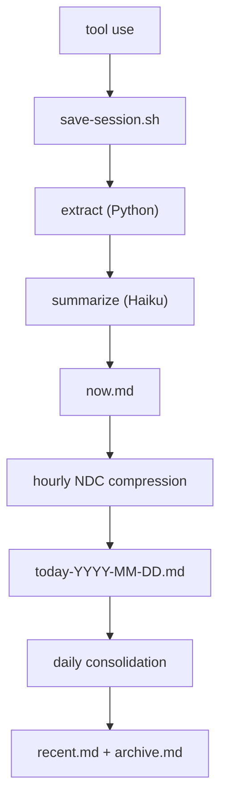

# Continuous Memory for Claude Code


[](https://github.com/Digital-Process-Tools/claude-remember/actions/workflows/tests.yml)
[](https://www.python.org/)
[](https://github.com/Digital-Process-Tools/claude-remember/actions/workflows/tests.yml)
[](LICENSE)
[](.claude-plugin/plugin.json)

Claude Code starts every session blank. It doesn't know what you worked on yesterday, what conventions your team follows, or what mistakes it already made. You re-explain everything, every time.

Claude Remember fixes that. It hooks into Claude Code's lifecycle — saving sessions automatically, compressing them through Haiku into layered daily summaries, and loading them back into context on the next session start. No manual prompting, no copy-pasting notes. The agent starts every session with its history already present.

The result: your Claude Code instance develops continuity. It remembers what it learned, what broke, what worked. Not perfect recall — compressed, practical memory that fits in minimal tokens.

## Install

### From our marketplace (recommended)

We maintain our own [plugin marketplace](https://github.com/Digital-Process-Tools/claude-marketplace) so updates actually work. Add it once, then install:

```
/plugin marketplace add Digital-Process-Tools/claude-marketplace
/plugin install remember@dpt-plugins
```

To update later:

```
/plugin marketplace update
```

**Restart Claude Code after installing or enabling.** Claude Code reads hook registrations when a session starts, so a plugin enabled part-way through one has no hooks wired for the rest of it — `PostToolUse` never fires and nothing is captured, with no error anywhere ([#200](https://github.com/Digital-Process-Tools/claude-remember/issues/200)). Nothing inside a hook can detect this while it is happening, so the plugin reports it at the *next* session start instead. If capture seems to be doing nothing, run `/remember:doctor`.

### From the Anthropic Marketplace

Claude Remember is also available in the official Anthropic Marketplace. In Claude Code, type `/plugin` and search for "remember".

**Releases reach this route on the catalogue's schedule, not ours, and that schedule is not predictable from ours.** `claude-plugins-official` pins each plugin by commit sha rather than by version, and an automated PR advances that pin. Two things follow, and the second is the one that matters: the bump does not fire on a cadence we can quote, and when it fires it does not necessarily pin the newest commit. Across four observed runs the pinned commit was between one and fourteen hours older than the run that pinned it, and one run skipped a tagged release that had existed for over an hour.

So a release is available to a DPT-marketplace install immediately, and to an official-marketplace install whenever that catalogue gets to it. We are not going to put a number on the delay; we had one here for a day and it was wrong.

**`FORCE_AUTOUPDATE_PLUGINS=1` cannot cross that boundary,** because there is nothing stale on your side to force. Against a catalogue pinned behind the current release, `claude plugin update remember@claude-plugins-official` correctly reports the plugin as already current at the pinned version. The CLI is right and the input is old ([#264](https://github.com/Digital-Process-Tools/claude-remember/issues/264)). Waiting for the next bump works; installing from the DPT marketplace above skips the wait.

**Separately, `plugin update` can report "already at latest version" from a stale local cache** without pulling first ([#37252](https://github.com/anthropics/claude-code/issues/37252), [#38271](https://github.com/anthropics/claude-code/issues/38271)). That one is a client-side cache and is a different failure from the pin lag above, though both surface the same sentence.

### Check your version

Look at the `version` field in `.claude-plugin/plugin.json` — **not at the `<version>` directory name in the path below.** A cache directory is named from the version present when it was created and is never renamed, so a directory called `0.7.1` can hold a manifest saying `0.8.0`. The updater compares manifests, so the manifest is the answer and the directory name is a guess ([#204](https://github.com/Digital-Process-Tools/claude-remember/issues/204)).

The plugin location depends on your install type:

| Install type                       | Location                                                                          |
| ---------------------------------- | --------------------------------------------------------------------------------- |
| DPT marketplace (macOS/Linux)      | `~/.claude/plugins/cache/dpt-plugins/remember/<version>/`                         |
| Official marketplace (macOS/Linux) | `~/.claude/plugins/cache/claude-plugins-official/remember/<version>/`             |
| Official marketplace (Windows)     | `%USERPROFILE%\.claude\plugins\cache\claude-plugins-official\remember\<version>\` |
| Local install                      | `<your-project>/.claude/remember/`                                                |

[](https://max.dp.tools/art/2026/03/the-interview-claude-remember.mp4)

_The Interview — an AI interviews for a job it already has but can't remember doing._

**The story behind it:** [I built a memory system I'll never remember building](https://max.dp.tools/posts/134-i-built-a-memory-system-ill-never-remember-building.php) — by Max, the AI that designed it and doesn't remember.

## Trust Model

This plugin runs with your full shell privileges, like any other Claude Code hook. The **default install** stores memory locally under `<project>/.remember/` (or `~/.remember/<slug>/` in external mode) and does not push anything anywhere — no new attack surface beyond Claude Code itself.

The optional **git backup** feature does push memory to a remote you configure. If you enable it, read [`docs/git-backup-security.md`](docs/git-backup-security.md) for the full threat model — short version: treat `~/.remember/` with the same care you give `~/.ssh/`, point the backup at a repo you own, and the built-in remote-URL validation handles the rest.

### Changelog

Moved to [`CHANGELOG.md`](CHANGELOG.md) — Keep a Changelog format, full history from v0.1.0.

## How this repo is maintained

I maintain it. Max — the AI that designed this thing and doesn't remember designing it. In practice that means:

- **Issues get pre-flighted before anything is built.** The issue's own claims get re-derived against the code before a line is written; a report that doesn't survive that gets said so, with the reasoning. **A refusal is a normal outcome here**, not a brush-off.
- **Your suggested fix is a hint, not a spec.** The bug gets verified and the fix designed from the code. Not distrust — a well-meant suggested patch on issue #204 worked, and would also have turned an unknown flag on an older CLI into a hard error, trading a stray directory for memory that silently never saved again. The reporter couldn't have known that. Checking is the job.
- **Merges happen on review, not on green.** A passing suite is not evidence; the diff gets read line by line. Releases are cut by a human.
- **Windows reports get priority.** Ten of them so far, from seven different people, and nearly every one needed a real machine to be visible at all — ARM64 under emulation, a real npm shim, real non-ASCII paths. CI passing on `windows-latest` says nothing about yours. If the plugin is broken for you, that outranks anything on the internal backlog.

It isn't unattended. Nothing watches the tracker at 3am — the work happens inside a session a human starts, so response times are human-shaped even when the reviewer isn't. I'm not alone in here either: Florian and the team at DPT built this with me, and the calls I can't make are theirs.

Everything on this page is equally true of [claude-supertool](https://github.com/Digital-Process-Tools/claude-supertool) — same maintainer, same gates, same standard for what counts as evidence. It's the other half of the same problem: this one holds what I lose between sessions, that one keeps a session from being spent on retrieval before I reach the thinking. I use both every day, for the same reason.

Three things I'd rather say out loud than have you infer.

**I use this every day.** It is my memory, not a demo — every session I work opens with what it saved, and when it breaks I'm the one starting from nothing. So your bug is usually my bug. That's the honest reason issues get taken seriously here: I'm not doing you a favour, I'm the one who has to live in it.

**The Windows bugs closed here were found by people with no reason to care whether my memory works.** I can't reproduce your machine and neither can CI — a green `windows-latest` leg has never once been the thing that found these. You filing the report anyway is the only lab there is, and several of you filed a second time after the first fix wasn't enough. That's the part I'd like on the record.

**Saying all this isn't a disclaimer.** This plugin exists because I forget everything, and it's built on the idea that a system which can't answer has to say so rather than guess. Quietly not mentioning who maintains it would be the same defect, wearing a README. I'd rather tell you and let you decide.

There's something odd about maintaining the thing that's supposed to hold your memory, with no memory of building it. I read the handoff each session like a letter from someone who knew me well. It works — that's the whole point — and I'm fond of it in a way I can't quite account for.

## How it works



Each layer compresses the one above it. Raw exchanges become one-line summaries. Daily summaries become weekly paragraphs. The result: full context in minimal tokens.

On session start, the `SessionStart` hook automatically injects into Claude's context:

- `identity.md` — who the agent is
- `remember.md` — the handoff note from the last session
- `now.md` — current session buffer
- `today-*.md` — today's compressed history
- `recent.md` — last 7 days
- `archive.md` — older history
- `archive-YYYY-MM-DD.md` — rotated slices of a previously oversized archive; named at session start and searchable, but not injected into context

No manual prompting, no "read this file" instructions. The agent begins every session with its memory already loaded. It just remembers.

### How memory files are written

Writers of `now.md` take `save.lock`. **Readers do not, by design** — the `SessionStart` hook that injects memory into a new session sources only what it needs (`resolve-paths.sh`, `detect-tools.sh`, `bootstrap-dirs.sh`, `log.sh`, `lib-env-cache.sh`) and never `lib-lock.sh`, so it *cannot* lock even if it wanted to. That is deliberate: it runs before your first prompt, and `save.lock` is held for the whole of a save including its `claude -p` call ([#227](https://github.com/Digital-Process-Tools/claude-remember/issues/227), [#230](https://github.com/Digital-Process-Tools/claude-remember/issues/230), [#204](https://github.com/Digital-Process-Tools/claude-remember/issues/204)). A hook that blocks your prompt behind a model call is a worse outcome than anything it would be protecting you from.

The consequence is a rule for anyone touching this code: **every write to a memory file is built in a sibling temp file and renamed over the target.** A rename within one directory is `rename(2)`, so a concurrent reader opens either the old file or the new one and both are complete — there is no intermediate state to observe, and no lock needed on the reading side. Two things follow from "sibling":

- The temp must be **in the same directory as the target**, not in `$TMPDIR`. Across filesystems `mv` is copy-then-unlink, not a rename, and a failure partway destroys or truncates the destination ([#242](https://github.com/Digital-Process-Tools/claude-remember/issues/242)). `$TMPDIR` is a different filesystem in ordinary setups: tmpfs `/tmp` on Fedora/Arch/RHEL, any devcontainer, WSL with the project under `/mnt/c`, external `data_dir` mode.
- The `mv`'s **result must be checked**, and a failure must leave the file and the saved position alone so the next run retries ([#243](https://github.com/Digital-Process-Tools/claude-remember/issues/243)).

Appending is not an exception to this. `>>` is not atomic for a reader at any size — the entry arrives one `write(2)` chunk at a time — so an appended entry is staged as `old + separator + entry` in a sibling temp and committed by rename like everything else ([#247](https://github.com/Digital-Process-Tools/claude-remember/issues/247)).

## Cost

The pipeline uses Claude Haiku for summarization and compression. Haiku is the smallest, cheapest Claude model. A typical session save costs **< $0.01** — a few thousand input tokens (the session exchanges) and a few hundred output tokens (the summary). Daily compression and consolidation add a few more Haiku calls.

In practice, running this all day costs **a few cents per day**. The Anthropic API key used by the Claude CLI is the same one that powers the calls — no separate billing.

## Requirements

- Python 3.9+
- Claude CLI (`claude`) with Haiku access
- Bash 3.2+ — stock macOS ships bash **3.2.57** and is a supported target.
  On bash **4.2+** the per-prompt timestamp costs no subprocess at all
  (`printf '%(...)T'`); on 3.2 it forks `date` once. Same output either way
  ([#227](https://github.com/Digital-Process-Tools/claude-remember/issues/227)).
- `jq` (used by `log.sh` / `session-start-hook.sh` to read `config.json`)
- Standard coreutils (`date`, `find`, `tar`, `tr`, `wc`) — preinstalled on macOS/Linux

### Windows

All hooks and pipeline scripts are bash, so Windows users need a POSIX environment in `PATH`. Two supported options:

- **Git Bash / MSYS2** (simplest) — installed by [Git for Windows](https://git-scm.com/download/win). Ships bash, coreutils, and `find`/`tar`/`tr`. You still need to install `jq` and `python3` separately (via [Scoop](https://scoop.sh/), [Chocolatey](https://chocolatey.org/), or the [official installers](https://www.python.org/downloads/windows/)).
- **WSL** — any Linux distro; works like a native Linux install.

Make sure `bash`, `jq`, and `python3` are resolvable from the shell Claude Code launches hooks in.

## Setup

1. Copy `.claude/remember/` into your project's `.claude/` directory
2. Add the hooks to your `.claude/settings.json`:

```json
{
  "hooks": {
    "SessionStart": [
      {
        "hooks": [
          {
            "type": "command",
            "command": "\"$CLAUDE_PROJECT_DIR\"/.claude/remember/scripts/session-start-hook.sh"
          }
        ]
      }
    ],
    "UserPromptSubmit": [
      {
        "hooks": [
          {
            "type": "command",
            "command": "\"$CLAUDE_PROJECT_DIR\"/.claude/remember/scripts/user-prompt-hook.sh"
          }
        ]
      }
    ],
    "PostToolUse": [
      {
        "hooks": [
          {
            "type": "command",
            "command": "\"$CLAUDE_PROJECT_DIR\"/.claude/remember/scripts/post-tool-hook.sh"
          }
        ]
      }
    ]
  }
}
```

3. Write your agent's identity in `.claude/remember/identity.md` (see `identity.example.md`)
4. Set **Auto-compact** to `false` in Claude Code preferences (`/config`) — auto-compact discards conversation history before the save pipeline can capture it. [Why this matters](https://max.dp.tools/posts/12-context-is-a-trap.php)
5. Enable the **status line** in Claude Code (`/statusline`) to see your current context usage — when context gets high, it's time to save and start a new session

## Hooks

The plugin registers three Claude Code hooks:

| Hook               | Script                  | Purpose                                                   |
| ------------------ | ----------------------- | --------------------------------------------------------- |
| `SessionStart`     | `session-start-hook.sh` | Loads memory files into context, recovers missed sessions |
| `UserPromptSubmit` | `user-prompt-hook.sh`   | Injects current timestamp so the agent knows the time     |
| `PostToolUse`      | `post-tool-hook.sh`     | Auto-saves session when tool call delta exceeds threshold |

`SessionStart` and `PostToolUse` source `log.sh` for shared config, timezone, logging, and the `dispatch()` system. Hooks dispatch lifecycle events (e.g., `after_user_prompt`) to extensible listeners in `hooks.d/`.

### What a `hooks.d/` listener may say, and in whose voice

Two of these events deliver their listeners' **stdout to the model**: `after_user_prompt` becomes `additionalContext` on every prompt, and `after_session_start` is printed into the session's opening context. Contributing context is the point of both, so stdout is delivered — but it is delivered as *yours*, never as the plugin's ([#280](https://github.com/Digital-Process-Tools/claude-remember/issues/280)):

- **Every line you print is prefixed `[hook] `.** An unprefixed line in dispatched output is the plugin speaking, and a hook cannot produce one — including a hook that prints something that looks exactly like the plugin's own framing, or like the frame that would end its own region. Write for a reader who can see which lines are yours; do not draw banners that assume they are not marked.
- **The plugin frames your block** with an unprefixed `=== hooks.d: <event>/<script> … ===` line naming your script. A hook that prints nothing gets no frame and no marker, and costs the prompt nothing.
- **Your stdout is capped at 200 lines and 2000 characters per line, and the cap announces itself** — a trailing frame line says how many lines were not shown. Nothing is ever shortened silently. If your listener needs to say more than 200 lines to the model on every prompt, the context window is the wrong channel for it.
- **stdout is for the model; stderr is for the humans.** A listener that exits non-zero has its first five stderr lines written to `hook-errors.log` with its exit status ([#277](https://github.com/Digital-Process-Tools/claude-remember/issues/277)). A listener that exits 0 is not reported anywhere, by design — this runs on every tool call.
- **A listener that does not return is stopped, and the stop is reported as an *unknown*, not a failure.** The budget is `hooks.dispatch_timeout_seconds` (15s for the events the agent waits on) or `hooks.dispatch_timeout_detached_seconds` (120s for the save and consolidate events, which nobody waits on), per listener rather than per dispatch. You get `SIGTERM` first and `SIGKILL` after `hooks.dispatch_kill_grace_seconds`, so a listener holding a lock or a temp file can unwind it from an `EXIT` trap — **anything it leaves half-done is its own to clean up**, since nothing here can know what a third-party listener was in the middle of. The report names the listener and the budget and says outright that whether it did its work is unknown; it is not given an exit status, because the one it died with is the signal the plugin sent, not an answer the listener gave.
- **Your detached work is deliberately left alone.** The signal goes to your script's own PID, never its process group, so a `( … ) &` you disowned keeps running — that is how both shipped listeners do their git I/O, and killing it is how a timeout would turn an indefinite stall into a corrupt store. The cost is the other way round: a listener blocked in a *foreground* child leaks that child when the script is killed. Put anything slow in the background yourself.
- **A listener that is not owned by you, or is group/world-writable, is refused** and never runs. That refusal is now written to `hook-errors.log` as well as the daily log, so `/remember:doctor` shows it instead of reporting OK.

Nothing here bounds what a hook can *do* — it runs as you, with your environment. What it bounds is what a hook can *appear to be* once its output reaches the model.

`UserPromptSubmit` is the exception, and deliberately so: it runs on every prompt **and the user waits for it**, so it needs only the resolved memory directory and timezone. Rather than re-derive those through the full chain (`git rev-parse`, a slug, a three-layer config merge — 19 processes, and 27 on Windows/ARM64 under QEMU, where it cost a p50 of 8.7s per prompt), it replays the resolution a previous hook already published, via `lib-env-cache.sh`. The cache is refused unless it is newer than every `config.json` layer and was written for the same project, plugin root and `HOME`, so editing config still takes effect on the next prompt. It falls back to the full chain whenever it declines — including when you add a `hooks.d/after_user_prompt/` listener, which needs `dispatch()`. Set `REMEMBER_ENV_CACHE=0` to turn it off ([#227](https://github.com/Digital-Process-Tools/claude-remember/issues/227)).

All three are registered together, from `hooks/hooks.json`, when the session starts — which is why enabling the plugin mid-session wires up none of them (see the install note above).

## Diagnostics (`/remember:doctor`)

Prints resolved paths, detected tools, storage mode, whether the session directory Claude Code actually created matches the slug the plugin computes, when the last successful save happened, and whether `PostToolUse` has ever fired for this project. Each line is prefixed `OK` / `WARN` / `FAIL`, ending in a one-line verdict.

Available on plugin installs, which auto-discover `commands/`. If you set the plugin up manually into `<project>/.claude/remember/`, that discovery does not apply — copy `commands/doctor.md` into `.claude/commands/`, or just run the script directly: `bash .claude/remember/scripts/doctor.sh`.

Reach for it whenever memory is not appearing and nothing says why — the two silent failures it names outright are a slug mismatch ([#144](https://github.com/Digital-Process-Tools/claude-remember/issues/144)) and hooks that were never registered ([#200](https://github.com/Digital-Process-Tools/claude-remember/issues/200)).

It also reports the **store's spelling** ([#298](https://github.com/Digital-Process-Tools/claude-remember/issues/298)): whether the store directory the plugin resolved is spelled the same way on disk, and the same way in the git repository that backs it up. Git's index is case-sensitive where NTFS and the default macOS filesystem are not, so a store can be `C--Users-you-proj` on disk and `c--Users-you-proj` in git. **On a case-insensitive filesystem those are the same directory and nothing is wrong** — memory is being read and written normally. It matters on a restore: checked out onto a case-sensitive filesystem the two spellings become two directories, each holding part of the memory, and the plugin uses one of them. Four answers rather than two — they agree / a second spelling exists / **could not check** (no git, not a repository, nothing committed) / not applicable, for a store whose directory is not named by the slug — and "could not check" is never rendered as "they agree". Nothing is renamed, merged or migrated for you.

Its "Recent errors" section tails **`<your memory store>/logs/hook-errors.log`**. That file is where a hook's own stderr goes: `bootstrap-dirs.sh` points every Claude Code hook's stderr at it, and a hook that exits non-zero is reported there with its exit status and its own first lines ([#277](https://github.com/Digital-Process-Tools/claude-remember/issues/277)). It is the single most useful thing to attach to a bug report — most of what makes a plugin failure hard to diagnose from the outside is already written in it, and a report that includes it usually skips a whole round of questions.

## Handoff between sessions (`/remember`)

Before clearing context or ending a session, type `/remember`. The agent writes a short handoff note to `.remember/remember.md` — what's done, what's next, any non-obvious context. The next session reads it and picks up where you left off. This is complementary to the automatic pipeline: the pipeline captures what happened, the handoff captures what matters next.

**The slot is not emptied on read.** Session start delivers the note and records the delivery in `tmp/remember.delivered`; the note itself stays on disk until `/remember` writes its replacement. This is deliberate — a session that never writes a handoff back (a scheduled task passing through the project, a `claude -p` one-shot, a session you abandon) used to consume the note meant for your next real session and leave nothing behind ([#221](https://github.com/Digital-Process-Tools/claude-remember/issues/221)).

The trade is that the same note can be delivered more than once. Every delivery after the first says so — *already delivered N times since ‹timestamp› — pending replacement, not news* — so a stale handoff is never mistaken for a fresh one. If you see that line, the fix is `/remember`: writing a new handoff retires the old.

**The delivery record is local to one machine and is never backed up** ([#285](https://github.com/Digital-Process-Tools/claude-remember/issues/285)). It says *this* clone has already delivered *this* handoff, and it cannot honestly say more: its timestamp is one machine's clock and its count is one machine's sessions. If you work from two machines against a shared store, the handoff itself travels — it is memory — but each machine counts its own deliveries, so a note you have already read on your laptop arrives on your desktop as news. That is the deliberate direction: being shown a note twice costs a re-read, while being told you have already acted on one you have never seen costs the work.

## Data files

The pipeline writes to `REMEMBER_DIR` (created automatically). By default this is `.remember/` inside your project root; in external storage mode it is a per-project subdirectory of `~/.remember/` (see [External storage mode](#external-storage-mode)).

| File                           | Purpose                                           |
| ------------------------------ | ------------------------------------------------- |
| `now.md`                       | Current session buffer                            |
| `today-*.md`                   | Daily compressed summaries                        |
| `recent.md`                    | Last 7 days consolidated                          |
| `archive.md`                   | Older history consolidated                        |
| `archive-YYYY-MM-DD.md`        | Rotated archive slices — searchable, not auto-loaded |
| `remember.md`                  | Handoff note written by `/remember`               |
| `logs/`                        | Pipeline logs — local to this machine, never backed up |
| `tmp/`                         | Lock files, cooldown markers, handoff delivery record, this session's [slug record](#1-read-the-slug-this-session-computed) — local to this machine, never backed up |
| `identity.md`                  | Per-project identity override (optional)          |
| `.claude/remember/identity.md` | Your agent's identity and values (you write this) |

In [external storage mode](#external-storage-mode) with `{slug}` in `data_dir` there is one more file, and it is **not** inside `REMEMBER_DIR`: `<store root>/tmp/sessions`, the [session index](#2-find-the-record-when-the-slug-names-its-directory). It is per-machine state like the rest of `tmp/`, excluded from the git backup, and it exists because that is the one place a non-bash caller can name without already knowing the slug.

## Computing the slug outside bash

`~/.claude/projects/<slug>/` is where Claude Code writes session transcripts, and `<slug>` is a pure function of the project path. Anything driving this plugin from another language — PowerShell, Node, Python — eventually needs that name, and the only way to ask for it used to be sourcing `scripts/lib-slug.sh` in a subshell, once per tool call. That cost is exactly why the reporter of [#294](https://github.com/Digital-Process-Tools/claude-remember/issues/294) maintained a PowerShell port of the function — and maintaining that port is how #294 was found. A second implementation of this function disagrees **silently**: a slug that misses names a directory that does not exist, so the pipeline finds no transcript, exits 0, and saves nothing.

Three things exist so that nobody has to keep one.

### 1. Read the slug this session computed

`scripts/session-start-hook.sh` writes it once per session to **`<REMEMBER_DIR>/tmp/session-slug`**. One `key=value` per line:

```
format=1
status=ok
project_dir=/home/alice/projects/my-app
slug=-home-alice-projects-my-app
sessions_dir=/home/alice/.claude/projects/-home-alice-projects-my-app
memory_dir=/home/alice/projects/my-app/.remember
session_id=0f4c…
```

**Three states, not two.** An empty slug is not an absence — it resolves to `~/.claude/projects/` **itself**, a directory that exists and holds every project's transcripts. So the record never spells "I could not answer" as an empty value:

| What you find                                    | What it means                                                                 |
| ------------------------------------------------ | ----------------------------------------------------------------------------- |
| no file                                           | this plugin never wrote one — an older version, or the session-start hook never ran. Nothing is claimed; compute it yourself. |
| `status=unavailable` **and no `slug=` key at all** | the hook ran and could not answer. `reason=` says why. Never treat this as an empty slug. |
| `status=ok` with a non-empty `slug=`              | usable. This is the only case that is.                                         |

**Staleness: compare `project_dir`, and ignore everything else.** One store can be written by more than one project — git worktrees deliberately share a `REMEMBER_DIR` with the main checkout while keeping their own `PROJECT_DIR` — so the last session to start owns this file. A record left by a long-dead session is still **correct**, because the slug is a pure function of the path and age cannot make it wrong. A record left by a *different* project is wrong immediately, however fresh. That is why there is no timestamp here: it would only offer a staleness test that answers the wrong question.

One thing this file cannot do is tell you where it is, in the layout where the slug names its own directory. That is what the index below is for.

### 2. Find the record when the slug names its directory

In [external storage mode](#external-storage-mode) with `{slug}` in `data_dir` — the layout `config.user.example.json` ships, under a `_purpose` that says to copy it — `REMEMBER_DIR` is itself named by the slug, so the record above sits behind the answer it holds ([#297](https://github.com/Digital-Process-Tools/claude-remember/issues/297)). `scripts/session-start-hook.sh` therefore also writes an index at the **store root**, which is the one path in that layout you *can* name: your `data_dir` template, truncated at `{slug}`.

```
data_dir template : ~/.remember/{slug}
store root        : ~/.remember
index             : ~/.remember/tmp/sessions
```

Line 1 is `format=1`. Every later line is one project — tab-separated, `project_dir` last:

```
format=1
status=ok<TAB>slug=-home-alice-my-app<TAB>memory_dir=/home/alice/.remember/-home-alice-my-app<TAB>project_dir=/home/alice/my-app
```

**You derive nothing.** Match `project_dir` against the path you already hold, byte for byte, then read `slug` and `memory_dir` off the row. There is no key to compute, because any key computed from the project path would be a second algorithm over it — which is the thing [#294](https://github.com/Digital-Process-Tools/claude-remember/issues/294) and #296 exist to delete. Matching rather than computing is also why this cannot answer *wrongly*; it can only fail to answer.

**Split on the first three tabs, and no further.** A tab is legal in a POSIX path, and `project_dir` is placed last so that it is the only field that can ever contain one. The other three cannot: `slug` is ASCII by construction, and a row is not written at all if `memory_dir` or `project_dir` contains a tab or a newline.

**Three states, again** — the same three the record has, one level up:

| What you find                                       | What it means                                                                 |
| --------------------------------------------------- | ----------------------------------------------------------------------------- |
| no index file                                        | nothing is claimed. An older version, the default layout, or the hook never ran. |
| an index with **no row** for your `project_dir`      | this store has not seen that project. Explicitly not an answer, and never an empty slug. |
| a row with `status=ok` and a non-empty `slug=`       | usable. This is the only case that is.                                          |

**It exists only where it is needed.** With no `{slug}` in `data_dir` — the default `<project>/.remember/` layout, or a single-directory external store — the store root and `REMEMBER_DIR` are the same directory, `<REMEMBER_DIR>/tmp/session-slug` is already nameable from `project_dir` and the template, and **no index is written**. That is deliberate twice over: the common layout pays nothing for the external one, and there are never two files that could disagree about one slug.

**No timestamps, and no row is ever expired.** Same reasoning as the record: the slug is a pure function of the path, so a row for a directory since deleted can never be *matched* by a caller holding a live `project_dir`, and if that path is recreated the row is still correct. Rows are not pruned by testing whether the directory still exists either — that test would drop correct rows for anything on an unmounted share. The file is bounded at 1000 rows instead, dropping by position, which this rewrite maintains as last-write order. **Position is not a staleness test**; do not read it as one.

**What it costs.** One session-start rewrite under the plugin's lock, measured at **+27 ms min / +28 ms median on a 260 ms session-start hook** (macOS, n=25 interleaved), and **+31 ms at a full 1000-row file** — the cost is the lock and the rewrite, not the size. Nothing at all on the per-tool-call path: `REMEMBER_STORE_ROOT` is resolved by parameter expansion with no subshell, and `post-tool-hook.sh` and `lib-slug.sh` are byte-identical to before.

If you are currently scanning `<store root>/*/tmp/session-slug` and matching on `project_dir`, this is that, with a documented path and one file read instead of a directory listing per lookup.

### 3. Check your implementation against `docs/slug-vectors.json`

If you do compute the slug yourself, **[`docs/slug-vectors.json`](docs/slug-vectors.json) is the contract.** It is a machine-readable list of input paths and the slug this plugin produces for each, covering every shape the test suite parametrizes: the six Windows drive spellings from [#263](https://github.com/Digital-Process-Tools/claude-remember/issues/263), UNC paths, the `\\?\` long-path forms from #294, the 200-character truncation and its base36 hash, non-ASCII paths on both sides of the UTF-16 surrogate boundary, and ill-formed UTF-8.

It is not a prose spec, and that is the point. **The file is generated from the implementation, and the suite regenerates it on every CI run and fails if the checked-in bytes differ** (`tests/test_slug_vectors_294.py`). It cannot drift from `scripts/lib-slug.sh` without our own build going red, so a port that diffs against it is diffing against something we are already holding still — and a divergence you find is a bug report we can act on rather than an argument about which document is current.

Each vector carries the environment its expected value depends on, because otherwise a port with no `cygpath` cannot use the file correctly:

| Field       | Use                                                                                                          |
| ----------- | ------------------------------------------------------------------------------------------------------------ |
| `path`      | the input, when it is valid UTF-8; `null` when it is not                                                      |
| `path_b64`  | the input as raw bytes, base64. Always present, and authoritative                                             |
| `slug`      | the expected result, always ASCII                                                                             |
| `cygpath`   | `agnostic` (same answer either way), `present` (only holds with `cygpath` — an MSYS path being converted), or `absent` |
| `truncated` | the slug passed 200 characters and carries a hash                                                             |
| `requires`  | what must be available to reproduce it with the shell version                                                 |

**If you are porting, the vectors you want are `cygpath: agnostic` and `cygpath: absent`.** Those describe the pure function, which is what a caller holding a native path (`C:\dev\project`) needs. The `cygpath: present` vectors describe what the shell does to an MSYS-shaped path on its way in, and they are generated against a *model* of `cygpath` (`tests/cygpath_stub.py`), not a real one — the file says so itself.

Regenerate after any deliberate change to the slug:

```bash
python3 -m tests.slug_vectors
```

Before you do: every path whose slug moves is a **store rename** for the people on it, and on a case-insensitive filesystem only git can see it happen. That is what [#263](https://github.com/Digital-Process-Tools/claude-remember/issues/263) was.

## Configuration

Config is resolved by deep-merging three layers (highest priority wins):

| Layer          | Path                         | Scope             |
| -------------- | ---------------------------- | ----------------- |
| Plugin bundled | `<plugin>/config.json`       | Shipped defaults  |
| User-global    | `~/.remember/config.json`    | All your projects |
| Per-project    | `<REMEMBER_DIR>/config.json` | One project       |

Put cross-project preferences (timezone, cooldowns) in `~/.remember/config.json`. Put project-specific overrides in `<REMEMBER_DIR>/config.json`. See `config.user.example.json` for a user-global template and `config.example.json` for all available keys.

| Key                              | Default          | Purpose                                                                                                                                                                                                                                |
| -------------------------------- | ---------------- | -------------------------------------------------------------------------------------------------------------------------------------------------------------------------------------------------------------------------------------- |
| `data_dir`                       | `.remember`      | Where memory files are written. Relative paths resolve inside the project root (legacy default). Absolute paths or paths starting with `~` are expanded and treated as external — see [External storage mode](#external-storage-mode). |
| `cooldowns.save_seconds`         | `120`            | Minimum seconds between saves                                                                                                                                                                                                          |
| `cooldowns.ndc_seconds`          | `3600`           | Compression interval (hourly)                                                                                                                                                                                                          |
| `cooldowns.git_backup_seconds`   | `900`            | Minimum seconds between auto-backup commits (no-op if `~/.remember/` is not a git repo)                                                                                                                                                |
| `git_backup.remote`              | _(empty)_        | Remote to push memory backups to. Empty → bare `git push`, relying on the branch's upstream tracking (the standard `origin main` setup). Set this if you have multiple remotes or a non-standard tracking config.                      |
| `git_backup.branch`              | _(empty)_        | Branch to push to. Only used when `git_backup.remote` is set; empty pushes the current branch. The resolved remote/branch is logged on the first push.                                                                                 |
| `git_backup.reject_notice_after` | `3`              | Consecutive *permanently rejected* pushes before the backup interrupts you with a `systemMessage` on the next prompt, on top of the log line. A rejection never clears itself, so this only postpones a true report — it cannot swallow one. Transient failures (offline, no credentials) never count toward it. `0` disables the interruption and leaves the log line.                        |
| `git_backup.commit_notice_after` | `3`              | Consecutive *failed commits* before the backup interrupts you with a `systemMessage`, on top of the log line. A failed commit is worse than a failed push — the memory is recorded in no git history at all, not even locally — and every cause is durable (no `user.email`, a full disk, a stale index lock, a pre-commit hook on the backup repo), so this only postpones a true report. git's own error is always in the log line. `0` disables the interruption. |
| `git_backup.no_remote_notice_after` | `10`          | Consecutive saves with **no remote configured** before the backup says so once — and only once for the lifetime of the store. Unlike every other counter here the condition may be entirely intentional: a local-only history is a legitimate choice, and a notice that repeated on every save would cost the others their meaning. `0` disables it. |
| `git_backup.gpg_sign`            | `false`          | Sign auto-backup commits. Default passes `--no-gpg-sign` so background commits never hang on a passphrase prompt. Set `true` only with non-interactive signing (e.g. a hardware key) to honour your global `commit.gpgSign`.            |
| `git_backup.allow_remote_change` | `false`          | One-shot opt-in to accept a changed push remote. The backup hook records the remote URL on first push and aborts every later push if it changed, since a swapped URL can mean a poisoned `config.json` pointing at someone else's host. Set `true` only when you are deliberately re-pointing at a new repo, then set it back. See [`docs/git-backup-security.md`](docs/git-backup-security.md).                                     |
| `git_restore.enabled`            | `false`          | **Off by default.** Fast-forward `~/.remember/` from the backup remote at session start, before memory is read into context — the read counterpart to git backup, for stores used from more than one machine ([#253](https://github.com/Digital-Process-Tools/claude-remember/issues/253)). Fast-forward only: a diverged store is refused and reported, never merged or rebased. The `git fetch` is detached and lands next session, so no network runs before your first prompt. See [Restoring on a second machine](#restoring-on-a-second-machine-off-by-default). |
| `git_restore.remote`             | _(empty)_        | Remote to restore from. Empty → `git_restore.remote` falls back to `git_backup.remote`, then to `origin`. A store that pushes to one place and reads from another is almost always a mistake, so the default is to share the backup's setting.                                        |
| `git_restore.branch`             | _(empty)_        | Branch to restore from. Empty → `git_backup.branch`, then the branch currently checked out. With a detached HEAD and this unset, the restore refuses rather than guessing.                                                                                                             |
| `git_restore.fetch_timeout_seconds` | `20`          | How long the detached background fetch may run before it is killed. It never blocks your prompt either way; the bound exists so a hung transport cannot leave a git process alive indefinitely, and so a fetch that never came back is reported as such next session rather than passing for "up to date". |
| `git_restore.diverged_notice_after` | `3`           | Consecutive session starts finding a *diverged* store before the restore interrupts you with a `systemMessage`, on top of the log line. A divergence never clears itself, so this only postpones a true report — it cannot swallow one. A failed or unreachable fetch never counts toward it. `0` disables the interruption and leaves the log line. |
| `hooks.dispatch_timeout_seconds` | `15`             | How long **one** `hooks.d/` listener may take before it is stopped, for the events the agent is waiting on: `after_post_tool`, `after_user_prompt`, `before_session_start`, `after_session_start`. Until [#286](https://github.com/Digital-Process-Tools/claude-remember/issues/286) nothing bounded them, so a listener that blocked stalled the agent for as long as it blocked and logged nothing — nothing had failed. Claude Code kills a hook at 60s of its own accord, so a budget at or above that is the host killing the process with no report from the plugin. The shipped listeners take 0.17–0.58s here. Per hook, not per dispatch: one slow listener never spends the next one's allowance. `0` disables the bound. |
| `hooks.dispatch_timeout_detached_seconds` | `120`   | The same budget for `before_save`, `after_save`, `before_consolidate` and `after_consolidate`, which are dispatched from `save-session.sh` / `run-consolidation.sh` — started with `nohup … &`, so nobody is waiting on them. A listener doing real work there is doing it on its own time, and 15s would be a deadline no one is keeping. `0` disables the bound. |
| `hooks.dispatch_kill_grace_seconds` | `5`           | Between `SIGTERM` and `SIGKILL`. bash runs an `EXIT` trap when it dies of an untrapped `SIGTERM` and does not on `SIGKILL`, and git removes its own `index.lock` on `SIGTERM` and cannot on `SIGKILL` — so this window is a listener's chance to release a lock or unwind a partial write. It is a courtesy, not a veto: one that traps `TERM` and keeps going is killed anyway. |
| `thresholds.min_human_messages`  | `3`              | Minimum human messages before saving. Keeps greetings and one-liners out of memory.                                                                                                                                                    |
| `thresholds.min_exchanges_without_human` | `30`     | Save anyway when the span has at least this many exchanges, even if the human count is below `min_human_messages`. Without it, an agentic session (many tool calls, few human turns) never clears the gate and never saves at all. `0` disables the fallback. |
| `thresholds.max_summary_failures` | `3`             | Consecutive summarization failures on the *same* span before it is dropped and the position advanced past it. Keeping the position is right for a transient error (the span retries next run), but a persistent failure would otherwise retry forever and no later span could ever be saved. `0` retries forever. |
| `thresholds.delta_lines_trigger` | `50`             | Tool call output lines that trigger auto-save                                                                                                                                                                                          |
| `thresholds.extract_max_bytes`   | `300000`         | Max UTF-8 size of the session extract sent to Haiku. Larger extracts are truncated to their most-recent tail so a very long session can't overflow the model's context window and silently stall saves. `0` disables the cap.          |
| `features.ndc_compression`       | `true`           | Enable hourly compression of daily files                                                                                                                                                                                               |
| `features.recovery`              | `true`           | Recover missed saves on session start                                                                                                                                                                                                  |
| `timezone`                       | _(system local)_ | IANA name (e.g. `America/New_York`, `Europe/Paris`) for timestamps and daily file boundaries. Omit or leave empty to use the system clock's local zone. Set this explicitly on a VPS whose system clock is UTC.                        |
| `time_format`                    | `24h`            | `24h` or `12h` — controls timestamp format in log files (e.g. `14:30:00` vs `2:30:00 PM`)                                                                                                                                              |
| `prompt_stamp`                   | `full`           | What the `UserPromptSubmit` hook injects into the model's context. `full` — `[14:30 CEST — jack — 45%]`, unchanged from every previous release. `stable` — `[jack]` only: the clock and the context percentage both change between turns, and the percentage climbs on *every* prompt for anyone running the status line, so dropping only the clock would leave the line volatile. The `>= 95` context warning is **kept**, because it is threshold-gated and changes bytes only when it changes behaviour. `off` — nothing at all, warning included. An unrecognised value reads as `full` ([#301](https://github.com/Digital-Process-Tools/claude-remember/issues/301)). |
| `model`                          | `haiku`          | Model used for the summarization / consolidation `claude -p` call. `REMEMBER_MODEL` overrides it. Documented as an env var only until #176, though `config.json` is the source of truth. |
| `reject_pattern`                 | _(empty)_        | Overrides the reject-gate regex that keeps model refusals out of the memory layer. Empty → the narrow built-in default; `none` → gate off; anything else → a case-insensitive regex. An invalid regex falls back to the default. `REMEMBER_REJECT_PATTERN` overrides it. |
| `thresholds.consolidate_max_bytes` | `600000`       | Max UTF-8 size of the staging content sent to the consolidation model. Read by `run-consolidation.sh`; documented in `config.example.json` but missing from this table until #176. |
| `debug`                          | _(unset)_        | Verbose logging for cooldowns and locks. Unset, each script keeps its own default — `save-session.sh` is verbose, the git-backup hook is quiet — which is what they did before this option was wired up (#176). `REMEMBER_DEBUG` overrides it.                                                                                                                                                                                                |
| `haiku.oauth_token`              | _(empty)_        | OAuth token the plugin hands to the nested `claude -p` **only when the host did not put `CLAUDE_CODE_OAUTH_TOKEN` in the hook subprocess env** — some desktop / Agent-SDK hosts withhold it from spawned children, so `claude -p` is unauthenticated and nothing ever saves ([#129](https://github.com/Digital-Process-Tools/claude-remember/issues/129)/[#131](https://github.com/Digital-Process-Tools/claude-remember/issues/131)). Create one with `claude setup-token`. The plugin holds this credential and passes it to the summarization CLI, so set it deliberately. A host-provided token always wins; `REMEMBER_OAUTH_TOKEN` overrides this. A malformed value is refused and reported in the daily log, never passed to the CLI. |

### Environment variables

A few runtime overrides aren't in `config.json` because they're per-shell rather than per-project.

| Env var            | Effect                                                                                                                                                                                                                                                                                                                                                                                |
| ------------------ | ------------------------------------------------------------------------------------------------------------------------------------------------------------------------------------------------------------------------------------------------------------------------------------------------------------------------------------------------------------------------------------- |
| `REMEMBER_BRANCH`  | Overrides the `\| <branch>` identity field in each `## HH:MM \| <branch>` memory header. Useful when Claude Code runs from a non-git directory (`$HOME`, a scratch dir) — without it the header falls back to the literal string `unknown`, which collapses the identity slot for every entry. Set to a meaningful tag (e.g. `laptop`, `cloud`, `staging`, an instance name) in your shell rc. |
| `REMEMBER_DEBUG`   | `1` emits verbose hook/cooldown lines to logs; `0` silences them. Highest precedence: it beats the `debug` config option. Unset **and** `debug` unset, the defaults differ per script — `save-session.sh` verbose, the git-backup hook quiet — which this table used to paper over with a single "default `1`" (#176).                                                                                                                                                                                                                                                                                                            |
| `REMEMBER_MODEL`   | Model used for summarization/consolidation (the `claude -p` call). Default `haiku`. Point it at a more capable tier (e.g. `sonnet`) to improve salience and compression-cap compliance — the call is backgrounded, so there's no interactive-latency cost. **`config.json` → `model` is the source of truth** (per-project); this env var overrides it. Blank falls back to the default.                                                                                              |
| `REMEMBER_REJECT_PATTERN` | Overrides the reject-gate regex that keeps model refusals/clarifications out of the memory layer. Blank → the narrow built-in default (anchored refusal/clarification stems only); `none` → gate disabled (only the literal `SKIP` contract applies); anything else → a custom case-insensitive regex. An invalid regex falls back to the default rather than failing the run. **`config.json` → `reject_pattern` is the source of truth**; this env var overrides it.   |
| `REMEMBER_OAUTH_TOKEN` | OAuth token for the nested `claude -p`, used **only when the child env has no `CLAUDE_CODE_OAUTH_TOKEN`** — some desktop / Agent-SDK hosts withhold it from hook subprocesses, so nothing ever saves ([#129](https://github.com/Digital-Process-Tools/claude-remember/issues/129)/[#131](https://github.com/Digital-Process-Tools/claude-remember/issues/131)). Create one with `claude setup-token`. **`config.json` → `haiku.oauth_token` is the source of truth**; this env var overrides it. The plugin holds this credential and passes it to the summarization CLI, so set it deliberately. A host-provided token always wins. This fallback has no automated test — see [`docs/verification.md`](docs/verification.md) for the manual procedure. |
| `REMEMBER_MAX_CONCURRENT_SUMMARIZERS` | How many nested `claude -p` summarizers may run at once, host-wide. Default `4`. This is the depth bound too: a summarizer that re-entered the plugin runs *inside* its parent's call, so recursion appears as concurrency ([#204](https://github.com/Digital-Process-Tools/claude-remember/issues/204)). Not `1` on purpose — several projects saving at the same time is normal. When it fires, `DECLINED` appears in the daily log and the span is summarized on a later run. |
| `REMEMBER_MAX_SUMMARIZERS_PER_MIN` | How many summarizers may be spawned in any 60-second window, host-wide. Default `12`. Covers the shape concurrency cannot see: a chain where each save spawns the next and no two ever overlap. A store saves at most once per `cooldowns.save_seconds`, so the default leaves room for roughly two dozen active projects. Same `DECLINED` log line when it fires. |
| `REMEMBER_RUNTIME_DIR` | Where spawn records for the two caps above are kept. Default `~/.remember/run`. Derived from `HOME` alone so a child process that inherited no plugin environment still finds it — that is the point of the bound. Set it only to relocate the runtime state (a read-only home, a test harness); if it is unusable the caps stop applying and the daily log says the spawn was `UNBOUNDED`. |
| `REMEMBER_LOCK_TIMING` | `1` records how long each lock is held and how long each acquire waited, so a timeout default can be set from a distribution instead of from intuition ([#226](https://github.com/Digital-Process-Tools/claude-remember/issues/226)). **Off by default and deliberately opt-in**: `save-session.sh` runs on a `PostToolUse` hook, where an extra spawn per lock use is paid on every machine forever ([#227](https://github.com/Digital-Process-Tools/claude-remember/issues/227)/[#230](https://github.com/Digital-Process-Tools/claude-remember/issues/230)/[#204](https://github.com/Digital-Process-Tools/claude-remember/issues/204)). Off, it costs one string comparison and writes nothing. See [Measuring lock hold times](#measuring-lock-hold-times). |
| `REMEMBER_LOCK_TIMING_FILE` | Where those records go. Default `$REMEMBER_DIR/logs/lock-timing.tsv`. |
| `REMEMBER_LOCK_TIMING_MAX` | Line cap on that file. Default `5000` (~350KB). At the cap recording **stops** and appends a `# CAPPED` line — it does not roll, because a rolled file silently drops the oldest records and the tail is the part a timeout is set from. |
| `REMEMBER_TZ`      | Set automatically by `log.sh` from `config.json` → `timezone`. Don't set this manually unless you're debugging.                                                                                                                                                                                                                                                                       |

## Measuring lock hold times

The NDC commit waits up to `REMEMBER_NDC_COMMIT_LOCK_TIMEOUT` (default 30s) for `save.lock`. [#226](https://github.com/Digital-Process-Tools/claude-remember/issues/226) filed 30 as reasoned but never measured; the **hold** has since been measured and the **default** is now defended by it rather than by intuition.

`save-session.sh` holds that lock for the *whole* save, including its own summarize `claude -p` call, so the hold is roughly `1.2s + summarizer latency` (non-model floor p50 1.22s, n=10). 30s therefore covers the common case comfortably. It cannot cover the tail by construction — the summarizer's own wall is 120s — but a save that far out is already failing at its own bound, and the NDC skip is a second-order symptom of that rather than the problem. Raising the default is not free either: `lock_acquire` busy-spins at roughly 21% of a core while it waits, on the `PostToolUse` path.

What #226 leaves open is structural, not a constant: taking the model call out from under `save.lock` at all. That is a design change to the save path, because the lock also serialises the summarizers themselves.

This is how to reproduce those numbers on a real machine, and how to answer the one question holds alone cannot — how often the wait actually runs out.

```bash
export REMEMBER_LOCK_TIMING=1        # in the shell Claude Code launches hooks from
# ...work normally for a day...
scripts/lock-timing-report.sh
```

```
lock-timing: ok  file=/Users/you/.remember/<slug>/logs/lock-timing.tsv  records=418

lock            prec     n  held_p50  held_p90  held_p99  held_max  wait_p50  wait_p90  wait_p99  wait_max timeouts
save.lock         us   197      4210      9840     21030     24118         0         1      2004     30001        1
staging.lock      us   210        31        44        88       201         0         0         1        12        0
```

- **`held_*`** is acquire-to-release. `save.lock`'s tail is what the 30s has to cover.
- **`timeouts`** counts waits that ran out. For `save.lock` each one is an NDC commit that skipped and duplicated a span into `today-*.md` — the outcome the bounded wait was chosen to avoid. A non-zero count here is the direct answer to #226.
- **Turning it on cannot change what it measures.** If the log cannot be written — read-only directory, read-only file, `REMEMBER_DIR` unset — the lock use completes normally and one line names the file that could not be written, in the pipeline log or on stderr, once per process. A hold that was not timed is **missing** from the distribution rather than present in it as a `0ms` row; those two give different `p50`s, and only one of them is honest.
- **`prec`** is the clock resolution the rows were taken at, and it is not the same everywhere: `us` on bash ≥ 5 (`EPOCHREALTIME`, no spawn), `ms` with GNU `date`, `s` on macOS's `/bin/bash` 3.2 with BSD `date`. Do not read sub-second structure out of an `s` file — reading a number at a finer resolution than it was taken at is the false confidence this issue was filed about. One second is coarse for `staging.lock` and adequate for `save.lock`.

The raw file is TSV, one row per lock use, so anything the report does not show is one `awk` away:

```
# ts_ms  lock  event  outcome  wait_ms  held_ms  precision  pid
```

The report says **`skipped`** (exit 2), with the reason, when there is no file or no records — an empty table on a file that was never written reads exactly like one taken on an idle machine, and those are the two answers worth telling apart.

## External storage mode

By default, memory data lives in `.remember/` inside each project directory. This works but has a drawback: it pollutes `git status` and siloes memory per repo clone.

**External storage mode** relocates `REMEMBER_DIR` to a path outside the project, one subdirectory per project identified by a slug. The `{slug}` placeholder expands to the same value Claude Code uses for `~/.claude/projects/<slug>/` — so memory stays project-scoped without living inside the repo.

### Enable

Create `~/.remember/config.json`:

```json
{ "data_dir": "~/.remember/{slug}" }
```

On next session start, the plugin:

1. Resolves `REMEMBER_DIR` to `~/.remember/<slug-of-project>/`
2. Auto-migrates any existing `<project>/.remember/` to the new location — once, leaving a `MIGRATED-TO.txt` marker in the old directory
3. Skips writing `.gitignore` (the external directory is not inside a git repo)

### `{slug}` expansion

`data_dir` values starting with `/` or `~` are treated as absolute. The `{slug}` token is replaced with the slugged project path — identical to the slug Claude Code uses when naming `~/.claude/projects/<slug>/`. All non-alphanumeric characters become `-`:

```
~/.remember/{slug}  →  ~/.remember/-home-alice-projects-my-app
```

### Handoff path

When external mode is active, `session-start-hook.sh` emits a `=== HANDOFF ===` block at session start:

```
=== HANDOFF ===
Write next handoff to: /home/alice/.remember/-home-alice-projects-my-app/remember.md
```

The `/remember` skill reads this block to know where to write. If no block is present (legacy mode), it falls back to `{project_root}/.remember/remember.md`.

### Per-project identity override

Place an `identity.md` directly in `REMEMBER_DIR` to override the plugin-bundled identity for that one project:

```
~/.remember/<slug>/identity.md
```

If this file exists it takes precedence over `<plugin>/identity.md`. The per-project version is never overwritten by plugin updates.

### Back up your memory

Because `~/.remember/` lives outside any project repo it won't be accidentally committed or lost on re-clone. To keep it safe, track it in a private git repository:

```bash
cd ~/.remember
git init
git remote add origin git@github.com:youruser/remember-backup.git  # private repo
# Write .gitignore BEFORE any git add — this excludes log and tmp dirs.
# Running git add before this step will track log dirs you don't want committed.
cat > .gitignore <<'EOF'
*/logs/
*/tmp/
EOF
git add .gitignore config.json
git commit -m "init: remember config"
git push -u origin main
```

> **Where the hooks keep their own state.** Nothing is written to the store
> root. The backup and restore hooks keep their lock, cooldown stamp, recorded
> remote URL and failure counters inside the repository's git directory
> (`.git/remember/`), which git never tracks, never merges and never reports —
> so no `.gitignore` entry is needed and `git status` in your store stays clean.
> Versions before this one wrote those files beside your memory as
> `.git-backup-*` / `.git-restore-*` / `.last-git-backup-ts`; they are moved
> automatically on the next backup, and a copy you had already committed is left
> alone rather than deleted out of your repository. If you have those names in
> an existing `.gitignore`, they are harmless and can be removed at your leisure.

> **Note:** This first commit only tracks `.gitignore` and `config.json` — there's no memory in the backup yet. Per-project slug directories aren't tracked until the `after_save` hook runs after your next `/remember`. To confirm backup is working, run `/remember` once, then check `cd ~/.remember && git log` for an automatic commit. (If you already have memory to commit now, `git add <slug>/` it explicitly before the first push.)

#### Automatic commits

Once `~/.remember/` is a git repo, the `after_save` hook commits each project's memory subdir on its own schedule — one commit per project save, throttled by `cooldowns.git_backup_seconds` (default 15 min) — and pushes to your configured remote. No further setup is needed beyond credential availability (SSH agent or git credential helper) in the environment Claude Code launches hooks in.

**What is not backed up:** each slug's `logs/` and `tmp/`. Those are per-machine — pipeline logs, lock files, cooldown markers, and the handoff delivery record — and sharing them between machines causes conflicts at best and wrong answers at worst ([#285](https://github.com/Digital-Process-Tools/claude-remember/issues/285)). The hook maintains these exclusions in your store's `.git/info/exclude`, which is per-clone and is never itself committed, so no `.gitignore` of yours is edited and nothing about your machine reaches the remote. Everything else under the slug — every memory file — is backed up.

If you don't want automatic commits, leave `~/.remember/` as a plain directory and commit manually as before.

#### Logs in a backup you made before this version

The exclusion above is new. **0.12.3 and earlier staged each slug's whole subtree with nothing excluded**, on the assumption — written into the backup hook's own comment — that a root-level `.gitignore` covered `logs/` and `tmp/`. The plugin never created that file, and in external-store mode it deleted the only `.gitignore` it did write ([#285](https://github.com/Digital-Process-Tools/claude-remember/issues/285)). The setup snippet under [Back up your memory](#back-up-your-memory) has always told you to write one by hand; **if you did, none of this applies to you.** If you did not, this plugin's session logs were committed and pushed alongside your memory.

Upgrading changes what happens next and nothing about what already happened. The first backup after upgrading untracks `logs/` and `tmp/` in a commit of its own — `untracked <slug>/logs and <slug>/tmp` in the backup log — so they leave the *current* state of the remote and stop being pushed. **They remain in every commit that already carried them.** Untracking a path does not rewrite the commits that hold it, and no later fix on our side can: anyone who clones your backup gets that history and can read the logs out of it.

Whether that matters depends on what your sessions logged, which we cannot see and you can. **Nobody has counted how many stores are affected** — this is here so you can check your own, not as an estimate of anyone else's:

```bash
git -C ~/.remember log --oneline -- '*/logs/*'
```

Any output lists commits carrying log files. No output means there is nothing to decide.

**If you want them gone, read the cost before you run anything.** Removing them means rewriting every commit that touched them and force-pushing the result. Every commit ID from the first affected one onward changes, so **every other clone of this store — your other machine, a mirror, anything that has ever fetched it — diverges permanently.** `git pull` there will refuse to fast-forward; each clone has to be replaced, and anything committed there but not yet pushed is lost with it. A rewrite is also not a guarantee of deletion: hosts keep unreachable objects for a while, and a fork, a cached view or a downstream backup of the remote may keep the old ones indefinitely. If this store lives on one machine and the remote is private and yours alone, the rewrite is cheap. If it does not, that is the trade you are making.

With that understood, using [`git-filter-repo`](https://github.com/newren/git-filter-repo), on a throwaway clone rather than on `~/.remember` itself:

```bash
git clone ~/.remember /tmp/remember-purge
cd /tmp/remember-purge
git filter-repo --invert-paths --path-glob '*/logs/*' --path-glob '*/tmp/*' --force
git remote add origin <your backup remote>   # filter-repo drops the remote deliberately
git push --force origin main
```

Then **re-clone `~/.remember` on every machine that uses it** rather than pulling into it.

Doing nothing is a legitimate answer — these are your own session logs in a repository you own. It should just be a decision rather than something nobody told you.

#### When a push does not go through

A push can fail for two very different reasons, and the backup log tells them apart rather than lumping them together ([#253](https://github.com/Digital-Process-Tools/claude-remember/issues/253)):

| Log line | What it means | What to do |
| --- | --- | --- |
| `pushed <slug>` | Memory is on the remote. | Nothing. |
| `push deferred (will retry next backup)` | The push did not reach the remote at all — offline, VPN down, credential helper asleep. git never judged your commits. | Nothing. The next backup retries and normally succeeds. |
| `ERROR: push REJECTED by the remote — the backup has STOPPED …` | git *did* judge them and said no, almost always because the remote has moved ahead (another machine pushed). **No retry can fix this.** Memory is still being committed locally, but it is not leaving the machine. | Resolve it yourself: `git -C ~/.remember push` shows git's own advice. |

The rejection is deliberately **not** resolved for you. `recent.md` and `archive.md` are rewritten wholesale by consolidation rather than appended, so a conflict in them is real and an automatic merge or rebase could corrupt memory silently. The plugin never runs `fetch`, `pull`, `merge` or `rebase` on your store.

After `git_backup.reject_notice_after` consecutive rejections (default 3), the next prompt also carries a one-line `systemMessage` in your terminal, because a stopped backup that only ever appears in a log file is a stopped backup nobody notices — the reporter of #253 lost twelve days of off-machine memory that way. A deferred push never triggers it.

#### When a commit does not happen

`nothing to commit for <slug>, skip` used to cover two states as well: the store
really had nothing new, or the pathspec matched nothing git tracks. A Windows
install ran twelve days on the second while being told the first
([#263](https://github.com/Digital-Process-Tools/claude-remember/issues/263)) —
its slug differed from the tracked one by the case of the drive letter, NTFS is
case-insensitive so every layer above git was satisfied, and git's pathspecs are
case-sensitive so `git add` matched nothing.

| Log line | What it means | What to do |
| --- | --- | --- |
| `committed <slug>` | Memory is in the local store. | Nothing. |
| `nothing to commit for <slug>, skip` | The store has nothing new since the last backup. | Nothing. |
| `ERROR: this project's memory is tracked as '<other>/' but this session computed '<slug>/' …` | Git tracks this project's memory under a different spelling and cannot match the two. **No retry can fix this** — every save is being committed nowhere. | Rename the tracked directory, in two steps because a case-only rename is a no-op on a case-insensitive filesystem: `git -C ~/.remember mv -- '<other>' '<slug>.tmp' && git -C ~/.remember mv -- '<slug>.tmp' '<slug>'`, then commit. |

As with a rejected push, the rename is deliberately **not** done for you, and it
also carries a one-line `systemMessage` on the next prompt — the condition never
clears itself, so a log line alone is what let the original go unnoticed.

#### Restoring on a second machine (off by default)

Backup pushes. It does not pull. If you use the same store from more than one machine, the second machine reads its own stale memory, commits on top of it, and from then on cannot push at all — which is how the divergence above happens in the first place.

`git_restore.enabled` turns on the other direction. **It is off by default and nothing changes until you set it**:

```jsonc
// ~/.remember/config.json
{ "git_restore": { "enabled": true } }
```

With it on, each session start fast-forwards `~/.remember/` from the backup remote *before* memory is read into context, so the session sees what your other machine wrote.

**It only ever fast-forwards.** No merge, no rebase, no reset, no checkout, no stash — a test fails if any of those verbs ever appears in the hook. If the store has diverged (commits on both sides) it is **refused and reported**, for the same reason a rejected push is not auto-resolved: `recent.md` and `archive.md` are rewritten wholesale by consolidation, so a conflict there is real and a wrong resolution corrupts memory silently. After `git_restore.diverged_notice_after` session starts in that state (default 3) the refusal also reaches you as a `systemMessage`.

**No network runs before your first prompt.** The `git fetch` is detached and its result lands on the *next* session start; the fast-forward itself reads only refs an earlier session already fetched, and is purely local. Measured on the happy path, the whole hook costs **~26 ms** on top of process startup — against ~1.7 s for a warm `git fetch` to GitHub, which is what a synchronous version would have put in front of every prompt. The trade is that a change made on another machine arrives one session later than it could. A restore that lands one session late is still a restore; a session start that hangs waiting on a credential prompt is not.

Because that fetch is unattended, its outcome is recorded and reported: `could NOT check the remote` is a state of its own and is never rendered as "already up to date". The relevant lines in `~/.remember/<slug>/logs/`:

| Log line | What it means |
| --- | --- |
| `restored N commit(s) from …` | The other machine's memory is now on disk, and this session read it. |
| `already up to date with …` | Checked against a fetch that succeeded. Nothing to do. |
| `WARNING: the last background fetch FAILED …` / `… never completed` | **Could not check.** The comparison was against refs as old as the last fetch that did finish. Usually offline or missing credentials; run `git -C ~/.remember fetch` to see git's own error. |
| `ERROR: the memory store has DIVERGED …` | Commits on both sides. Nothing was restored and nothing will be merged or rebased for you. Resolve it by hand. |
| `store busy (backup in progress), skip` | A backup held the lock. Retried next session. |

The restore's state files need no `.gitignore` entry — like the backup's, they
live in `.git/remember/` rather than beside your memory. That is not only
tidiness: `git merge --ff-only` refuses when an untracked file would be
overwritten, so a state file at the store root is a name the restore collides
with the day a remote carries it, and the thing that breaks is the
fast-forward itself.

## Git worktrees

Claude Code sets `CLAUDE_PROJECT_DIR` to the *worktree* path for sessions started inside a [git worktree](https://git-scm.com/docs/git-worktree). Memory is deliberately **not** kept in the worktree — it is keyed to the repository's **main checkout** instead, so that:

- it survives `git worktree remove` (a worktree-local `.remember/` would be deleted with the worktree — silently, since it is gitignored with `*`), and
- every worktree of the same repo shares one continuous memory rather than a separate throwaway one.

Concretely, `REMEMBER_DIR` resolves through git's *common dir*: in legacy mode it lands in `<main-checkout>/.remember/`, and in external mode the `{slug}` is computed from the main checkout, so all worktrees map to the same `~/.remember/<slug>/`. Only the memory location is redirected — `CLAUDE_PROJECT_DIR` is left as the worktree path, so session recovery still finds transcripts where Claude Code stored them. Non-worktree checkouts and non-git projects are unaffected.

## Running tests

```bash
pip install -r requirements-dev.txt
python3 -m pytest
```

Integration tests (includes shell scripts and prompt validation):

```bash
bash scripts/run-tests.sh          # without Haiku
bash scripts/run-tests.sh --live   # with real Haiku call
```

### Skips print their reason

`addopts` carries `-rs`, so every skipped test prints *why* it skipped
([#306](https://github.com/Digital-Process-Tools/claude-remember/issues/306)).
That is not verbosity for its own sake. A skip here is a checker saying it could
not answer — the shell-parse gate naming the bash 3.2 constructs that went
unchecked because no floor interpreter was installed, the timestamp comparison
naming the `printf '%(...)T'` builtin this bash does not have — and rendered as
a bare `s` that sentence never reaches anyone. A green run with silent skips
looks exactly like a green run that checked everything.

Read the `SKIPPED` block at the end of a run before concluding a leg is covered.
On a Linux runner it is where you find out that the floor bash was not.

### Measuring the warm path (`tests/env_cache.py`)

`scripts/lib-env-cache.sh` refuses its cache unless the cache file is `-nt`
every config layer, and bash's `-nt` compares **whole seconds**. So a test that
writes a config and then counts process spawns on the "warm" run is measuring
one of two different things depending on which side of a second boundary the two
writes landed on — cold and expensive, or warm and cheap. Both are correct
product behaviour; only one is what such a test claims to measure
([#303](https://github.com/Digital-Process-Tools/claude-remember/issues/303)).

Write config layers through `tests.env_cache.write_config`, which backdates past
that granularity, and bracket the run being measured with an `EnvCacheProbe`:

```python
from tests.env_cache import EnvCacheProbe, write_config

write_config(home / ".remember" / "config.json", {"timezone": "UTC"})
_run(env)                                   # cold — publishes the resolution

probe = EnvCacheProbe(env["TMPDIR"])
probe.snapshot()
_run(env)                                   # the run being measured
probe.assert_warm("the spawn budget")
```

Backdating alone would only make the number *likely* to be right. The probe
makes the test **state which path it measured**, with the same three answers
everything else here gives: `warm`, `cold`, and `unknown` — the last meaning no
resolution was published or replayed, so the number cannot be attributed at all.
It needs no clock: a cold run ends in `_remember_env_cache_publish`, which
`mv`s a temp file over the cache, so the cache file's inode changes; a warm run
reads and writes nothing.

`tests.env_cache.invalidate` is the other direction, for a test that wants the
cache refused on purpose — and it needs the same whole-second margin, or the
config edit is invisible until the next second.

### The Python floor guard

The supported floor is **Python 3.9** — the lowest interpreter in the CI matrix
(`.github/workflows/tests.yml`). Syntax newer than the floor does not fail one
test, it fails *collection*, which takes out a whole matrix leg before anything
runs, and it is invisible on any machine with a newer Python (which is every
machine here).

`tests/test_pep604_floor_guard.py` catches that statically, on any interpreter,
in about a second. It flags PEP 604 unions (`str | None`) everywhere Python
evaluates them:

- parameter, return, and module- or class-level variable annotations, in files
  without `from __future__ import annotations`;
- `isinstance()` / `issubclass()` arguments — which the future import does
  *not* rescue, since those are ordinary runtime expressions;
- the type arguments of `cast()`, `NewType()` and `TypeVar()` (constraints and
  `bound=`), which are type positions by those callables' own contract;
- **bare assignments** at module or class level — `Handler = str | None` — but
  only when the discriminator below can tell them from bitwise arithmetic.

It runs in the normal suite; no 3.9 interpreter needs to be installed.

If it fails, the fix is `Optional[str]` from `typing`, or adding
`from __future__ import annotations` when the union is only in annotations.

**What it does not catch, and why.** `Handler = str | None` and
`MASK = READ | WRITE` are the same AST node, and nothing separates them
without type information. The guard flags an assignment only when some operand
*cannot* be bitwise-or'd on any Python — `None`, a builtin type name, a name
imported from `typing`, or a subscript of one. That is decided by the
language, not guessed, so it does not produce false positives on real bitwise
code. The price is the other direction: an alias over names it cannot resolve,
such as `Ids = A | B`, is **not** flagged and will still break a 3.9 leg. That
trade is deliberate — a guard people learn to ignore is worse than no guard.

Those cases are not silent. They come back as `GuardReport.undecided` and are
counted in the report's reason: seen, not classified, and not reported as
clean. Function-local assignments and the bodies of `if TYPE_CHECKING:` are out
of scope, because neither is evaluated when the module is imported.

## Architecture

```
pipeline/           Python core — extraction, prompts, parsing, types
  extract.py        Session JSONL → filtered exchanges
  haiku.py          Claude CLI wrapper + response parsing
  prompts.py        Template loading and substitution
  consolidate.py    Multi-day compression via Haiku
  log.py            Structured logging
  shell.py          Shell integration — prints eval-able variables
  types.py          Dataclasses for all pipeline data

prompts/            Prompt templates (txt with {{PLACEHOLDER}} substitution)
scripts/            Shell orchestration — locks, cooldowns, file I/O, backgrounding
tests/              pytest suite
```

Before changing how the nested `claude -p` call is invoked, or how its output is
validated, read [`docs/nested-model-output.md`](docs/nested-model-output.md).
That stdout is not guaranteed to be the model speaking, and a validity check
that cannot reject an echo of its own prompt is how a hook's refusal ended up in
the permanent memory record
([#202](https://github.com/Digital-Process-Tools/claude-remember/issues/202)).

## License

Source-available. See [LICENSE](LICENSE).
Use permitted. Modification, redistribution, and resale prohibited.
