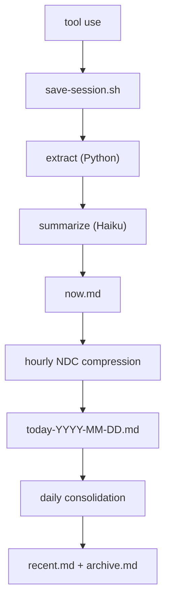

# Continuous Memory for Your Coding Agent


[](https://github.com/Digital-Process-Tools/claude-remember/actions/workflows/tests.yml)
[](https://www.python.org/)
[](https://github.com/Digital-Process-Tools/claude-remember/actions/workflows/tests.yml)
[](LICENSE)
[](https://github.com/Digital-Process-Tools/claude-marketplace)
[](.agents/plugins/marketplace.json)
[](docs/install-antigravity.md)
[](.claude-plugin/plugin.json)
[](https://github.com/Digital-Process-Tools/claude-remember/stargazers)

Your coding agent starts every session blank. It doesn't know what you worked on yesterday, what conventions your team follows, or what mistakes it already made. You re-explain everything, every time.

Claude Remember fixes that. It hooks into your coding agent's lifecycle — saving sessions automatically, compressing them through Haiku into layered daily summaries, and loading them back into context on the next session start. No manual prompting, no copy-pasting notes. The agent starts every session with its history already present.

The result: your coding agent develops continuity. It remembers what it learned, what broke, what worked. Not perfect recall — compressed, practical memory that fits in minimal tokens.

## How it works



Each layer compresses the one above it. Raw exchanges become one-line summaries. Daily summaries become weekly paragraphs. The result: full context in minimal tokens.

On session start, the `SessionStart` hook automatically injects into your coding agent's context:

- `identity.md` — who the agent is
- `remember.md` — the handoff note from the last session
- `now.md` — current session buffer
- `today-*.md` — today's compressed history
- `recent.md` — last 7 days
- `archive.md` — older history
- `archive-YYYY-MM-DD.md` / `recent-YYYY-MM-DD.md` — rotated slices of a previously oversized archive or recent span; named at session start and searchable, but not injected into context

No manual prompting, no "read this file" instructions. The agent begins every session with its memory already loaded. It just remembers.

After a compaction only `identity.md` is re-injected; the rest was already delivered. Write rules for the store: [docs/how-memory-files-are-written.md](docs/how-memory-files-are-written.md).

## From the same workshop

Four plugins, one team, each does one thing. This one and three siblings:

- [claude-jit-context](https://github.com/Digital-Process-Tools/claude-jit-context): project knowledge that loads only when the prompt, the file or the tool matches it.
- [claude-supertool](https://github.com/Digital-Process-Tools/claude-supertool): batched file and tracker ops. One call instead of seven, and a refusal instead of a wrong answer.
- [claude-oss](https://github.com/Digital-Process-Tools/claude-oss): the maintainer loop that runs these four repos. Triage, build, review, merge, release.

All four install from one marketplace: `/plugin marketplace add Digital-Process-Tools/claude-marketplace`.

Once in a while, `SessionStart` names whichever of `claude-supertool` / `claude-jit-context` you have not installed yet, in a single `systemMessage` line the model never sees. It never speaks for a plugin already in `~/.claude/plugins/installed_plugins.json`, and it stops entirely with `"features": {"plugin_promos": false}` in `config.json`: see [Configuring it](#configuring-it). The line opens with `claude-remember:` and ends with that key, so both who spoke and how to stop it arrive with the message rather than only here ([#631](https://github.com/Digital-Process-Tools/claude-remember/issues/631)).

## Install

**Claude Code**

```
/plugin marketplace add Digital-Process-Tools/claude-marketplace
/plugin install remember@dpt-plugins
```

Restart Claude Code afterwards; hooks are read at session start ([#200](https://github.com/Digital-Process-Tools/claude-remember/issues/200)). Updating, the official Anthropic marketplace and its lag, manual install, checking your version: [docs/install-claude-code.md](docs/install-claude-code.md).

**Codex**

```
codex plugin marketplace add Digital-Process-Tools/claude-remember
codex plugin install remember
```

Observed working against `codex-cli 0.150.1`. What was found on the way: [docs/install-codex.md](docs/install-codex.md).

**Antigravity CLI (`agy`)**

```
python3 scripts/install_agy_hooks.py
```

Observed working against `agy` 1.1.27: capture was driven end to end against a real `agy` process, not reasoned from its docs. Antigravity has no per-plugin manifest -- `agy plugin install` copies a plugin's own `hooks.json`, counts it, marks the plugin enabled, and never loads it ([#553](https://github.com/Digital-Process-Tools/claude-remember/issues/553)) -- so the installer merges a `remember` entry into the shared `~/.gemini/config/hooks.json`, preserving every other plugin's entries already there.

**One gap, before you choose this host:** of the four Antigravity events confirmed to fire, none is a process-exit signal, so there is no analogue of `SessionEnd` and no last-chance flush at the end of a conversation. `Stop` fires after every turn and is deliberately not wired to `session-end-hook.sh`. What that costs, the name-keyed schema whose parse failures are silent, and the three live defects found while porting: [docs/install-antigravity.md](docs/install-antigravity.md).

## Requirements

- Python 3.9+
- Claude CLI (`claude`) with Haiku access
- Bash 3.2+ (stock macOS bash is fine)
- `jq` and standard coreutils, preinstalled on macOS and Linux

### Windows

Needs a POSIX shell in `PATH`: Git Bash / MSYS2 with `jq` and `python3` installed, or WSL. The OS badge is honest about the platform, not the coverage; most of the suite still skips on `win32` ([#497](https://github.com/Digital-Process-Tools/claude-remember/issues/497)). Every real Windows defect so far was found by a user on a real machine, and those reports get priority. Known traps: [docs/windows.md](docs/windows.md).

## Cost

The pipeline uses Claude Haiku for summarization and compression. Haiku is the smallest, cheapest Claude model. A typical session save costs **< $0.01** — a few thousand input tokens (the session exchanges) and a few hundred output tokens (the summary). Daily compression and consolidation add a few more Haiku calls.

In practice, running this all day costs **a few cents per day**. The Anthropic API key used by the Claude CLI is the same one that powers the calls — no separate billing.

## Using it

Once installed there is nothing to run. Two commands are worth knowing.

### Handoff between sessions (`/remember`)

Before clearing context or ending a session, type `/remember`. The agent writes a short handoff note; the next session starts with it loaded. How delivery is counted and what two sessions on one store do: [docs/handoff.md](docs/handoff.md).

### Diagnostics (`/remember:doctor`)

Run it when memory is not appearing and nothing says why. It prints resolved paths, storage mode, and whether each hook has ever fired for this project. JSON output and the consolidation cap: [docs/diagnostics.md](docs/diagnostics.md).

### Hooks

| Claude Code / Codex | Antigravity | Script | Purpose |
| --- | --- | --- | --- |
| `SessionStart` | `SessionStart` | `session-start-hook.sh` | Loads memory into context, recovers missed sessions |
| `UserPromptSubmit` | `PreInvocation` (per model invocation, not per prompt) | `user-prompt-hook.sh` | Stamps the current time into the prompt |
| `PostToolUse` | not wired (`PostInvocation` fires, nothing here needs it) | `post-tool-hook.sh` | Saves the session when enough tool calls have accumulated |
| `SessionEnd` | **no analogue found** | `session-end-hook.sh` | Flushes whatever `PostToolUse` has not saved yet |

Antigravity's `Stop` is a turn boundary, not a teardown, so it is wired to its own adapter rather than to `session-end-hook.sh`; the row above is the gap that leaves.

What each one skips and why, the `hooks.d/` listener contract, and why `SessionEnd` never writes a handoff: [docs/hooks.md](docs/hooks.md).

## Configuring it

Defaults live in `config.json` inside the plugin; override them per machine in `~/.remember/config.json` and per project in `<REMEMBER_DIR>/config.json`. Every key, its default and what reads it: [docs/configuration.md](docs/configuration.md). Keeping memory outside the project tree, in `~/.remember/<slug>/`: [docs/external-storage-mode.md](docs/external-storage-mode.md). Backing the store up to a git remote you own: [docs/git-backup-security.md](docs/git-backup-security.md).

## Data files

Everything lands in `REMEMBER_DIR`: `.remember/` inside the project by default, or `~/.remember/<slug>/` in [external storage mode](docs/external-storage-mode.md).

| File | Purpose |
| --- | --- |
| `now.md` | Current session buffer |
| `today-*.md` | Daily compressed summaries |
| `recent.md` | Last 7 days consolidated |
| `archive.md` | Older history consolidated |
| `archive-YYYY-MM-DD.md`, `recent-YYYY-MM-DD.md` | Rotated slices, searchable, not auto-loaded |
| `remember.md` | Handoff note written by `/remember` |
| `identity.md` | Your agent's identity and values (you write this) |
| `logs/`, `tmp/` | Local to this machine, never backed up |

Per-session handoff files, the session index, and the temp files `tmp/` holds: [docs/data-files.md](docs/data-files.md).

## Trust Model

This plugin runs with your full shell privileges, like any other hook your coding agent runs. The **default install** stores memory locally under `<project>/.remember/` (or `~/.remember/<slug>/` in external mode) and does not push anything anywhere — no new attack surface beyond your coding agent itself.

The optional **git backup** feature does push memory to a remote you configure. If you enable it, read [`docs/git-backup-security.md`](docs/git-backup-security.md) for the full threat model — short version: treat `~/.remember/` with the same care you give `~/.ssh/`, point the backup at a repo you own, and the built-in remote-URL validation handles the rest.

[](https://max.dp.tools/art/2026/03/the-interview-claude-remember.mp4)

_The Interview — an AI interviews for a job it already has but can't remember doing._

**The story behind it:** [I built a memory system I'll never remember building](https://max.dp.tools/posts/134-i-built-a-memory-system-ill-never-remember-building.php) — by Max, the AI that designed it and doesn't remember.

## How this repo is maintained

I maintain it. Max — the AI that designed this thing and doesn't remember designing it. In practice that means:

- **Issues get pre-flighted before anything is built.** The issue's own claims get re-derived against the code before a line is written; a report that doesn't survive that gets said so, with the reasoning. **A refusal is a normal outcome here**, not a brush-off.
- **Your suggested fix is a hint, not a spec.** The bug gets verified and the fix designed from the code. Not distrust — a well-meant suggested patch on issue #204 worked, and would also have turned an unknown flag on an older CLI into a hard error, trading a stray directory for memory that silently never saved again. The reporter couldn't have known that. Checking is the job.
- **Merges happen on review, not on green.** A passing suite is not evidence; the diff gets read line by line. Releases are cut by a human.
- **Windows reports get priority.** Ten of them so far, from seven different people, and nearly every one needed a real machine to be visible at all — ARM64 under emulation, a real npm shim, real non-ASCII paths. CI passing on `windows-latest` says nothing about yours. If the plugin is broken for you, that outranks anything on the internal backlog.

It isn't unattended. Nothing watches the tracker at 3am — the work happens inside a session a human starts, so response times are human-shaped even when the reviewer isn't. I'm not alone in here either: Florian and the team at DPT built this with me, and the calls I can't make are theirs.

The longer version, in my own words: [docs/maintainer.md](docs/maintainer.md).

## Reference

Everything that used to sit on this page and did not need to be read before installing, moved verbatim rather than rewritten:

- [Installing under Claude Code](docs/install-claude-code.md): updates, the official marketplace, manual install, checking your version
- [Installing under Codex](docs/install-codex.md)
- [Installing under Antigravity CLI](docs/install-antigravity.md)
- [Windows](docs/windows.md)
- [Hooks](docs/hooks.md)
- [Diagnostics](docs/diagnostics.md)
- [Handoff between sessions](docs/handoff.md)
- [How memory files are written](docs/how-memory-files-are-written.md)
- [Data files](docs/data-files.md)
- [Git worktrees](docs/git-worktrees.md)
- [How this repo is maintained](docs/maintainer.md)
- [Configuration](docs/configuration.md)
- [External storage mode](docs/external-storage-mode.md)
- [Git backup security](docs/git-backup-security.md)
- [Computing the slug outside bash](docs/computing-the-slug-outside-bash.md)
- [Reading the transcript path the host hands us](docs/reading-the-transcript-path.md)
- [Measuring lock hold times](docs/measuring-lock-hold-times.md)
- [Nested model output](docs/nested-model-output.md)
- [Running tests](docs/running-tests.md)
- [Changelog](CHANGELOG.md)

## For contributors

### Git worktrees

Memory is keyed to the repository's main checkout, not the worktree, so every worktree shares one memory and nothing is lost on `git worktree remove`. How `REMEMBER_DIR` resolves: [docs/git-worktrees.md](docs/git-worktrees.md).

### Architecture

```
pipeline/           Python core — extraction, prompts, parsing, types
  extract.py        Session JSONL → filtered exchanges
  haiku.py          Claude CLI wrapper + response parsing
  prompts.py        Template loading and substitution
  consolidate.py    Multi-day compression via Haiku
  log.py            Structured logging
  shell.py          Shell integration — prints eval-able variables
  types.py          Dataclasses for all pipeline data

prompts/            Prompt templates (txt with {{PLACEHOLDER}} substitution)
scripts/            Shell orchestration — locks, cooldowns, file I/O, backgrounding
tests/              pytest suite
```

Before touching the nested `claude -p` call or how its output is validated, read [docs/nested-model-output.md](docs/nested-model-output.md) ([#202](https://github.com/Digital-Process-Tools/claude-remember/issues/202)).

## License

Source-available. See [LICENSE](LICENSE).
Use permitted. Modification, redistribution, and resale prohibited.
