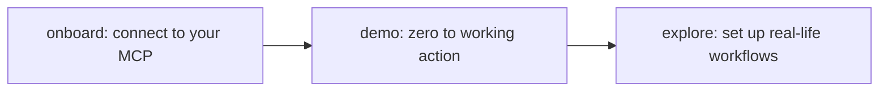

# Zapier MCP Plugin

[Zapier MCP](https://docs.zapier.com/mcp/home) is how your AI talks to the apps you already live in. 9,000+ of them, 40,000+ actions, all triggered by a sentence. This plugin makes it effortless to get there: a guided onboard, real-life use cases that show you what's worth automating, and the shortest path from "I wish my AI could do that" to it actually happening.

## Get started

1. **Install the plugin.** Pick your AI client at [docs.zapier.com/mcp/clients](https://docs.zapier.com/mcp/clients). We've got a setup guide for each one.
2. **Onboard.** Tell your AI **"onboard zapier"** and we'll take it from there.

https://github.com/user-attachments/assets/8304058f-67da-40b9-bc4f-5095b2817d61

## Features

- **Guided onboarding** *("onboard zapier")*: we'll get you connected and figure out what to set up first.
- **Live demo** *("show me how Zapier works")*: see Zapier work in one quick action before you commit to more.
- **Real-life workflow setup** *("set up my Zapier toolkit")*: we'll help you build a toolkit shaped around how you actually work.
- **Health checks** *("zapier status")*: quick check that everything's running, find duplicates, troubleshoot.

Talk to your assistant naturally. It picks the right path from context.

## How the skills fit together

We'll walk you through each step: get you connected, run your first real action, then help you build out the workflows you'll actually use day-to-day.

## Example prompts

> "Draft a Gmail reply to sarah@acme.com confirming Friday's 2pm meeting"
>
> "Find 30 minutes I'm free tomorrow afternoon and book a Google Calendar event with the team"
>
> "Send a Slack message in #launches: 'Release shipped, monitoring now'"
>
> "Add a row to my Q3 Campaigns sheet with today's lead numbers"
>
> "Create a Jira ticket in BACKEND for the auth bug we just discussed"
>
> "Save the action items from this meeting to my Notion 'Engineering' workspace"
>
> "Find the HubSpot contact for sarah@acme.com and log this conversation as a note"
>
> "Create a Linear issue from this customer email and DM the owner on Slack"

More examples at [docs.zapier.com/mcp/home](https://docs.zapier.com/mcp/home).

## Tips

- **Try one action before configuring a whole toolkit.** A few minutes seeing Zapier work beats reading a feature list. The demo is built for exactly that.
- **Re-run `"zapier status"` every once in a while.** Catches duplicates, low-value actions, and conflicts as your setup grows.

## Documentation & support

- [docs.zapier.com/mcp](https://docs.zapier.com/mcp/home): full product documentation
- [mcp.zapier.com](https://mcp.zapier.com): manage your server and actions
- [status.zapier.com](https://status.zapier.com): check for outages
- [help.zapier.com](https://help.zapier.com): support
